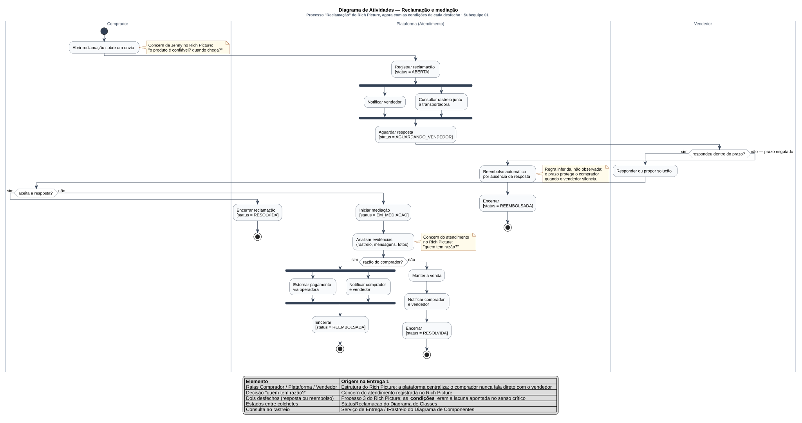

# Diagrama de Atividades

Conforme a divisão registrada em [1.1.1. SubEquipe_01](/Base/Relatórios/1.1.1.SubEquipe_01.md) e decidida na [reunião de 12/09/2026](/ReunioesAtas/Subequipe1/Ata12_09.md), este diagrama é de responsabilidade de **Guilherme Costa Zanella**. Ele fecha uma lacuna que o próprio Rich Picture da Entrega 1 deixou registrada no senso crítico: *"o fluxo de reclamação mostra que há mediação e dois desfechos possíveis, mas não sob quais condições"*. Este diagrama existe para mostrar as condições.

---

## O que é o artefato

O diagrama de atividades é o diagrama de comportamento da UML voltado a **fluxo de controle e de dados** entre ações: mostra a sequência de passos, as decisões, o paralelismo e — com **raias** (*swimlanes* ou partições) — quem é responsável por cada passo (BOOCH; RUMBAUGH; JACOBSON, 2005; OMG, 2017, seção 15). Desde a UML 2, sua semântica é baseada em redes de Petri, o que dá significado preciso a bifurcação (`fork`) e junção (`join`): a junção só prossegue quando **todos** os fluxos de entrada chegaram.

É o diagrama da UML mais próximo do BPMN usado na Entrega 1, e a escolha entre os dois é de propósito: o BPMN é orientado a processo de negócio, com pools e mensagens entre participantes; o diagrama de atividades é orientado a **fluxo dentro de um sistema**, com raias que separam responsabilidade sem impor fronteira de comunicação. Para um fluxo em que a plataforma centraliza tudo, a raia é a abstração certa. Fowler (2004) resume a força própria da notação: o que o diagrama de atividades faz e um fluxograma não faz é descrever **comportamento paralelo** — e é exatamente esse recurso que a decisão 2 desta página explora, com os dois pares `fork`/`join`.

---

## O artefato

Clique na imagem para abrir em tela cheia, com zoom.

> _Figura 7 — Diagrama de Atividades do fluxo de reclamação e mediação. Três raias: Comprador, Plataforma (Atendimento) e Vendedor. Dezessete ações; três decisões com guardas; duas bifurcações com junção; quatro nós finais, um por desfecho. As ações da plataforma registram, entre colchetes, o valor de `StatusReclamacao` do Diagrama de Classes. A legenda rastreia cada elemento ao Rich Picture. Fonte: Subequipe 01, 2026._

---

## Por que assumi o diagrama de atividades

**Eu mesmo apontei a lacuna, e ela ficou em aberto.** No senso crítico do Rich Picture escrevi que o artefato "não expressa ordem nem condição — o fluxo de reclamação mostra que há mediação e dois desfechos possíveis, mas não sob quais condições", e que isso "pode ser melhor explorado no BPMN". A Entrega 2 não tem BPMN: a notação pedida é UML, e o equivalente UML de um fluxo com responsabilidades separadas é o diagrama de atividades. Este diagrama é, literalmente, o fechamento daquela nota — e o que ele acrescenta é exatamente o que faltava. Os dois desfechos que eu havia registrado como "resposta ou reembolso" agora são **quatro nós finais**, e cada caminho até eles passa por uma guarda escrita que diz sob qual condição se chega lá.

**As raias são a estrutura do meu Rich Picture.** O achado que registrei como não previsto — "Jenny não tem ligação direta com os vendedores: produto, dinheiro, informação e reclamação passam todos pela plataforma" — é o que as três raias tornam verificável: **nenhuma seta vai da raia do Comprador à do Vendedor**, em nenhum caminho do diagrama. Toda transição entre os dois atravessa a raia do meio. No [Diagrama de Casos de Uso](/Base/Relatórios/Subequipe01/ModelagemEstatica/DiagramaDeCasosDeUso.md) essa mesma centralidade aparece como topologia — nenhum ator se liga a outro ator; aqui aparece como fluxo, que é a forma mais forte de dizê-la, porque um fluxo tem direção e ordem.

**As decisões são as concerns.** As duas notas do diagrama trazem os balões de pensamento do Rich Picture literalmente, e não por enfeite: elas marcam onde cada concern virou estrutura. "O produto é confiável? Quando chega?", da Jenny, é o que dispara o fluxo — a reclamação é o que acontece quando a resposta a essas perguntas foi não. "Quem tem razão?", do atendimento, é o losango central, `razão do comprador?`, com as duas saídas que decidem entre manter a venda e devolver o dinheiro. O caminho de um balão de pensamento desenhado à mão até um nó de decisão com guarda é curto, e é o argumento desta página.

---

## Como o diagrama foi montado

| # | Passo | O que foi feito |
| -- | -- | -- |
| 1 | Sequência básica | O processo 3 do Rich Picture — "Jenny reclama, atendimento media com o vendedor, e retorna com resposta ou reembolso" — foi reescrito como sequência linear de ações, sem decisões |
| 2 | Raias | Os três participantes do processo viraram partições. O atendimento ficou nomeado dentro da raia da plataforma, e não em raia própria, pela razão discutida na decisão 1 |
| 3 | Decisões e guardas | Para cada desfecho, a pergunta "que condição leva até aqui?". Onde a resposta não veio de um achado da Entrega 1, a condição foi marcada como inferida no próprio desenho |
| 4 | Paralelismo | O que a plataforma faz ao mesmo tempo — notificar e consultar rastreio; estornar e notificar — virou `fork` com `join` |
| 5 | Estados | Cada ação da plataforma que muda a situação da reclamação recebeu, entre colchetes, o valor de `StatusReclamacao` do Diagrama de Classes, conferido um a um contra a enumeração |
| 6 | Interfaces | Revisão contra o Diagrama de Componentes, para nomear de onde vem o rastreio (`IRastreio`) e por onde sai o estorno (`IPagamento`) |
| 7 | Nós finais | Um por desfecho, cada um encerrando com o status correspondente, em vez de convergirem em um só |
| 8 | Revisão em pares | O diagrama foi revisado por Pedro Luciano de Azevedo na reunião de 16/09/2026, sem apontamento que exigisse alteração no desenho, e esta página na de 17/09/2026, pelo rodízio registrado nas duas atas. O apontamento aceito — Fowler (2004) listado nas referências sem citação no texto — está aplicado nesta versão |

---

## Decisões de modelagem e sua origem

### 1. Três raias, e o atendimento dentro da raia da plataforma

**A decisão.** As partições são `Comprador`, `Plataforma (Atendimento)` e `Vendedor` — três, não duas nem quatro.

**Por quê.** No Rich Picture o atendimento é *stakeholder* com concern própria, o que é um argumento por raia própria; mas metade das ações da raia do meio são registros e notificações automáticas, que não são trabalho de um atendente. O nome composto é a solução de compromisso: preserva a visibilidade que a Entrega 1 dá ao atendimento sem afirmar que ele executa o que o software executa.

**Trade-off.** Há uma tensão declarada com o meu próprio Diagrama de Casos de Uso, em que `Atendimento` é ator **fora** do sistema. Não é contradição, e sim mudança de sujeito: lá a pergunta é quem usa o sistema, e o atendente usa; aqui a pergunta é quem responde por cada passo do processo, e o passo pertence ao lado da plataforma. A alternativa de quatro raias seria mais fiel ao Rich Picture e menos legível, com dois participantes trocando setas a cada dois passos. A subequipe fechou o ponto na reunião de 17/09/2026: em vez de unificar os nomes, como previa a decisão 9 da [ata de 16/09/2026](/ReunioesAtas/Subequipe1/Ata16_09.md), ficam os três — ator `Atendimento` no [Diagrama de Casos de Uso](/Base/Relatórios/Subequipe01/ModelagemEstatica/DiagramaDeCasosDeUso.md), raia `Plataforma (Atendimento)` aqui e classe `Atendente` no [Diagrama de Classes](/Base/Relatórios/Subequipe01/ModelagemEstatica/DiagramaDeClasses.md) —, com referência cruzada explícita nas três páginas, porque o que muda entre eles é o nível de abstração, e não o vocabulário (decisão 4 da [ata de 17/09/2026](/ReunioesAtas/Subequipe1/Ata17_09.md)).

### 2. Bifurcação depois do registro da reclamação

**A decisão.** `Notificar vendedor` e `Consultar rastreio junto à transportadora` saem de um `fork` e se reúnem em um `join` antes de `Aguardar resposta`.

**Por quê.** As duas ações são independentes: nenhuma precisa do resultado da outra, e modelá-las em sequência imporia uma ordem que a evidência não sustenta. A semântica de rede de Petri da junção é o que torna a modelagem correta e não apenas bonita: o fluxo só entra em espera quando **ambos** terminaram — quer dizer, a plataforma só começa a contar o prazo do vendedor depois de tê-lo notificado e de já ter em mãos a evidência que vai sustentar a mediação, se houver.

**Trade-off.** É o primeiro uso de paralelismo da subequipe nesta entrega, e ele traz uma suposição embutida: a de que a consulta ao rastreio responde. Se a transportadora estiver indisponível, o `join` trava e a reclamação não avança. Um `joinSpec` ou um fluxo de exceção resolveria; não modelei porque não há nenhuma evidência sobre o comportamento dessa consulta, e inventar um caminho de falha seria exatamente a inferência não declarada que esta página critica adiante.

### 3. A decisão do prazo está na raia do Vendedor

**A decisão.** O losango `respondeu dentro do prazo?` fica na partição do Vendedor, não na da plataforma.

**Por quê.** O critério que apliquei foi o do **sujeito do comportamento avaliado**, e não o de quem executa a verificação. A UML define partição como agrupamento de nós por responsabilidade sobre o comportamento (OMG, 2017, seção 15), e o comportamento em julgamento aqui é a resposta do vendedor. Colocar o losango na raia do meio diria que esperar é um passo de trabalho do atendimento — e esperar não é trabalho de ninguém: é tempo passando.

**Trade-off.** A leitura oposta é defensável, e registro isso em vez de escondê-lo: quem dispara o temporizador, verifica o prazo e decide o desvio é a plataforma; pelo critério de *quem executa*, o losango iria para a raia do meio. Assumi a primeira leitura, mas ela é uma escolha, não uma consequência da evidência. Vale notar que o Patrick tomou a decisão simétrica na [Máquina de Estados](/Base/Relatórios/Subequipe01/ModelagemDinamica/DiagramaDeMaquinaDeEstados.md): lá o evento `after(tempo limite)` pertence ao `Pedido`, que é o objeto que espera, e não a quem conta o tempo.

### 4. Reembolso automático por silêncio do vendedor — regra **inferida**

**A decisão.** Se o prazo se esgota sem resposta, o fluxo segue para `Reembolso automático por ausência de resposta` e encerra em `REEMBOLSADA`. Uma nota no próprio desenho declara que a regra é inferida.

**Por quê.** Ela não foi observada, e não poderia ter sido. Decorre da lógica de proteção ao comprador: sem prazo, um vendedor que simplesmente não responde bloqueia a reclamação indefinidamente, e o Rich Picture registrou dois desfechos, não três. Para confirmá-la, a Entrega 1 teria precisado de algo que o nosso método não podia produzir — uma reclamação real, aberta sobre uma compra real, deixada expirar. O levantamento foi de caixa-preta sobre a interface, e o Recorte B parou antes da tela de pagamento justamente para não efetuar compra real.

**Trade-off.** A alternativa honesta seria não modelar o caminho, deixando `Aguardar resposta` sem saída para o caso de silêncio. Isso é pior: deixaria um *deadlock* visível no diagrama, ou seja, afirmaria que o processo trava — e disso também não há evidência. Entre inventar um caminho e afirmar um travamento, escolhi inventar e marcar. A marcação está no SVG, e não só nesta página, porque quem abre a imagem solta precisa da mesma informação.

### 5. Segunda bifurcação no desfecho de reembolso

**A decisão.** `Estornar pagamento via operadora` e `Notificar comprador e vendedor` correm em paralelo antes do encerramento.

**Por quê.** São ações de natureza diferente e sem dependência entre si: o estorno é uma chamada a um sistema externo — `IPagamento` e a Operadora, no [Diagrama de Componentes](/Base/Relatórios/Subequipe01/ModelagemEstatica/DiagramaDeComponentes.md) —, e a notificação é interna. A junção antes do nó final afirma o que interessa: a reclamação só encerra como `REEMBOLSADA` quando o estorno foi efetivado, e não quando foi pedido.

**Trade-off.** Há uma assimetria deliberada no desenho. No desfecho oposto, `Manter a venda` e `Notificar comprador e vendedor` estão em **sequência**, não em `fork`. Manter a venda não é chamada a sistema externo, é mudança de registro local, e um `fork` ali seria paralelismo decorativo. Uma revisão poderia argumentar pela simetria visual; preferi que cada bifurcação do diagrama significasse alguma coisa.

### 6. Quatro nós finais em vez de um

**A decisão.** Cada desfecho encerra em seu próprio nó final de atividade, com o status ao lado.

**Por quê.** Dois caminhos terminam em `RESOLVIDA` e dois em `REEMBOLSADA`, mas por rotas que significam coisas distintas para o negócio: *resolvida porque o comprador aceitou a resposta* não é o mesmo evento que *resolvida porque a mediação deu razão ao vendedor*, e *reembolsada por decisão de mediação* não é o mesmo que *reembolsada por silêncio*. Um nó final único esconderia as quatro histórias sob dois rótulos.

**Trade-off.** É o contraste explícito com a Máquina de Estados do Patrick, que faz quatro caminhos de encerramento convergirem em **um** único estado final. As duas escolhas estão certas para as duas notações, e a diferença é instrutiva: lá o sujeito é o `Pedido`, e um objeto encerrado é um objeto encerrado, com o status registrando o motivo; aqui o sujeito é o processo, e um processo que termina de quatro maneiras tem quatro fins. A UML permite as duas formas — múltiplos nós finais de atividade são legais e equivalentes em execução (OMG, 2017, seção 15); o que muda é o que o desenho comunica.

---

## Recursos da notação utilizados

As Diretrizes pedem para usar os vários recursos de modelagem da notação. Este diagrama emprega:

| Recurso | Onde aparece | Por que estava lá |
| -- | -- | -- |
| Partição (raia) | `Comprador`, `Plataforma (Atendimento)`, `Vendedor` | Responsabilidade por cada ação; estrutura do Rich Picture |
| Nó inicial | Antes de `Abrir reclamação sobre um envio`, na raia do Comprador | O fluxo começa por quem tem a concern |
| Nó de ação | Dezessete ações | Passo de trabalho, humano ou automático |
| Nó de decisão com guarda | `respondeu dentro do prazo?`, `aceita a resposta?`, `razão do comprador?` | As condições que o Rich Picture não dizia |
| Bifurcação e junção (`fork` / `join`) | Dois pares: notificar ∥ consultar rastreio; estornar ∥ notificar | Fluxos concorrentes; a junção só prossegue quando todos chegaram |
| Nó final de atividade | Quatro | Um por desfecho, em vez de um encerramento único |
| Anotação de estado na ação | `[status = ABERTA]`, `[status = AGUARDANDO_VENDEDOR]`, `[status = EM_MEDIACAO]`, `[status = RESOLVIDA]`, `[status = REEMBOLSADA]` | Liga cada passo à enumeração `StatusReclamacao` do [Diagrama de Classes](/Base/Relatórios/Subequipe01/ModelagemEstatica/DiagramaDeClasses.md) |
| Nota | Duas com as concerns do Rich Picture e uma marcando a regra inferida | Separa o observado do inferido dentro do próprio desenho |
| Legenda embutida | Rodapé da imagem | Rastreabilidade legível sem sair da imagem |

---

## Rastreabilidade

| Elemento | Vem de | Vai para |
| -- | -- | -- |
| Raias `Comprador` / `Plataforma (Atendimento)` / `Vendedor` | Estrutura do Rich Picture e o achado da centralidade da plataforma | Atores `Comprador`, `Atendimento` e `Vendedor` no [Diagrama de Casos de Uso](/Base/Relatórios/Subequipe01/ModelagemEstatica/DiagramaDeCasosDeUso.md). A raia `Plataforma (Atendimento)`, o ator `Atendimento` de lá e a classe `Atendente` do [Diagrama de Classes](/Base/Relatórios/Subequipe01/ModelagemEstatica/DiagramaDeClasses.md) são o mesmo conceito em três níveis, mantidos separados pela decisão 4 da [ata de 17/09/2026](/ReunioesAtas/Subequipe1/Ata17_09.md) |
| Sequência de ações | Processo 3 do Rich Picture — reclamação, mediação, resposta ou reembolso | Casos de uso `UC17`–`UC21`, pacote Pós-venda |
| Decisão `razão do comprador?` | Concern do atendimento — "quem tem razão?" | `Atendente.mediar(r: Reclamacao)` no Diagrama de Classes |
| `[status = ...]` nas ações da plataforma | Enumeração `StatusReclamacao` do Diagrama de Classes | Os cinco valores conferidos um a um: `ABERTA`, `AGUARDANDO_VENDEDOR`, `EM_MEDIACAO`, `RESOLVIDA`, `REEMBOLSADA` |
| `Consultar rastreio junto à transportadora` | Processo 2 do Rich Picture (produto: vendedor → transportadora → Jenny) | `IRastreio` e `Serviço de Entrega` no [Diagrama de Componentes](/Base/Relatórios/Subequipe01/ModelagemEstatica/DiagramaDeComponentes.md) |
| `Estornar pagamento via operadora` | Operadora de pagamento no Rich Picture | `IPagamento` no Diagrama de Componentes; transição `Em disputa → Reembolsado` na [Máquina de Estados](/Base/Relatórios/Subequipe01/ModelagemDinamica/DiagramaDeMaquinaDeEstados.md) do Pedido |
| `Registrar reclamação` e `Iniciar mediação` | Processo 3 do Rich Picture | `Serviço de Pós-venda` e a interface `IReclamacao` no Diagrama de Componentes |
| Guarda `não — prazo esgotado` | **Inferida**; nenhuma origem na Entrega 1 | Declarada na decisão 4 e na nota do próprio diagrama |

---

## Limites do diagrama

- **Nada disto foi observado.** O fluxo de reclamação exige uma compra concluída e um problema com ela. O diagrama é a formalização do processo 3 do Rich Picture, que por sua vez foi desenhado a partir de conhecimento de domínio, e não de percurso na interface. É o diagrama de origem mais fraca da subequipe, e é honesto dizer isso antes de qualquer outra coisa: o valor dele está em tornar explícitas e discutíveis as condições que eu já estava assumindo sem perceber, não em descrever um comportamento verificado.
- **A regra do prazo é inferida**, e é a única afirmação do diagrama que não tem nenhum lastro na Entrega 1. Está registrada na decisão 4, na nota do desenho e na tabela de rastreabilidade — três lugares, de propósito.
- **Não há recurso nem segunda instância.** Um vendedor que discorda da mediação não tem caminho no diagrama: o fluxo encerra e pronto. Um processo de recurso pode existir na plataforma real; não se sabe, e modelá-lo seria inventar um segundo ciclo inteiro sobre a mesma ausência de evidência que já sustenta a regra do prazo.
- **O rastreio é tratado como evidência sempre disponível.** Se a transportadora não oferecer rastreio, ou se a consulta falhar, o fluxo não muda — e deveria. É a fragilidade apontada no *trade-off* da decisão 2, e ela tem consequência prática: a mediação ficaria sem a principal evidência objetiva de que dispõe.
- **Um único tipo de reclamação.** "Produto não chegou", "chegou errado" e "chegou danificado" quase certamente têm fluxos diferentes — prazos diferentes, evidências diferentes, e o último provavelmente exige foto antes da mediação. O diagrama trata os três como um só, e `Analisar evidências (rastreio, mensagens, fotos)` é onde essa simplificação está escondida.
- **Não há modelagem de dados no fluxo.** A UML permite *object nodes* e *pins* para mostrar o que cada ação consome e produz — a reclamação, a evidência, o comprovante de estorno. Não usei: com três raias e dezessete ações, acrescentar objetos deixaria o diagrama ilegível, e a estrutura desses dados já está no Diagrama de Classes. É um recurso da notação deliberadamente não empregado, e não um esquecimento.

---

## Referências

BOOCH, Grady; RUMBAUGH, James; JACOBSON, Ivar. **UML: guia do usuário**. 2. ed. Rio de Janeiro: Elsevier, 2005.

FOWLER, Martin. **UML Distilled: A Brief Guide to the Standard Object Modeling Language**. 3. ed. Boston: Addison-Wesley, 2004.

MONK, Andrew; HOWARD, Steve. The Rich Picture: A Tool for Reasoning About Work Context. **Interactions**, v. 5, n. 2, p. 21–30, mar./abr. 1998.

OBJECT MANAGEMENT GROUP. **OMG Unified Modeling Language (OMG UML), Version 2.5.1**. Needham: OMG, 2017. Disponível em: https://www.omg.org/spec/UML/2.5.1. Acesso em: 16 set. 2026.

---

## Histórico de Versões

| Versão | Data | Descrição | Autor(es) | Revisor(es) |
| -- | -- | -- | -- | -- |
| 1.0 | 16/09/2026 | Criação da página com o diagrama (autoria coletiva da subequipe) e o roteiro de redação | Pedro Luciano de Azevedo | -- |
| 1.1 | 17/09/2026 | Redação do conteúdo da página: justificativa a partir da lacuna apontada no senso crítico do Rich Picture, método de montagem em sete passos, seis decisões de modelagem com a regra inferida declarada, recursos da notação utilizados, tabela de rastreabilidade e limites | Guilherme Costa Zanella | Pedro Luciano de Azevedo |
| 1.2 | 17/09/2026 | Aplicação dos apontamentos da revisão em pares: citação de Fowler (2004) no texto, registro da decisão 4 da ata de 17/09/2026 sobre os três nomes do atendimento na decisão 1 e na rastreabilidade, e passo 8 de revisão em pares | Guilherme Costa Zanella | -- |
