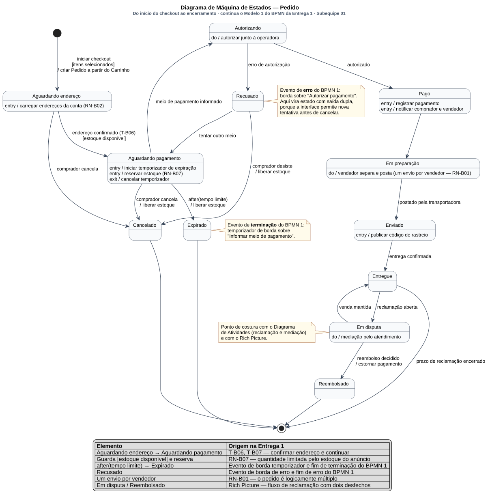
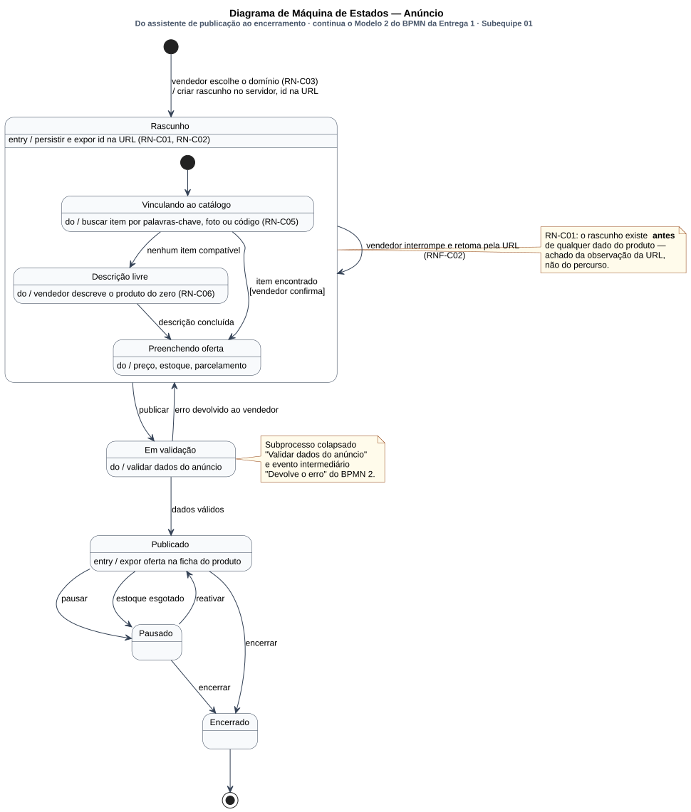

# Diagrama de Máquina de Estados

Conforme a divisão registrada em [1.1.1. SubEquipe_01](/Base/Relatórios/1.1.1.SubEquipe_01.md) e decidida na [reunião de 12/09/2026](/ReunioesAtas/Subequipe1/Ata12_09.md), este diagrama é de responsabilidade de **Patrick Anderson**. São duas máquinas: a do **Pedido**, que continua o Modelo 1 do BPMN da Entrega 1 (carrinho, endereço e checkout), e a do **Anúncio**, que continua o Modelo 2 (publicação pelo vendedor). Os eventos de borda que aqueles modelos registraram — temporizador em *Informar meio de pagamento*, erro em *Autorizar pagamento* — são aqui transições com guarda e efeito.

---

## O que é o artefato

O diagrama de máquina de estados descreve o comportamento de **um objeto** ao longo do seu ciclo de vida: os estados em que pode estar, os eventos que o fazem mudar de estado, as guardas que condicionam a mudança e os efeitos que ela dispara (BOOCH; RUMBAUGH; JACOBSON, 2005). A UML herda a semântica dos *statecharts* de Harel (1987), o que traz três recursos que este diagrama usa: **estados compostos** (um estado que contém uma submáquina), **ações de entrada, saída e atividade contínua** (`entry`, `exit`, `do`) e **eventos temporais** (`after(t)`).

A diferença para o BPMN, que a Entrega 1 usou para os mesmos fluxos, é de sujeito: o BPMN descreve o *processo* — quem faz o quê —; a máquina de estados descreve o *objeto* — em que situação o pedido está, e o que pode acontecer com ele a partir dali. Os dois modelos são complementares, e a rastreabilidade entre eles é ponto a ponto.

---

## O artefato

### Máquina de estados do Pedido

Clique na imagem para abrir em tela cheia, com zoom.

> _Figura 4 — Máquina de Estados do Pedido, do início do checkout ao encerramento. Doze estados, com ações `entry`, `exit` e `do`. Transições rotuladas com evento, guarda entre colchetes e efeito após a barra. Evento temporal `after(tempo limite)`. Quatro caminhos de encerramento — venda concluída, expiração, cancelamento e reembolso — convergem em um único estado final. A legenda embutida rastreia cada elemento ao BPMN 1 e às regras RN-B. Fonte: Subequipe 01, 2026._

### Máquina de estados do Anúncio

Clique na imagem para abrir em tela cheia, com zoom.

> _Figura 5 — Máquina de Estados do Anúncio. `Rascunho` é um estado composto com três subestados — `Vinculando ao catálogo`, `Descrição livre` e `Preenchendo oferta` — e uma autotransição que registra a retomada pela URL. As duas notas marcam os achados da Entrega 1 que sustentam a ordem dos estados. Fonte: Subequipe 01, 2026._

---

## Por que assumi a máquina de estados

Os meus dois BPMNs já continham os **eventos**. O que faltava era o **objeto** que os sofre — e é isso que a máquina de estados acrescenta.

**O temporizador virou um desfecho com nome próprio.** No BPMN 1 havia um evento de borda de temporizador sobre *Informar meio de pagamento* e um evento de fim de terminação rotulado "checkout expirado". Na máquina, os dois viram uma transição só: `Aguardando pagamento → Expirado : after(tempo limite) / liberar estoque`. E aqui aparece uma distinção que o BPMN não fazia: `Expirado` é um estado diferente de `Cancelado`, embora os dois encerrem o pedido e os dois liberem o estoque. Um é passagem do tempo, o outro é decisão do comprador. A diferença importa porque as consequências de negócio não são as mesmas — um cancelamento é sinal de desistência, uma expiração é sinal de fricção no checkout, e só o segundo é defeito de produto. O BPMN, que modela o processo, tratava ambos como "o processo acabou"; a máquina de estados, que modela o objeto, é obrigada a dizer *em que situação* ele acabou.

**O evento de erro virou um estado, e não uma seta.** O evento de borda de erro sobre *Autorizar pagamento* e o fim de erro "pagamento recusado" viraram o estado `Recusado`. Modelá-lo como estado, e não como transição direta ao encerramento, é uma decisão que o próprio desenho anota — e que eu preciso qualificar honestamente. O Recorte B foi interrompido **antes da tela de pagamento**, porque avançar exigiria confirmar uma compra real, com cobrança real. Então eu não observei a tentativa de novo meio de pagamento. A saída dupla de `Recusado` — `tentar outro meio` de volta a `Aguardando pagamento`, ou `comprador desiste / liberar estoque` para `Cancelado` — é **inferida**, e está registrada como tal na seção de limites. O que sustenta a inferência é o BPMN: um evento de *borda* interrompe a atividade sem encerrar o processo, o que é precisamente um estado intermediário, não um fim.

**O subprocesso colapsado ficou explícito.** No Modelo 2, *Validar dados do anúncio* era um subprocesso colapsado e *Devolve o erro* um evento intermediário de mensagem — ou seja, o modelo dizia que havia validação e que havia erro, mas não dizia o que acontecia com o anúncio depois. Na máquina do Anúncio isso é `Em validação → Rascunho : erro devolvido ao vendedor`, e a seta de volta aponta para o **estado composto**, não para o seu subestado inicial. Essa escolha carrega uma afirmação: o vendedor volta ao rascunho que já tinha, não recomeça o assistente. É o que RN-C02 e RNF-C02 sustentam — o rascunho persiste e é retomável pela URL.

---

## Como o diagrama foi montado

| # | Passo | O que foi feito |
| -- | -- | -- |
| 1 | Identificação do objeto | Cada BPMN tem um objeto de dados no centro: `Pedido` no Modelo 1 e `Rascunho` no Modelo 2. Esses objetos viraram os sujeitos das duas máquinas |
| 2 | Estados | Cada tarefa do BPMN que **muda a situação** do objeto virou um estado; tarefas que apenas leem ou exibem não viraram |
| 3 | Transições | Cada evento do BPMN — de início, de borda, intermediário e de fim — virou uma transição, preservando o nome |
| 4 | Guardas | Cada gateway exclusivo do BPMN virou guarda entre colchetes no fluxo de saída correspondente, seguindo a mesma regra da Entrega 1: o losango marca a bifurcação, a condição fica no rótulo |
| 5 | Ações | Tarefas de serviço automáticas viraram `entry` (acontecem ao entrar), `do` (duram enquanto o estado dura) ou efeito de transição (após a barra) |
| 6 | Conferência com o modelo estático | As enumerações `StatusPedido` e `StatusAnuncio` do [Diagrama de Classes](/Base/Relatórios/Subequipe01/ModelagemEstatica/DiagramaDeClasses.md) foram conferidas uma a uma contra os estados, para que os dois diagramas usem os mesmos nomes |
| 7 | Marcação do inferido | Todo estado ou transição sem origem em observação foi identificado, e está declarado na seção de limites |

---

## Decisões de modelagem e sua origem

### Pedido

#### 1. A reserva de estoque é `entry`, e a liberação é efeito de saída

**A decisão.** `Aguardando pagamento` tem `entry / reservar estoque (RN-B07)`, e toda transição que sai dele sem autorização carrega `/ liberar estoque`.

**Por quê.** RN-B07 registrou que o seletor de quantidade é limitado pelo estoque do anúncio, exibido no próprio controle. Se a quantidade é limitada pelo estoque, o estoque é recurso disputado; e se é disputado, um pedido que está esperando pagamento precisa segurá-lo, senão dois compradores levam a mesma unidade. A guarda `[estoque disponível]` na transição de entrada verifica; o `entry` reserva.

**Por que não é `do`.** Reservar é operação pontual, não atividade contínua — acontece uma vez, ao entrar. Já `exit / cancelar temporizador` é `exit` porque vale para *qualquer* saída, inclusive a bem-sucedida. A liberação do estoque, ao contrário, **não** é `exit`: sair para `Autorizando` e depois para `Pago` deve manter a reserva. Por isso ela é efeito das transições específicas (`after(tempo limite)`, `comprador cancela`, `comprador desiste`) e não ação de saída do estado. Essa distinção é a razão de o diagrama repetir `/ liberar estoque` em três setas em vez de escrevê-lo uma vez.

#### 2. `after(tempo limite)` não tem valor numérico

**A decisão.** O evento temporal está no diagrama sem prazo.

**Por quê.** O temporizador foi observado como recurso do BPMN — havia um evento de borda —, mas o prazo nunca foi observado. A Entrega 1 já registrava isso: o evento temporizador sobre o pagamento está nos limites do modelo BPMN como inferido a partir do comportamento padrão do domínio. Escrever `after(30min)` seria inventar um número; escrever `after(tempo limite)` registra que existe um prazo e que ele é desconhecido. É a mesma disciplina de marcação do inferido que a Entrega 1 adotou.

#### 3. `Pago` tem duas ações `entry`

**A decisão.** `entry / registrar pagamento` e `entry / notificar comprador e vendedor`.

**Por quê.** É o gateway paralelo do BPMN 1 — o par registrar/notificar — traduzido para a notação de estados. O BPMN expressava simultaneidade com um losango de bifurcação; a máquina de estados expressa com duas ações de entrada, que por definição ocorrem ambas ao entrar no estado, sem ordem imposta entre si.

**Trade-off.** A tradução perde a explicitação gráfica do paralelismo. Ganha-se, em troca, que as ações ficam ancoradas ao estado que as justifica: elas acontecem *porque* o pedido passou a estar pago, e não como duas caixas soltas num fluxo.

#### 4. `Em preparação` achata os múltiplos envios

**A decisão.** `do / vendedor separa e posta (um envio por vendedor — RN-B01)`.

**Por quê.** RN-B01 é dos achados mais fortes do Recorte B: o carrinho agrupa os itens **por vendedor**, o que significa que o pedido é logicamente múltiplo — um envio por vendedor. A rigor, um pedido com dois vendedores tem dois ciclos `Em preparação → Enviado → Entregue` correndo em paralelo.

**Por que não usei regiões ortogonais.** A UML tem o recurso certo para isso: um estado composto com regiões concorrentes, uma por envio. Não o usei por duas razões. A primeira é que o número de regiões seria **variável** — depende de quantos vendedores há no pedido —, e regiões ortogonais são estruturais e fixas na notação; modelar corretamente exigiria uma submáquina por `Envio`, com o `Pedido` agregando-as. A segunda é que isso seria outro diagrama: o ciclo de vida do `Envio`, não o do `Pedido`. A anotação `do` registra a multiplicidade sem fingir modelá-la, e este limite está declarado adiante. É a decisão mais discutível do diagrama, e prefiro apresentá-la como escolha assumida do que deixá-la implícita.

#### 5. `Em disputa` e `Reembolsado` não vêm do meu recorte

**A decisão.** Os dois estados estão na máquina, com uma nota no diagrama identificando-os como ponto de costura.

**Por quê.** Vêm do Rich Picture do Guilherme, que mapeou o fluxo de reclamação e mediação com dois desfechos. Estão aqui porque a alternativa era pior: encerrar o pedido em `Entregue` faria a máquina afirmar que nada acontece depois da entrega, o que o Rich Picture desmente. A nota no diagrama e o elo com o [Diagrama de Atividades](/Base/Relatórios/Subequipe01/ModelagemDinamica/DiagramaDeAtividades.md) dizem de onde vêm.

**Trade-off.** `Entregue → [*] : prazo de reclamação encerrado` pressupõe que existe um prazo. Existe, em qualquer marketplace; não foi observado neste. É inferência declarada.

### Anúncio

#### 6. `Rascunho` é o primeiro estado, criado antes de qualquer dado

**A decisão.** A transição inicial é `vendedor escolhe o domínio (RN-C03) / criar rascunho no servidor, id na URL`, e o objeto entra em `Rascunho` **antes** de o vendedor informar qualquer coisa sobre o produto.

**Por quê.** RN-C01, e este é o achado que me fez escolher o Recorte C. T-C02 registrou que escolher "Produtos" **cria um rascunho no servidor** e faz o identificador passar a viajar na URL. Não veio do percurso — nada na tela anuncia isso —, veio da observação da URL, que é a etapa 6 do método da Entrega 1.

**Por que isso muda o modelo.** A leitura intuitiva seria que o rascunho nasce quando há algo para rascunhar: depois de escolher o item de catálogo, ou depois de preencher o primeiro campo. A observação diz o contrário, e isso reposiciona o estado inicial da máquina inteira. É um caso em que a evidência contradiz a modelagem plausível — exatamente o tipo de coisa que justifica fazer engenharia reversa antes de modelar.

#### 7. `Vinculando ao catálogo` é o subestado inicial, e a ordem codifica a regra

**A decisão.** Dentro de `Rascunho`, o pseudoestado inicial aponta para `Vinculando ao catálogo`; `Descrição livre` só é alcançável por `nenhum item compatível`.

**Por quê.** RN-C04 registrou que a plataforma tenta vincular a nova oferta a um item existente **antes** de permitir descrição livre, e RN-C05 que o vínculo pode ser por palavras-chave, foto ou código — três modos de busca, o que revela o quanto a plataforma investe em não deixar o vendedor descrever do zero. RN-C06 completa: descrever do zero é o caminho de exceção.

**Como a notação carrega isso.** A ordem dos subestados não é decoração: em uma máquina de estados, o subestado inicial é o caminho padrão e os demais são alcançados por evento. Modelar `Descrição livre` como alternativa alcançável apenas por `nenhum item compatível` afirma, na própria gramática do diagrama, que ela é exceção. É a mesma informação que o gateway *Encontrou no catálogo?* do BPMN 2 carregava, agora com a assimetria explícita.

**Elo com o modelo de domínio.** Essa é a regra que a seção 7 da Engenharia Reversa identificou como o eixo do sistema: o vínculo obrigatório ao catálogo explica as ofertas concorrentes na ficha do produto (RN-B09) e o agrupamento por vendedor no carrinho (RN-B01). No [Diagrama de Classes](/Base/Relatórios/Subequipe01/ModelagemEstatica/DiagramaDeClasses.md) ela aparece como a separação entre `Produto` e `Anuncio`.

#### 8. A autotransição em `Rascunho` registra a retomada

**A decisão.** `Rascunho → Rascunho : vendedor interrompe e retoma pela URL (RNF-C02)`, ancorada no estado composto.

**Por quê.** RN-C02 registrou que o identificador do rascunho viaja na URL, o que torna o assistente retomável — a mesma decisão de projeto de RN-B03, no Recorte B, e de RN-A06, no Recorte A. RNF-C02 é o requisito derivado: o assistente deve tolerar interrupção e retomada sem perda do que já foi preenchido.

**Por que no composto e não no subestado.** Ancorar a autotransição no estado composto afirma que a retomada preserva o subestado corrente — quem parou em `Preenchendo oferta` volta para `Preenchendo oferta`. Ancorá-la em um subestado específico afirmaria o contrário. A URL carrega apenas o identificador do rascunho, então, a rigor, **qual** subestado é restaurado não foi observado: é inferência, e está na lista de limites.

---

## Recursos da notação utilizados

| Recurso | Onde aparece | Por que estava lá |
| -- | -- | -- |
| Estado simples | `Autorizando`, `Pago`, `Enviado`, `Publicado`, `Pausado` | Situação estável do objeto |
| Estado composto com submáquina | `Rascunho`, com três subestados | O assistente de anúncio é um fluxo dentro de um estado (HAREL, 1987) |
| Pseudoestado inicial | Um por máquina, e um dentro de `Rascunho` | Marca o ponto de entrada, inclusive da submáquina |
| Estado final | Um por máquina | Encerramento do ciclo de vida |
| Ação `entry` | `carregar endereços da conta`, `reservar estoque`, `registrar pagamento`, `publicar código de rastreio`, `persistir e expor id na URL` | Acontece ao entrar no estado |
| Ação `exit` | `cancelar temporizador`, em `Aguardando pagamento` | Vale para qualquer saída do estado |
| Atividade `do` | `autorizar junto à operadora`, `mediação pelo atendimento`, `buscar item por palavras-chave, foto ou código` | Dura enquanto o estado durar |
| Transição com evento | Todas | O gatilho da mudança |
| Guarda | `[itens selecionados]`, `[estoque disponível]`, `[vendedor confirma]` | Condição que o gateway do BPMN carregava |
| Efeito de transição | `/ criar Pedido a partir do Carrinho`, `/ liberar estoque`, `/ estornar pagamento`, `/ criar rascunho no servidor, id na URL` | Ação disparada pela mudança, não pelo estado |
| Evento temporal `after()` | `after(tempo limite)` | Traduz o evento de borda de temporizador do BPMN 1 |
| Autotransição | `Rascunho → Rascunho` | Retomada que não muda de estado (RNF-C02) |
| Nota | Três no Pedido, duas no Anúncio | Registram a origem no BPMN e marcam o que é inferido |
| Legenda | Tabela embutida no Pedido | Rastreabilidade legível sem sair da imagem |

---

## Rastreabilidade

| Elemento | Vem de | Vai para |
| -- | -- | -- |
| Transição inicial do Pedido | T-B07, T-B08 — "Continuar" no carrinho e "Comprar agora" na ficha | `ICheckout` no [Diagrama de Componentes](/Base/Relatórios/Subequipe01/ModelagemEstatica/DiagramaDeComponentes.md); fim do [Diagrama de Sequência](/Base/Relatórios/Subequipe01/ModelagemDinamica/DiagramaDeSequencia.md) |
| `Aguardando endereço` e sua ação `entry` | RN-B02 — endereço é dado da conta; T-B03 e T-B04 | `IEndereco` e `Serviço de Contas e Endereços` no Diagrama de Componentes |
| `Aguardando endereço → Aguardando pagamento` | T-B06 — "Confirmar" no hub retorna ao carrinho | — |
| Guarda `[estoque disponível]` e `entry / reservar estoque` | RN-B07 — quantidade limitada pelo estoque do anúncio | `ICatalogo` requerida por `Serviço de Carrinho` |
| `after(tempo limite) → Expirado` | Evento de borda de temporizador e fim de terminação do BPMN 1 | Limites — prazo não observado |
| `Autorizando` e `Recusado` | Evento de borda de erro e fim de erro do BPMN 1 | `IPagamento` e `IAutorizacao` no Diagrama de Componentes |
| `Em preparação` e `do` de múltiplos envios | RN-B01 — o pedido é logicamente múltiplo | Multiplicidade `Pedido → Envio` no [Diagrama de Classes](/Base/Relatórios/Subequipe01/ModelagemEstatica/DiagramaDeClasses.md) |
| `Enviado` e `entry / publicar código de rastreio` | Rich Picture — transportadora | `IRastreio` no Diagrama de Componentes |
| `Em disputa` e `Reembolsado` | Rich Picture — reclamação com dois desfechos | [Diagrama de Atividades](/Base/Relatórios/Subequipe01/ModelagemDinamica/DiagramaDeAtividades.md); `Serviço de Pós-venda` |
| Estados do Pedido, como conjunto | — | Enumeração `StatusPedido` no Diagrama de Classes |
| Transição inicial do Anúncio | RN-C01, RN-C03; T-C01 e T-C02 | `IAnuncio` e `Serviço de Anúncios` no Diagrama de Componentes |
| Subestados de `Rascunho` | RN-C04, RN-C05, RN-C06; gateway *Encontrou no catálogo?* do BPMN 2 | Seção 7 da [Engenharia Reversa](https://unbarqdsw2026-2-turma01.github.io/2026.2-T01-_G1_ProjetoComercioEletronico_Entrega_01/#/Base/Relat%C3%B3rios/SubEquipe01/EngenhariaReversa) — "o catálogo é o eixo do produto" |
| Autotransição em `Rascunho` | RN-C02, RNF-C02 — id do rascunho na URL | RN-B03 e RN-A06 — a mesma decisão de projeto nos três recortes |
| `Em validação` e `erro devolvido ao vendedor` | Subprocesso colapsado *Validar dados do anúncio* e evento intermediário *Devolve o erro* do BPMN 2 | Limites — o interior da validação não foi observado |
| `Publicado` e `entry / expor oferta na ficha` | T-C05, RN-C04; RN-B09 — ofertas concorrentes na ficha | `ICatalogo` e base `Catálogo e Ofertas` no Diagrama de Componentes |
| Estados do Anúncio, como conjunto | — | Enumeração `StatusAnuncio` no Diagrama de Classes |

---

## Limites do diagrama

- **Tudo que vem depois de `Pago` é inferido.** O Recorte B foi interrompido antes da tela de pagamento, porque avançar exigiria confirmar uma compra real, com cobrança real — o limite de escopo está declarado na própria Engenharia Reversa. `Em preparação`, `Enviado`, `Entregue`, `Em disputa` e `Reembolsado` vêm do Rich Picture e do conhecimento de domínio, não de observação.
- **`Recusado` com saída dupla é hipótese.** A nota no diagrama explica a escolha, mas a honestidade exige repetir aqui: eu não observei uma autorização recusada nem a possibilidade de tentar outro meio. O que sustenta a modelagem é a gramática do BPMN — um evento de *borda* interrompe sem encerrar —, não um percurso. Se a interface real levar direto ao cancelamento, a transição `tentar outro meio` deve sair.
- **O prazo de expiração é desconhecido.** `after(tempo limite)` registra que o prazo existe, não quanto vale. O mesmo vale para `prazo de reclamação encerrado`.
- **Não há regiões ortogonais.** Um pedido com dois vendedores tem, na prática, dois ciclos `Em preparação → Enviado → Entregue` em paralelo (RN-B01). O diagrama os achata em um e registra a multiplicidade apenas como texto na ação `do`. Modelá-la corretamente exigiria uma submáquina por `Envio`, o que muda o sujeito do diagrama.
- **O interior de `Em validação` não foi observado.** É o mesmo limite do subprocesso colapsado do BPMN 2: sabe-se que há validação e que há devolução de erro; não se sabe o que é validado. Coerente, aliás, com RN-B05 e RN-B06 do Recorte B — a obrigatoriedade não está no HTML e a validação ocorre só na submissão, ou seja, as regras moram no servidor.
- **Qual subestado de `Rascunho` é restaurado na retomada é inferência.** A URL carrega o identificador do rascunho, e só. Ancorar a autotransição no estado composto afirma que o subestado corrente é preservado; isso é o que RNF-C02 pede, não o que foi observado.
- **`Pausado` e `Encerrado` não foram percorridos.** Pausar, reativar e encerrar um anúncio são operações do painel do vendedor, fora do assistente de publicação que o Recorte C cobriu. Estão no diagrama para que o ciclo de vida do anúncio não termine em `Publicado`, mas nenhuma das quatro transições entre eles foi observada.

---

## Referências

BOOCH, Grady; RUMBAUGH, James; JACOBSON, Ivar. **UML: guia do usuário**. 2. ed. Rio de Janeiro: Elsevier, 2005.

FOWLER, Martin. **UML Distilled: A Brief Guide to the Standard Object Modeling Language**. 3. ed. Boston: Addison-Wesley, 2004.

HAREL, David. Statecharts: a visual formalism for complex systems. **Science of Computer Programming**, v. 8, n. 3, p. 231–274, jun. 1987.

OBJECT MANAGEMENT GROUP. **OMG Unified Modeling Language (OMG UML), Version 2.5.1**. Needham: OMG, 2017. Disponível em: https://www.omg.org/spec/UML/2.5.1. Acesso em: 16 set. 2026.

---

## Histórico de Versões

| Versão | Data | Descrição | Autor(es) | Revisor(es) |
| -- | -- | -- | -- | -- |
| 1.0 | 16/09/2026 | Criação da página com os dois diagramas (autoria coletiva da subequipe) e o roteiro de redação | Pedro Luciano de Azevedo | -- |
| 1.1 | 17/09/2026 | Redação do conteúdo da página: justificativa da escolha do diagrama, método de montagem, oito decisões de modelagem rastreadas ao BPMN 1 e 2 e às regras RN-B e RN-C, recursos da notação utilizados, tabela de rastreabilidade e limites, com marcação explícita do que é inferido | Patrick Anderson | -- |
