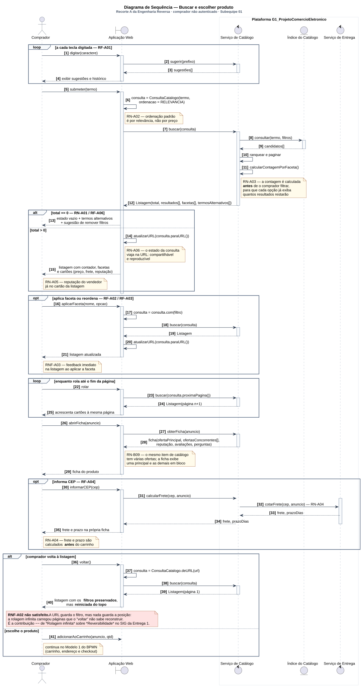

# Diagrama de Sequência

Conforme a divisão registrada em [1.1.1. SubEquipe_01](/Base/Relatórios/1.1.1.SubEquipe_01.md), este diagrama modela o fluxo de **busca e escolha de produto** — o Recorte A da [Engenharia Reversa](https://unbarqdsw2026-2-turma01.github.io/2026.2-T01-_G1_ProjetoComercioEletronico_Entrega_01/#/Base/Relat%C3%B3rios/SubEquipe01/EngenhariaReversa) da Entrega 1. É a continuação natural daquele recorte: lá, o inventário de tela registrou *o que* o comprador vê; aqui, o diagrama registra *quem faz o quê, em que ordem*, para que ele veja.

---

## O que é o artefato

O diagrama de sequência é o diagrama de interação da UML que enfatiza a **ordem temporal** das mensagens trocadas entre objetos (BOOCH; RUMBAUGH; JACOBSON, 2005). Cada participante tem uma linha de vida vertical; cada mensagem é uma seta horizontal; o tempo corre de cima para baixo. A UML 2 acrescentou os **fragmentos combinados** — `alt`, `opt`, `loop`, entre outros —, que permitem expressar condição, opcionalidade e repetição sem sair do diagrama (OMG, 2017, seção 17).

Três recursos da notação são estruturais neste diagrama:

1. **Estereótipos de Jacobson** para os participantes: `boundary` para a interface, `control` para os serviços, `entity` para o que persiste. A distinção vem de Jacobson et al. (1992) e é útil aqui porque separa o que foi **observado** (a fronteira) do que foi **inferido** (controle e entidade).
2. **Barras de ativação**, que mostram durante quanto tempo cada participante está executando. São o que torna visível, por exemplo, que a contagem por faceta acontece *dentro* da busca, antes da resposta.
3. **Fragmentos combinados** com guardas, que substituem os gateways do BPMN: `alt` para a bifurcação com resultado vazio, `opt` para o que o comprador pode ou não fazer, `loop` para o autocompletar e a rolagem.

Larman (2004) chama de *diagrama de sequência de sistema* a variante em que o sistema é uma caixa-preta e só as mensagens do ator aparecem. Este diagrama vai um passo além — abre a plataforma em três participantes — mas mantém a cautela: os participantes internos são hipóteses coerentes com o comportamento, não observação.

---

## O artefato

Clique na imagem para abrir em tela cheia, com zoom.

> _Figura 2 — Diagrama de Sequência do fluxo de busca e escolha de produto, com o comprador não autenticado. Participantes: o comprador (ator), a aplicação web (`boundary`), o serviço de catálogo e o serviço de entrega (`control`) e o índice do catálogo (`entity`). Mensagens numeradas de 1 a 41. Fragmentos `loop`, `alt` e `opt` com guardas que citam a regra de negócio correspondente. A nota vermelha marca o requisito não satisfeito. Fonte: Subequipe 01, 2026._

---

## Por que este fluxo, e por que sequência

O fluxo é o mesmo que engenheirei na Entrega 1, pelas mesmas três razões de lá: é integralmente observável sem conta; é o de maior densidade de decisões de usabilidade; e é onde o comprador desiste, quando desiste. A elas se soma uma quarta, própria desta entrega: é o fluxo em que a ordem das operações **é** o achado. Que a contagem por faceta aconteça antes do filtro, que a URL seja atualizada antes de a listagem ser exibida, que o "voltar" reconstrua a consulta mas não a posição — nada disso aparece num diagrama estático. Aparece na sequência.

Entre os diagramas dinâmicos, o de sequência foi escolhido em vez do de atividades porque a pergunta aqui não é "que passos o comprador dá" — o BPMN da Entrega 1 já respondeu isso para o checkout — mas **"que participante é responsável por cada resposta"**. Essa é a pergunta que o diagrama de sequência foi feito para responder e que o de atividades responde mal.

---

## Como o diagrama foi montado

| Passo | O que foi feito |
| -- | -- |
| 1 | Os seis estados de tela do inventário do Recorte A viraram os seis blocos do diagrama: sugestões, busca, refinamento, rolagem, ficha e retorno |
| 2 | Cada transição observada virou uma mensagem do comprador para a fronteira; cada resposta observada, uma mensagem de retorno |
| 3 | Para cada resposta, perguntei *que participante interno precisa existir para produzi-la* — daí o serviço de catálogo, o índice e o serviço de entrega |
| 4 | As regras de negócio RN-A01 a RN-A06 foram posicionadas como guardas de fragmento ou como notas sobre a mensagem que as evidencia |
| 5 | Os tipos das mensagens foram tomados do [Diagrama de Classes](/Base/Relatórios/Subequipe01/ModelagemEstatica/DiagramaDeClasses.md): `ConsultaCatalogo`, `Listagem`, `Faceta` e, para o frete, `ServicoDeEntrega.calcularFrete` |
| 6 | O bloco final foi modelado como `alt` porque a observação da Entrega 1 (etapa 4, provocação de exceções) mostrou que o retorno é o ponto de falha |
| 7 | Revisão em pares ([reunião de 16/09/2026](/ReunioesAtas/Subequipe1/Ata16_09.md)): a chamada de frete, que saía da fronteira direto para o serviço de entrega, passou a ser roteada pelo serviço de catálogo (mensagens 31–34), alinhando a Sequência à dependência `Serviço de Catálogo → IFrete` do [Diagrama de Componentes](/Base/Relatórios/Subequipe01/ModelagemEstatica/DiagramaDeComponentes.md). O diagrama passou de 39 para 41 mensagens |

---

## O que cada bloco registra

| Bloco | Mensagens | Regra evidenciada | O que o diagrama torna visível |
| -- | -- | -- | -- |
| Sugestões ao digitar | 1–4, `loop` | RF-A01 | Uma consulta ao catálogo **por tecla** — a origem da correlação `−` de *Autocompletar* sobre *Tempo de Resposta* no SIG |
| Busca | 5–15 | RN-A02, RN-A03, RN-A06, RN-A05, RN-A01 | A ordenação padrão é fixada pela fronteira antes de chamar o serviço; a contagem por faceta é uma automensagem do serviço **dentro** da ativação da busca; a URL é atualizada antes da exibição |
| Refinamento | 16–21, `opt` | RF-A02, RF-A03, RNF-A03 | Aplicar faceta é uma nova busca com a consulta derivada — e uma nova atualização de URL |
| Rolagem | 22–25, `loop` | Inventário: carregamento por rolagem, sem paginação clicável | Cada rolagem é `buscar(proximaPagina())`; os cartões são **acrescentados** à mesma página |
| Ficha | 26–35 | RN-B09, RF-A04, RN-A04 | A ficha traz oferta principal e concorrentes numa única resposta (28); o frete é um `opt` em que a fronteira pede ao serviço de catálogo (31), o catálogo pede ao serviço de entrega — `cotarFrete`, 32 — e a resposta volta pelo mesmo caminho (33 e 34) |
| Retorno | 36–41, `alt` | RNF-A02 | A fronteira reconstrói a consulta de `ConsultaCatalogo.deURL(url)` e pede a **página 1** — os filtros voltam, a posição não |

---

## O achado que o diagrama expõe

O bloco final é o motivo de este diagrama existir. Na Entrega 1, RNF-A02 — *preservar filtros e posição ao retornar à listagem* — foi registrado como requisito que o sistema **não satisfaz**, e o SIG atribuiu a causa à rolagem infinita com uma contribuição `−−` sobre *Reversibilidade*. O que faltava era mostrar o mecanismo. O diagrama de sequência mostra:

- na mensagem 14, a fronteira grava a consulta na URL — mas a consulta tem `pagina`, e a rolagem infinita (mensagens 22–25) carrega páginas **sem** atualizar esse campo, porque não há transição de página do ponto de vista do comprador;
- na mensagem 37, o "voltar" reconstrói a consulta da URL — e obtém a página 1, porque foi isso que ficou gravado;
- logo, a mensagem 40 devolve os filtros certos na posição errada.

A URL guarda o filtro e nada guarda a posição. Não é um defeito de implementação do "voltar": é uma consequência lógica de combinar estado na URL com rolagem infinita. O diagrama transforma o que era uma observação empírica ("a listagem reinicia do topo") em uma explicação estrutural, e essa explicação é a que o Diagrama de Classes já antecipava ao dar a `ConsultaCatalogo` um campo `pagina` que a rolagem não alimenta.

---

## Rastreabilidade

| Elemento | Vem de | Vai para |
| -- | -- | -- |
| Seis blocos do diagrama | Seis estados de tela do inventário do Recorte A | — |
| Guardas dos fragmentos | RN-A01 a RN-A06, RF-A01 a RF-A06, RNF-A02, RNF-A03 | — |
| `ConsultaCatalogo`, `Listagem`, `Faceta` | Diagrama de Classes | — |
| `loop` de autocompletar e `loop` de rolagem | RF-A01; inventário | SIG da Entrega 1: correlações `−` sobre *Tempo de Resposta* |
| `alt` de retorno | Etapa 4 da Engenharia Reversa; RNF-A02 | SIG da Entrega 1: `−−` de *Rolagem infinita* sobre *Reversibilidade*; claim C1 |
| Mensagem 41, `adicionarAoCarrinho` | T-B01 | Modelo 1 do BPMN da Entrega 1; [Máquina de Estados](/Base/Relatórios/Subequipe01/ModelagemDinamica/DiagramaDeMaquinaDeEstados.md) do Pedido |
| Mensagens 31–34, `calcularFrete` e `cotarFrete` | RN-A04; Diagrama de Classes: `ServicoDeEntrega.calcularFrete` (decisão 11) | Diagrama de Componentes: a mensagem 32 **é** a dependência `Serviço de Catálogo → IFrete` (decisão 2 daquela página) |
| `Serviço de Catálogo`, `Serviço de Entrega` | — | [Diagrama de Componentes](/Base/Relatórios/Subequipe01/ModelagemEstatica/DiagramaDeComponentes.md): `ICatalogo`, `IFichaProduto`, `IFrete` |

---

## Limites do diagrama

- **Os participantes internos são inferidos.** O comprador e a aplicação web foram observados; o serviço de catálogo, o índice e o serviço de entrega são a explicação mais simples para as respostas vistas. Podem ser um serviço só, ou dez. O diagrama representa uma partição plausível, não a real.
- **Não há mensagens de erro além do resultado vazio.** Falha de rede, tempo esgotado e indisponibilidade não foram provocados na Entrega 1 e não estão aqui. Um diagrama de produção teria um fragmento `break` para cada.
- **A rolagem infinita foi modelada como busca da próxima página.** É coerente com o comportamento, mas a implementação real pode usar cursor, offset ou pré-carregamento — três estratégias com custos diferentes que o diagrama não distingue.
- **O `alt` final assume que o comprador volta com o botão do navegador.** Foi assim que a exceção foi provocada na Entrega 1. Um botão "voltar" da própria aplicação poderia se comportar diferente; não foi observado nenhum.
- **A explicação do achado é dedução, não confirmação.** Que a URL não recebe a página durante a rolagem é consistente com tudo o que foi visto, mas não inspecionei a URL durante a rolagem na Entrega 1 — inspecionei antes e depois. É a hipótese mais econômica, e fica registrada como tal.
- **O roteamento do frete pelo catálogo é escolha de consistência, não observação.** A interface mostra que o frete aparece na ficha (RN-A04); não mostra se a fronteira fala com o serviço de entrega diretamente ou através do catálogo. A Sequência segue o Componentes — `Serviço de Catálogo → IFrete` — para que os dois digam a mesma coisa; a implementação real pode ser a outra.

---

## Referências

BOOCH, Grady; RUMBAUGH, James; JACOBSON, Ivar. **UML: guia do usuário**. 2. ed. Rio de Janeiro: Elsevier, 2005.

FOWLER, Martin. **UML Distilled: A Brief Guide to the Standard Object Modeling Language**. 3. ed. Boston: Addison-Wesley, 2004.

JACOBSON, Ivar; CHRISTERSON, Magnus; JONSSON, Patrik; ÖVERGAARD, Gunnar. **Object-Oriented Software Engineering: A Use Case Driven Approach**. Wokingham: Addison-Wesley, 1992.

LARMAN, Craig. **Applying UML and Patterns: An Introduction to Object-Oriented Analysis and Design and Iterative Development**. 3. ed. Upper Saddle River: Prentice Hall, 2004.

OBJECT MANAGEMENT GROUP. **OMG Unified Modeling Language (OMG UML), Version 2.5.1**. Needham: OMG, 2017. Disponível em: https://www.omg.org/spec/UML/2.5.1. Acesso em: 16 set. 2026.

---

## Histórico de Versões

| Versão | Data | Descrição | Autor(es) | Revisor(es) |
| -- | -- | -- | -- | -- |
| 1.0 | 17/09/2026 | Criação da página; diagrama de sequência do fluxo de busca e escolha de produto, com fragmentos combinados rastreados às regras do Recorte A e explicação estrutural do RNF-A02 não satisfeito | Pedro Luciano de Azevedo | Patrick Anderson Carvalho dos Santos — revisão em pares do diagrama, [16/09/2026](/ReunioesAtas/Subequipe1/Ata16_09.md) |
| 1.1 | 17/09/2026 | Atualização após as revisões em pares: chamada de frete roteada pelo serviço de catálogo (mensagens 31–34, passo 7 da montagem), numeração de 41 mensagens na figura, nos blocos, no achado e na rastreabilidade, linha de rastreabilidade para `calcularFrete`/`cotarFrete` e novo limite | Pedro Luciano de Azevedo | Patrick Anderson Carvalho dos Santos — revisão em pares do relatório, [17/09/2026](/ReunioesAtas/Subequipe1/Ata17_09.md) |
