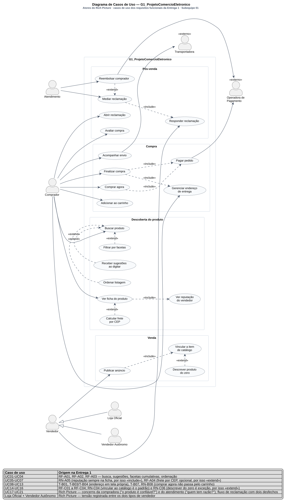

# Diagrama de Casos de Uso

Conforme a divisão registrada em [1.1.1. SubEquipe_01](/Base/Relatórios/1.1.1.SubEquipe_01.md) e decidida na [reunião de 12/09/2026](/ReunioesAtas/Subequipe1/Ata12_09.md), este diagrama é de responsabilidade de **Guilherme Costa Zanella**. Ele continua o Rich Picture da Entrega 1: os *stakeholders* registrados lá — a compradora, a loja oficial, o vendedor autônomo, o atendimento, a transportadora, a operadora de pagamento — são aqui os atores, e as preocupações de cada um viram os casos de uso que a plataforma precisa atender.

---

## O que é o artefato

O diagrama de casos de uso descreve o sistema pelo que ele oferece a quem está fora dele: **atores** — papéis desempenhados por pessoas ou sistemas externos — e **casos de uso** — unidades de funcionalidade que produzem um resultado de valor observável para um ator (JACOBSON et al., 1992; OMG, 2017, seção 18). Os relacionamentos `«include»` e `«extend»` decompõem casos de uso: `«include»` quando o comportamento incluído acontece **sempre**; `«extend»` quando acontece **em condições específicas**, sem que o caso base saiba da extensão.

Cockburn (2001) alerta que o diagrama é o índice, não o conteúdo: o valor está nos cenários que cada elipse representa. Aqui, esses cenários já existem — são as transições de estado e as regras de negócio da Engenharia Reversa da Entrega 1 —, e o diagrama funciona como o mapa que os conecta aos atores do Rich Picture.

A UML classifica o diagrama de casos de uso entre os de comportamento. Ele está na modelagem estática desta subequipe pela mesma razão que a Subequipe 03 o colocou lá: ele não expressa ordem nem tempo, e serve de ponte entre o modelo de domínio e os diagramas de interação.

---

## O artefato

Clique na imagem para abrir em tela cheia, com zoom.

> _Figura 6 — Diagrama de Casos de Uso do G1\_ProjetoComercioEletronico. Sete atores, dois deles `«externo»`; generalização entre Vendedor e seus dois tipos; vinte e um casos de uso em quatro pacotes, cada elipse com o seu identificador `UC01`–`UC21`; dezesseis associações e doze relacionamentos `«include»`/`«extend»`. A legenda rastreia cada faixa de identificadores ao requisito funcional ou à concern do Rich Picture que a origina. Fonte: Subequipe 01, 2026._

Versão revisada em 17/09/2026: as elipses passaram a carregar os identificadores `UC01`–`UC21`, aplicando a ação 6 da [ata de 16/09/2026](/ReunioesAtas/Subequipe1/Ata16_09.md), que apontou que a legenda os citava sem que o desenho os mostrasse.

---

## Por que assumi o diagrama de casos de uso

**O Rich Picture já era a lista de atores.** Monk e Howard (1998) definem *estrutura* como os aspectos que mudam lentamente, incluindo "todas as pessoas que usarão ou poderão ser afetadas pelo sistema". Na Entrega 1 registrei sete: Jenny (compradora), loja oficial, vendedor autônomo, atendimento, transportadora, operadora de pagamento e o catálogo de produtos. Seis viraram atores; o catálogo, não. O critério da passagem é o da própria UML — ator é um papel **externo** ao sistema que interage com ele. Transportadora e operadora são organizações de terceiros que trocam informação com a plataforma, e por isso entram estereotipadas `«externo»`. O catálogo falha no teste: a seção 7 da nossa Engenharia Reversa mostrou que ele é o eixo do produto, escrito pelo vendedor quando anuncia (RN-C04) e lido pelo comprador quando busca (RN-B09) — está **dentro** da fronteira, e por isso aparece como classe no Diagrama de Classes do Pedro, não como ator aqui. O contorno azul que eu desenhei à mão no Rich Picture para separar a plataforma do resto virou, literalmente, o retângulo de fronteira deste diagrama.

**A tensão que eu grafei virou uma generalização.** As espadas cruzadas entre loja oficial e vendedor autônomo eram a única tensão do meu Rich Picture. Os dois fazem exatamente os mesmos casos de uso — publicam anúncio e respondem reclamação —, e por comportamento seriam um ator só. Estão no diagrama como especializações de `Vendedor` porque um diagrama de casos de uso é sobre **quem**, e a tensão que eu observei é entre dois *quem*. Vale o contraste: o Pedro modelou o mesmo fato como enumeração, `Vendedor.tipo: TipoVendedor { LOJA_OFICIAL, AUTONOMO }`. Nenhum dos dois está errado, e a divergência é informativa — o diagrama de classes pergunta que dados o sistema guarda, e aí um tipo é um valor de atributo; o de casos de uso pergunta quem usa o sistema, e aí a mesma distinção é papel. O fato da Entrega 1 é um só; as duas modelagens diferem porque as perguntas diferem.

**As concerns viraram casos de uso.** A passagem mais direta entre os dois artefatos: um balão de pensamento é a pergunta que o ator faz; um caso de uso é o resultado de valor que o sistema entrega, que é como Jacobson et al. (1992) o definem. O balão da Jenny — "o produto é confiável?" — virou `Ver reputação do vendedor`, e está como `«include»` porque RN-A05 diz que a reputação aparece sempre. A segunda metade do mesmo balão — "quando chega?" — virou dois casos de uso em momentos diferentes da jornada: `Calcular frete por CEP`, antes da compra (RF-A04), e `Acompanhar envio`, depois dela. O balão do atendimento — "quem tem razão?" — virou `Mediar reclamação`, que é também a decisão central do meu [Diagrama de Atividades](/Base/Relatórios/Subequipe01/ModelagemDinamica/DiagramaDeAtividades.md).

---

## Como o diagrama foi montado

| # | Passo | O que foi feito |
| -- | -- | -- |
| 1 | Atores | Cada um dos sete elementos de estrutura do Rich Picture foi testado contra a definição de ator: papel externo que interage com o sistema. Seis passaram; o catálogo ficou dentro da fronteira |
| 2 | Fronteira e pacotes | O contorno azul do Rich Picture virou o retângulo de fronteira; os quatro pacotes internos — *Descoberta do produto*, *Compra*, *Venda* e *Pós-venda* — agrupam os casos de uso por **objetivo do ator**. Não são os pacotes do Diagrama de Classes, que agrupa por **coesão de domínio** (*Contas e Acesso*, *Catálogo e Descoberta*, *Transação*, *Pós-venda*): a divergência é de critério, e está registrada como decisão 5 da [ata de 17/09/2026](/ReunioesAtas/Subequipe1/Ata17_09.md) |
| 3 | Casos de uso do comprador | RF-A01 a RF-A05 viraram o pacote *Descoberta do produto*; as transições T-B01 a T-B08 viraram o pacote *Compra* |
| 4 | Casos de uso do vendedor | RF-C01 a RF-C04 sustentam os três casos de uso do pacote *Venda*, preservando a precedência que RN-C04 impõe: vincular ao catálogo antes de descrever |
| 5 | Casos de uso de pós-venda | O processo 3 do Rich Picture — reclamação, mediação, resposta ou reembolso — virou o pacote *Pós-venda* |
| 6 | `«include»` ou `«extend»` | Para cada par de casos de uso relacionados, a pergunta foi "acontece sempre ou só às vezes?", e a resposta teve de vir de uma regra da Entrega 1, não de intuição. Os pares sem regra que os sustentasse foram desfeitos |
| 7 | Legenda e revisão | Cada faixa de casos de uso recebeu, na legenda embutida, o código do achado que a origina; o que não tinha origem observada foi declarado nos limites desta página |
| 8 | Revisão em pares | O diagrama foi revisado por Pedro Luciano de Azevedo na reunião de 16/09/2026 e esta página, na de 17/09/2026, pelo rodízio registrado nas duas atas. Os apontamentos aceitos estão aplicados nesta versão: identificadores nas elipses, critério dos pacotes, interfaces dos parceiros externos na rastreabilidade e a citação da Máquina de Estados na decisão 3 |

---

## Decisões de modelagem e sua origem

### 1. `Ver reputação do vendedor` é `«include»`; `Calcular frete por CEP` é `«extend»`

**A decisão.** Dois casos de uso pendurados no mesmo `Ver ficha do produto`, com estereótipos opostos.

**Por quê.** RN-A05 registra que "todo produto de marketplace exibe a reputação do vendedor junto ao preço, **já na listagem**" — quer dizer, sempre, sem que o comprador peça. Comportamento que o caso base sempre executa é `«include»`. RN-A04 e RF-A04 registram que frete e prazo dependem do CEP e são calculados na ficha do produto; sem CEP informado, não há cálculo. Comportamento condicional é `«extend»`. O par é o melhor exemplo da regra que organizou o diagrama inteiro: o estereótipo não é escolha de estilo, é uma afirmação sobre a frequência do comportamento, e existe um achado da Entrega 1 que a confirma ou a desmente.

**Trade-off.** `«extend»` é o relacionamento mais criticado da UML, e Cockburn (2001) recomenda evitá-lo justamente porque empurra para o desenho uma condição que o texto do caso de uso expressaria melhor. Mantive porque a distinção entre RN-A05 e RF-A04 é precisamente "sempre × às vezes": apagá-la faria o diagrama afirmar que o frete aparece sozinho, como a reputação — e isso a observação desmente.

### 2. Sugestões, facetas e ordenação são `«extend»` de `Buscar produto`

**A decisão.** Os três recursos da busca são extensões, não partes obrigatórias.

**Por quê.** RF-A01, RF-A02 e RF-A03. Uma busca submetida sem tocar em sugestão, faceta ou ordenação é um percurso completo — e é o percurso padrão, já que RN-A02 registra a ordenação por relevância como comportamento inicial. O que pode não ocorrer é extensão.

**Trade-off.** Três extensões sobre o mesmo caso base deixam o desenho mais pesado do que um único `Buscar produto` deixaria. A alternativa — um caso de uso "Buscar e filtrar" — esconderia que RNF-A03, o feedback imediato ao aplicar uma faceta, tem um destinatário específico: a faceta, não a busca. Como este diagrama serve de índice para os requisitos da Entrega 1, separar valeu o peso.

### 3. `Comprar agora` e `Finalizar compra` incluem `Pagar pedido` separadamente

**A decisão.** Dois caminhos de compra, cada um com seu próprio `«include»` para o mesmo `Pagar pedido`.

**Por quê.** RN-B08 — "existem dois caminhos de compra, e o direto não passa pelo carrinho" —, sustentada por T-B08 (comprar agora leva ao checkout sem passar pelo carrinho) e T-B07 (continuar no carrinho leva à sequência de checkout). Um caso de uso "Comprar" unificado apagaria o único achado do Recorte B sobre topologia de fluxo.

**Trade-off.** A duplicação da seta é aparente: a leitura correta é que `Pagar pedido` é ponto de convergência, e a [Máquina de Estados](/Base/Relatórios/Subequipe01/ModelagemDinamica/DiagramaDeMaquinaDeEstados.md) do Patrick a confirma — mas em outro ponto do desenho, e não onde esta página afirmava. A revisão de 17/09 corrigiu a citação (apontamento 3 da seção 5.3 da [ata de 17/09/2026](/ReunioesAtas/Subequipe1/Ata17_09.md)): na máquina, os dois caminhos de compra, T-B07 e T-B08, entram pela **transição inicial**; os dois caminhos que chegam a `Aguardando pagamento` são `endereço confirmado` e `tentar outro meio`, que são outra coisa. A convergência existe, a referência cruzada é que estava no lugar errado. Vale registrar que T-B07 e T-B08 estão marcadas como **inferidas** na Engenharia Reversa — o percurso foi interrompido antes da tela de pagamento —, e portanto esta decisão herda a inferência.

### 4. `Finalizar compra` inclui `Gerenciar endereço de entrega`

**A decisão.** O endereço é um caso de uso próprio, sempre incluído pela finalização, e não um passo interno dela.

**Por quê.** Três achados independentes do Recorte B apontam para a mesma fronteira. T-B03: clicar em "Enviar para \<endereço\>" **navega para outra tela**, um hub de endereços, e não abre janela sobreposta. T-B04: "Adicionar novo endereço" leva a um formulário **em outro subdomínio**. RN-B02: o endereço é dado da conta, não do pedido — vale para a sessão. Isso é uma unidade de comportamento com valor próprio, alcançável fora do checkout, que é a definição de caso de uso.

**Trade-off.** É `«include»`, não `«extend»`, embora um comprador com endereço já salvo apenas confirme o que está lá. O critério que apliquei foi o de sempre/às vezes sobre o **comportamento**, não sobre o esforço: escolher para onde vai a entrega acontece em toda compra; o que varia é o custo de fazê-lo. Aplicar o critério sobre o esforço faria o diagrama dizer que existe compra sem endereço. É a mesma fronteira que o Patrick isolou como `Serviço de Contas e Endereços` no [Diagrama de Componentes](/Base/Relatórios/Subequipe01/ModelagemEstatica/DiagramaDeComponentes.md), a partir do mesmo T-B04 — dois diagramas, duas notações, o mesmo achado.

### 5. `Descrever produto do zero` é `«extend»` de `Vincular a item de catálogo`

**A decisão.** O vínculo com o catálogo é a base; descrever do zero é a extensão.

**Por quê.** RN-C04 — a plataforma tenta vincular a nova oferta a um item já existente **antes** de permitir descrição livre — e RN-C06 — descrever do zero é o caminho de exceção, não o padrão. A direção do `«extend»` é, ela própria, a afirmação: se fosse `«include»`, o diagrama diria que toda publicação passa por uma descrição livre, o contrário do que foi observado.

**Trade-off.** RN-C06 está marcada como **inferida** na Engenharia Reversa, assim como T-C04 e T-C05. Ou seja, o relacionamento com a evidência mais fraca do pacote é o que carrega a asserção mais forte sobre o modelo de negócio. Mantive a direção porque a regra que a sustenta do outro lado, RN-C04, é observada — mas a exceção, não o padrão, é o que está inferido.

### 6. Operadora e Transportadora são atores `«externo»` ligados a casos de uso, não a atores

**A decisão.** `Operadora de Pagamento` se liga a `Pagar pedido` e a `Reembolsar comprador`; `Transportadora` se liga a `Acompanhar envio`. Nenhuma linha liga um ator humano a outro ator.

**Por quê.** É a codificação do achado que eu mesmo registrei como não previsto no Rich Picture: "Jenny não tem ligação direta com os vendedores — produto, dinheiro, informação e reclamação passam todos pela plataforma". Num diagrama de casos de uso, a única maneira de dizer isso é topológica: toda associação atravessa a fronteira do sistema. O diagrama não afirma a centralidade da plataforma em nenhuma etiqueta; ele a torna impossível de violar no desenho.

**Trade-off.** O preço é que a mesma topologia se aplica a `Vendedor`, que também nunca toca `Comprador` — inclusive em `Responder reclamação`, onde as duas pessoas de fato conversam, ainda que mediadas. Um leitor desatento pode ler isso como ausência de comunicação entre elas. Quem desfaz o mal-entendido é o Diagrama de Atividades, em que a mediação aparece como fluxo atravessando as três raias.

### 7. `Atendimento` é ator, não parte do sistema

**A decisão.** O atendimento humano está **fora** da fronteira, com dois casos de uso próprios: `Mediar reclamação` e `Reembolsar comprador`.

**Por quê.** No Rich Picture ele é *stakeholder* com concern própria — "quem tem razão?" —, e concern, no sentido de Monk e Howard (1998), é atributo de quem trabalha, não de software. Quem decide o desfecho de uma mediação é uma pessoa; o que a plataforma faz é registrar a decisão e executar suas consequências — notificar, estornar, encerrar. Essa divisão é literalmente a raia do meio do meu Diagrama de Atividades: as ações ali são de registro e execução, e a única de julgamento, `Analisar evidências`, tem uma pessoa por trás.

**Trade-off.** É a decisão mais discutível desta página, e a alternativa é defensável. O Patrick modelou `Serviço de Pós-venda` como componente **da** plataforma, e o Pedro modelou `Atendente` como classe do domínio, com a operação `mediar(r: Reclamacao)` — nos dois diagramas o atendimento está dentro. Não há contradição, e sim mudança de nível: uma classe `Atendente` é o registro que o sistema guarda de uma pessoa; um ator `Atendimento` é a pessoa que opera o sistema. Registro o ponto aqui porque é neste elemento que as três leituras se tocam. A subequipe chegou a decidir, na reunião de 16/09/2026, unificar os nomes (decisão 9 da [ata de 16/09/2026](/ReunioesAtas/Subequipe1/Ata16_09.md)); em 17/09 reviu a decisão e manteve os três — ator `Atendimento` aqui, raia `Plataforma (Atendimento)` no [Diagrama de Atividades](/Base/Relatórios/Subequipe01/ModelagemDinamica/DiagramaDeAtividades.md) e classe `Atendente` no [Diagrama de Classes](/Base/Relatórios/Subequipe01/ModelagemEstatica/DiagramaDeClasses.md) —, com referência cruzada explícita nas três páginas, porque a divergência é de nível de abstração e unificá-la apagaria a distinção (decisão 4 da [ata de 17/09/2026](/ReunioesAtas/Subequipe1/Ata17_09.md)).

---

## Recursos da notação utilizados

As Diretrizes pedem para usar os vários recursos de modelagem da notação. Este diagrama emprega:

| Recurso | Onde aparece | Por que estava lá |
| -- | -- | -- |
| Ator | Sete papéis externos ao sistema | Papel de quem interage com a plataforma |
| Estereótipo `«externo»` em ator | Operadora de Pagamento e Transportadora | Marca o ator que é sistema de terceiro, e não pessoa — ator não precisa ser humano (BOOCH; RUMBAUGH; JACOBSON, 2005) |
| Generalização entre atores | `Vendedor` → `Loja Oficial` e `Vendedor Autônomo` | Tensão do Rich Picture: dois papéis distintos com os mesmos casos de uso |
| Fronteira do sistema | Retângulo `G1_ProjetoComercioEletronico` | Contorno azul do Rich Picture; separa quem usa de o que é usado |
| Pacote dentro da fronteira | Descoberta do produto, Compra, Venda, Pós-venda | Agrupamento por objetivo do ator — critério distinto do Diagrama de Classes, que agrupa por coesão de domínio |
| Associação ator–caso de uso | Dezesseis associações | Participação do ator no caso de uso |
| `«include»` | Seis relacionamentos | Comportamento que o caso base executa sempre |
| `«extend»` | Seis relacionamentos | Comportamento condicional, sem que a base conheça a extensão |
| Identificador de caso de uso | `UC01`–`UC21`, dentro de cada elipse | Liga a elipse à faixa da legenda embutida e à tabela de rastreabilidade desta página |
| Legenda embutida | Rodapé da imagem, por faixa `UC01`–`UC21` | Rastreabilidade legível sem sair do diagrama |

---

## Rastreabilidade

| Elemento | Vem de | Vai para |
| -- | -- | -- |
| `Comprador` | Jenny, no centro do Rich Picture | `Comprador` no [Diagrama de Classes](/Base/Relatórios/Subequipe01/ModelagemEstatica/DiagramaDeClasses.md); raia do Comprador no [Diagrama de Atividades](/Base/Relatórios/Subequipe01/ModelagemDinamica/DiagramaDeAtividades.md) |
| `Vendedor`, `Loja Oficial`, `Vendedor Autônomo` | Estrutura e tensão do Rich Picture | `Vendedor.tipo: TipoVendedor` no Diagrama de Classes |
| `Atendimento` | Concern "quem tem razão?" | Classe `Atendente`; raia `Plataforma (Atendimento)` no Diagrama de Atividades |
| `Operadora de Pagamento`, `Transportadora` | Estrutura do Rich Picture | Componentes `«externo»` no [Diagrama de Componentes](/Base/Relatórios/Subequipe01/ModelagemEstatica/DiagramaDeComponentes.md), fornecendo `IAutorizacao` e `ICotacaoEntrega`. `IPagamento` e `IRastreio` são interfaces dos serviços da própria plataforma — Pagamentos e Entrega —, e não dos parceiros: a correção veio do apontamento 2 da seção 5.3 da [ata de 17/09/2026](/ReunioesAtas/Subequipe1/Ata17_09.md) |
| `UC01`–`UC04` — `Buscar produto` e suas três extensões | RF-A01, RF-A02, RF-A03; RN-A02 | [Diagrama de Sequência](/Base/Relatórios/Subequipe01/ModelagemDinamica/DiagramaDeSequencia.md) — busca e escolha de produto |
| `UC05`–`UC07` — ficha, reputação e frete | RN-A05; RN-A04 e RF-A04 | Diagrama de Sequência; interfaces `IFichaProduto` e `IFrete` |
| `UC08`–`UC10` — carrinho, endereço e finalização | T-B01, T-B03, T-B04, T-B07; RN-B01, RN-B02 | Máquina de Estados do Pedido — `Aguardando endereço → Aguardando pagamento` |
| `UC11`–`UC12` — `Comprar agora` e `Pagar pedido` | RN-B08, T-B08 | Máquina de Estados do Pedido — `Autorizando`, `Pago`, `Recusado` |
| `UC13` — `Acompanhar envio` | Processo 2 do Rich Picture (produto: vendedor → transportadora → Jenny) | Estados `Enviado` e `Entregue`; interface `IRastreio`, fornecida pelo `Serviço de Entrega` |
| `UC14`–`UC16` — pacote Venda | RF-C01 a RF-C04; RN-C03, RN-C04, RN-C06 | Máquina de Estados do Anúncio — estado composto `Rascunho` |
| `UC17`–`UC21` — pacote Pós-venda | Processo 3 do Rich Picture e as concerns da Jenny e do atendimento | Diagrama de Atividades, integralmente; estados `Em disputa` e `Reembolsado` |

---

## Limites do diagrama

- **O diagrama não mostra ordem nem condição.** É a mesma limitação que eu apontei no senso crítico do Rich Picture, e ela não foi resolvida por trocar de notação: `Buscar produto` aparece ao lado de `Finalizar compra` sem que nada diga que uma antecede a outra. Um diagrama de casos de uso lido como fluxo é uma leitura errada dele. Cockburn (2001) coloca a questão nos termos certos — o diagrama é o índice, e o conteúdo está nos cenários; aqui os cenários estão nos outros cinco diagramas da subequipe, e é a tabela de rastreabilidade que faz as vezes de sumário.
- **Os casos de uso de pós-venda são inferidos, não observados.** `Abrir reclamação`, `Responder reclamação`, `Mediar reclamação` e `Reembolsar comprador` exigem uma compra concluída e um problema com ela — nada disso foi percorrido na Entrega 1. Eles vêm do processo 3 do Rich Picture, que por sua vez veio de conhecimento de domínio. É o pacote de origem mais fraca do diagrama.
- **`Acompanhar envio` pressupõe rastreio.** A transportadora está no Rich Picture; um código de rastreio consultável pelo comprador, não. O caso de uso existe por coerência com o processo 2, não por observação.
- **Nem todo requisito da Entrega 1 virou caso de uso.** RF-A06 — oferecer termos alternativos em consulta sem resultados — não tem elipse no diagrama, porque o estado vazio da busca é uma resposta do sistema dentro de `Buscar produto`, e não uma unidade de comportamento que o comprador solicite. A decisão é defensável, mas o efeito colateral é que um requisito observado some do índice; quem usar este diagrama como checklist de requisitos vai deixá-lo passar.
- **Vinte e um casos de uso são um recorte, não o sistema.** Ficaram de fora conta e acesso — login e cadastro, que a Subequipe 03 modelou — e tudo o que é administrativo: moderar anúncio, gerir comissão, repassar valor ao vendedor. O repasse, inclusive, está desenhado no meu próprio Rich Picture e não está aqui, porque não tem ator de interface.
- **Não há descrição textual dos casos de uso.** Cockburn (2001) diria que o essencial ficou de fora: o cenário principal, as extensões e as pré-condições de cada elipse. Vinte e uma descrições seriam outra entrega; a decisão assumida é que as elipses **indexam** requisitos já escritos na Entrega 1 em vez de os substituir, e a tabela de rastreabilidade é o que torna essa decisão verificável.
- **A subequipe não aparece como ator.** Monk e Howard (1998) recomendam incluir os analistas na estrutura, para lembrar que também têm ponto de vista e viés. É a mesma lacuna que eu reconheci na Entrega 1, e ela se propagou para cá.

---

## Referências

BOOCH, Grady; RUMBAUGH, James; JACOBSON, Ivar. **UML: guia do usuário**. 2. ed. Rio de Janeiro: Elsevier, 2005.

COCKBURN, Alistair. **Writing Effective Use Cases**. Boston: Addison-Wesley, 2001.

JACOBSON, Ivar; CHRISTERSON, Magnus; JONSSON, Patrik; ÖVERGAARD, Gunnar. **Object-Oriented Software Engineering: A Use Case Driven Approach**. Wokingham: Addison-Wesley, 1992.

MONK, Andrew; HOWARD, Steve. The Rich Picture: A Tool for Reasoning About Work Context. **Interactions**, v. 5, n. 2, p. 21–30, mar./abr. 1998.

OBJECT MANAGEMENT GROUP. **OMG Unified Modeling Language (OMG UML), Version 2.5.1**. Needham: OMG, 2017. Disponível em: https://www.omg.org/spec/UML/2.5.1. Acesso em: 16 set. 2026.

---

## Histórico de Versões

| Versão | Data | Descrição | Autor(es) | Revisor(es) |
| -- | -- | -- | -- | -- |
| 1.0 | 16/09/2026 | Criação da página com o diagrama (autoria coletiva da subequipe) e o roteiro de redação | Pedro Luciano de Azevedo | -- |
| 1.1 | 17/09/2026 | Redação do conteúdo da página: justificativa da escolha do diagrama a partir do Rich Picture, método de montagem em sete passos, sete decisões de modelagem rastreadas a RN-A, RN-B, RN-C e às transições T-B e T-C, recursos da notação utilizados, tabela de rastreabilidade e limites | Guilherme Costa Zanella | Pedro Luciano de Azevedo |
| 1.2 | 17/09/2026 | Aplicação dos apontamentos da revisão em pares: identificadores `UC01`–`UC21` nas elipses (ação 6 da ata de 16/09/2026), critério dos pacotes (decisão 5 da ata de 17/09/2026), interfaces dos parceiros externos na rastreabilidade, correção da citação da Máquina de Estados na decisão 3, registro da decisão 4 sobre os nomes do atendimento e passo 8 de revisão em pares | Guilherme Costa Zanella | -- |
