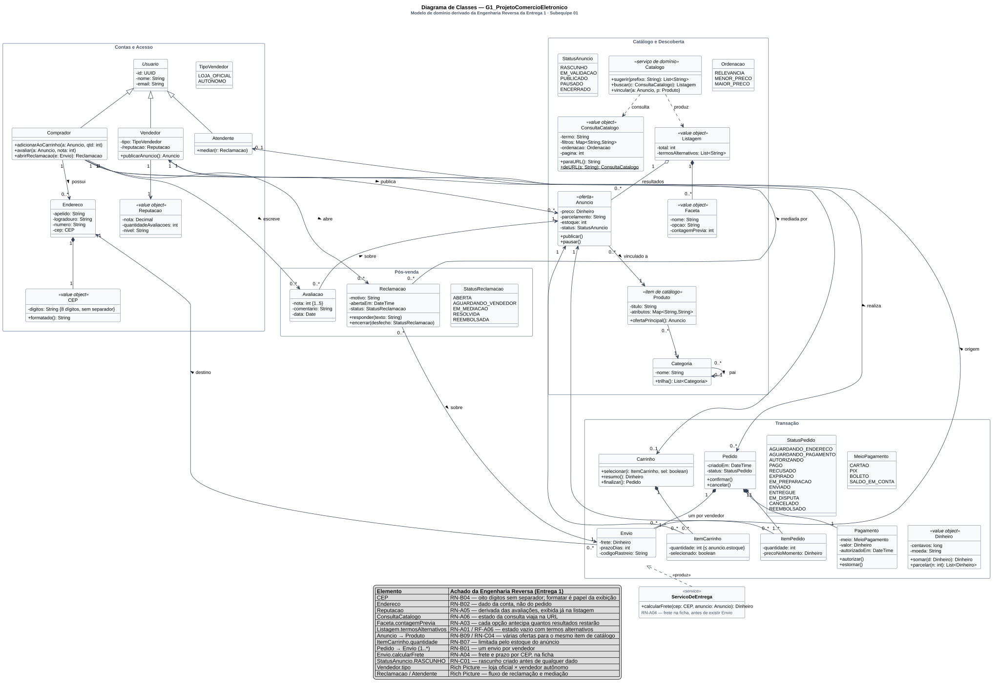

# Diagrama de Classes

Conforme a divisão registrada em [1.1.1. SubEquipe_01](/Base/Relatórios/1.1.1.SubEquipe_01.md), o modelo de domínio é o artefato estático de base da Subequipe 01: os demais diagramas — casos de uso, componentes, sequência, estados e atividades — referenciam as classes, enumerações e associações definidas aqui. Esta página documenta o diagrama e justifica cada decisão de modelagem a partir dos achados da [Engenharia Reversa](https://unbarqdsw2026-2-turma01.github.io/2026.2-T01-_G1_ProjetoComercioEletronico_Entrega_01/#/Base/Relat%C3%B3rios/SubEquipe01/EngenhariaReversa) da Entrega 1.

---

## O que é o artefato

O diagrama de classes é o diagrama estrutural central da UML: descreve os tipos de objetos do sistema e os relacionamentos estáticos entre eles — associações, agregações, composições, generalizações e dependências —, além dos atributos e operações de cada tipo (BOOCH; RUMBAUGH; JACOBSON, 2005). A especificação da OMG o classifica entre os *diagramas de estrutura*, em oposição aos *diagramas de comportamento* (OMG, 2017).

Fowler (2004) distingue três perspectivas em que um diagrama de classes pode ser lido: **conceitual**, em que as classes representam conceitos do domínio; **de especificação**, em que representam interfaces de software; e **de implementação**, em que representam classes concretas de código. Este diagrama foi construído na **perspectiva conceitual**, com incursões pontuais na de especificação — as operações listadas são as que os fluxos observados exigem, não uma API completa. A escolha decorre do método: tudo o que sabemos do sistema vem de inspeção de interface, sem acesso ao código; modelar em perspectiva de implementação seria inventar o que não foi observado.

Larman (2004) chama esse tipo de diagrama de **modelo de domínio** e o descreve como "um dicionário visual de abstrações": sua função é fixar vocabulário compartilhado antes que os diagramas de interação o consumam. É exatamente o papel que este diagrama cumpre para os outros cinco da subequipe.

---

## O artefato

Clique na imagem para abrir em tela cheia, com zoom.

> _Figura 1 — Diagrama de Classes do G1\_ProjetoComercioEletronico, organizado em quatro pacotes: Contas e Acesso, Catálogo e Descoberta, Transação e Pós-venda. Losango preenchido: composição. Losango vazado: agregação. Seta aberta: associação navegável. Triângulo vazado: generalização. Linha tracejada: dependência. Estereótipos `«value object»`, `«oferta»`, `«item de catálogo»` e `«serviço de domínio»` marcam o papel de cada classe. A legenda ao pé rastreia cada elemento ao achado da Entrega 1 que o sustenta. Fonte: Subequipe 01, 2026._

---

## Por que o domínio inteiro, e não um recorte

A Entrega 1 produziu três recortes de engenharia reversa — busca e escolha de produto (A), carrinho, endereço e checkout (B) e publicação de anúncio (C) — e um mapa mental que inventariou o domínio completo. Havia duas opções para o diagrama de classes: modelar só o recorte A, que é o meu, ou modelar o domínio inteiro e dividir entre os integrantes a documentação das partes.

Escolhi a segunda por uma razão que a própria Entrega 1 deixou registrada. A seção 7 da Engenharia Reversa — *o que só aparece juntando os três recortes* — mostra que a decisão mais estrutural do sistema, **o catálogo como eixo do produto**, atravessa os três recortes: em C a plataforma vincula toda oferta nova a um item já existente; em A a ficha exibe uma oferta principal e as concorrentes; em B o carrinho agrupa por vendedor porque o mesmo produto vem de vendedores diferentes. Um diagrama de classes do recorte A não teria como representar essa decisão, porque ela nasce em C. Modelar o domínio inteiro é a única forma de fazer `Produto`, `Anuncio`, `Carrinho` e `Envio` contarem a mesma história.

---

## Como o diagrama foi montado

| Passo | O que foi feito |
| -- | -- |
| 1 | Levantamento das entidades candidatas a partir das folhas do mapa mental e dos substantivos das regras de negócio RN-A, RN-B e RN-C |
| 2 | Separação entre **entidades** (identidade e ciclo de vida próprios) e **value objects** (definidos pelos atributos, imutáveis), seguindo Evans (2003) |
| 3 | Agrupamento em quatro pacotes, correspondentes aos ramos de 1º nível do mapa mental |
| 4 | Definição das associações com multiplicidade e navegabilidade, decidindo composição *versus* agregação *versus* associação pelo critério de ciclo de vida |
| 5 | Enumerações para os conjuntos fechados de estados observados ou inferidos; cada enumeração é consumida por um diagrama dinâmico da subequipe |
| 6 | Revisão de cada classe contra a Engenharia Reversa: toda classe sem origem rastreável foi removida ou marcada como inferida |
| 7 | Legenda de rastreabilidade embutida no próprio diagrama, para que a origem de cada elemento viaje com a figura |

---

## Decisões de modelagem e sua origem

### 1. `Produto` e `Anuncio` são classes distintas

**A decisão.** `Produto` é o item de catálogo — o "iPhone 13 128 GB" que existe uma vez. `Anuncio` é a oferta que um vendedor específico faz daquele item, com preço, estoque e status próprios. A associação é `Anuncio "0..*" --> "1" Produto`.

**Por quê.** Não é uma preferência de modelagem: é o que a plataforma faz. RN-C04 registra que, ao publicar, a plataforma **tenta vincular a nova oferta a um item já existente no catálogo** antes de permitir descrição livre; RN-B09 registra que a ficha de um produto exibe **uma oferta principal e as demais em bloco separado**. Uma única classe `Produto` com preço e vendedor não conseguiria representar nem uma coisa nem outra.

**Consequência.** Tudo o que é transacional aponta para `Anuncio`, não para `Produto`: `ItemCarrinho`, `ItemPedido` e `Avaliacao`. O comprador não compra "o produto"; compra a oferta de um vendedor. É isso que obriga o carrinho a agrupar por vendedor (RN-B01) e o pedido a ter um envio por vendedor.

**Trade-off.** O modelo fica com uma indireção a mais em todo caminho de compra. É o preço de ser fiel a um marketplace em vez de a uma loja única.

### 2. `ConsultaCatalogo` é um value object serializável

**A decisão.** O estado da busca — termo, filtros, ordenação e página — é uma classe própria, imutável, com `paraURL()` e `deURL()`.

**Por quê.** RN-A06: o estado da consulta **viaja na URL**, o que torna a busca compartilhável e reproduzível. Se termo, filtros e ordenação fossem quatro atributos soltos em um controlador, a garantia de que "a URL reconstrói exatamente a mesma listagem" ficaria implícita e frágil. Como value object, a igualdade é por valor e a serialização tem um lugar só. É também o que o [Diagrama de Sequência](/Base/Relatórios/Subequipe01/ModelagemDinamica/DiagramaDeSequencia.md) usa para representar o retorno pelo botão "voltar".

**Embasamento.** Evans (2003) define value object como objeto sem identidade, definido inteiramente por seus atributos e preferencialmente imutável — o que descreve uma consulta com precisão: duas consultas com os mesmos parâmetros *são* a mesma consulta.

### 3. `Faceta.contagemPrevia` é dado, não cálculo sob demanda

**A decisão.** `Listagem` compõe `Faceta`, e cada faceta carrega `contagemPrevia: int`.

**Por quê.** RN-A03 e RF-A02: cada opção de filtro **exibe antecipadamente quantos resultados restarão**. Isso significa que a contagem já vem calculada na resposta da busca, antes de o comprador clicar em qualquer filtro. Modelá-la como atributo da faceta — e não como operação chamada ao clicar — é o que torna visível o custo que o [SIG da Entrega 1](https://unbarqdsw2026-2-turma01.github.io/2026.2-T01-_G1_ProjetoComercioEletronico_Entrega_01/#/Base/Relat%C3%B3rios/SubEquipe01/NFR) atribui aos filtros facetados sobre `Tempo de Resposta`: contar antes de filtrar tem preço.

### 4. `Endereco` pertence a `Comprador`, e `Envio` apenas o referencia

**A decisão.** `Comprador "1" --> "0..*" Endereco` e `Envio "0..*" --> "1" Endereco`. O endereço não é composto pelo pedido.

**Por quê.** RN-B02: o endereço de entrega é **dado da conta, não do pedido** — é escolhido em tela própria, fora do carrinho, e vale para a sessão. T-B04 reforça: o cadastro acontece em outro subdomínio. Se `Pedido` compusesse `Endereco`, cada pedido teria a sua cópia e o hub de endereços observado não faria sentido.

**Trade-off reconhecido.** Referenciar em vez de copiar cria um problema real: se o comprador editar o endereço depois da compra, o histórico do envio muda. Um sistema de produção resolveria com um *snapshot* no envio — mas isso não foi observado, e o modelo registra o que foi observado. Fica anotado nos limites.

### 5. `CEP` é um value object de oito dígitos

**A decisão.** `Endereco` compõe `CEP`, que guarda `digitos: String` com a restrição `{8 dígitos, sem separador}` e expõe `formatado()`.

**Por quê.** RN-B04 foi um achado de inspeção do DOM: o CEP é **armazenado como oito dígitos sem separador; formatar é responsabilidade da exibição**. RF-B04 complementa: a entrada é normalizada com ou sem hífen. Um `String` cru não expressa nenhuma dessas duas regras; o value object expressa as duas — a invariante no construtor e a formatação em um único método.

### 6. `ItemCarrinho` e `ItemPedido` são classes distintas

**A decisão.** Estruturas parecidas, classes separadas. `ItemCarrinho` tem `selecionado` e a restrição `{≤ anuncio.estoque}`; `ItemPedido` tem `precoNoMomento`.

**Por quê.** Duas regras da Entrega 1 vivem em lados opostos da fronteira do checkout. RF-B02 — selecionar e desselecionar itens sem removê-los — só faz sentido no carrinho. RN-B07 — quantidade limitada pelo estoque do anúncio — é uma restrição de entrada, verificada enquanto o comprador monta o carrinho. Do outro lado, um pedido confirmado precisa congelar o preço: se `ItemPedido` apontasse para o preço corrente de `Anuncio`, uma promoção posterior alteraria o valor de um pedido já pago.

**Embasamento.** É o mesmo raciocínio de imutabilidade que Evans (2003) aplica a agregados fechados e que Fowler (2002) formaliza no padrão *Money* para valores monetários: o que foi acordado em uma transação não pode mudar por efeito colateral.

### 7. `Pedido` compõe `Envio`, com multiplicidade `1..*`

**A decisão.** Um pedido tem um ou mais envios, e cada envio aponta para um `Vendedor` de origem e um `Endereco` de destino.

**Por quê.** RN-B01: o carrinho agrupa os itens **por vendedor**; o pedido é logicamente múltiplo, **com um envio por vendedor**. RF-B01: o frete de cada grupo é calculado separadamente. A composição está em `Envio`, e não em uma classe "Pedido por vendedor", porque a observação mostrou um pedido único do ponto de vista do comprador, com entregas separadas.

### 8. `Vendedor.tipo` é enumeração, não subclasse

**A decisão.** `TipoVendedor { LOJA_OFICIAL, AUTONOMO }` como atributo, em vez de duas subclasses de `Vendedor`.

**Por quê.** O Rich Picture da Entrega 1 registra a tensão entre loja oficial e vendedor autônomo — "eu pago mais, então apareço mais" *versus* "por que meu anúncio nunca aparece na primeira página?". Essa é uma diferença de **visibilidade no ranking**, não de **comportamento** observável: os dois publicam anúncios, os dois recebem avaliações, os dois respondem reclamações. Sem operação distinta, subclasse seria hierarquia vazia. Fowler (2004) recomenda generalização quando há substituibilidade comportamental; aqui não há.

**Onde a distinção volta.** No [Diagrama de Casos de Uso](/Base/Relatórios/Subequipe01/ModelagemEstatica/DiagramaDeCasosDeUso.md), Loja Oficial e Vendedor Autônomo aparecem como atores especializados — porque lá o que importa é *quem* interage, e a tensão do Rich Picture precisa ficar visível.

### 9. `/reputacao` é atributo derivado

**A decisão.** `Vendedor` tem `-/reputacao: Reputacao`, com a barra que a UML reserva a atributos derivados.

**Por quê.** RN-A05 e RF-A05: todo produto exibe nota, número de avaliações e reputação do vendedor já na listagem. A reputação não é digitada por ninguém — é calculada a partir de `Avaliacao`. Marcá-la como derivada registra isso sem inventar a fórmula, que não é observável.

### 10. `Dinheiro` como value object em centavos

**A decisão.** `Dinheiro { centavos: long, moeda }` com `somar()` e `parcelar()`.

**Por quê.** A ficha do produto exibe preço e parcelamento; o carrinho recalcula o resumo ao selecionar itens (RF-B02). Operações financeiras sucessivas sobre ponto flutuante acumulam erro de arredondamento. Fowler (2002) descreve o padrão *Money* justamente para isso: representar dinheiro como inteiro na menor unidade. `parcelar(n)` está na classe porque é onde a divisão sem perda de centavos precisa acontecer.

---

## Rastreabilidade

| Elemento do diagrama | Vem de | Vai para |
| -- | -- | -- |
| `Produto` / `Anuncio` distintos | RN-B09, RN-C04; seção 7 da Engenharia Reversa | Componentes: `Serviço de Catálogo` e `Serviço de Anúncios` compartilham a base *Catálogo e Ofertas* |
| `ConsultaCatalogo`, `Listagem`, `Faceta`, `Ordenacao` | RN-A02, RN-A03, RN-A06; RF-A01 a RF-A03 | [Sequência](/Base/Relatórios/Subequipe01/ModelagemDinamica/DiagramaDeSequencia.md): mensagens `buscar(consulta)`, `atualizarURL()`, `deURL()` |
| `Listagem.termosAlternativos` | RN-A01, RF-A06 | Sequência: fragmento `alt total == 0` |
| `Endereco`, `CEP` | RN-B02, RN-B04, RF-B04, T-B03, T-B04 | Componentes: `Serviço de Contas e Endereços` como componente próprio |
| `Carrinho`, `ItemCarrinho` | RN-B01, RN-B07, RF-B01, RF-B02, T-B01 | Estados: guarda `[estoque disponível]` e ação `reservar estoque` |
| `Pedido`, `Envio`, `Pagamento`, `StatusPedido` | RN-B01, T-B06, T-B07; eventos de borda do BPMN 1 | [Máquina de Estados](/Base/Relatórios/Subequipe01/ModelagemDinamica/DiagramaDeMaquinaDeEstados.md) do Pedido |
| `StatusAnuncio` | RN-C01 a RN-C06; BPMN 2 | Máquina de Estados do Anúncio |
| `Vendedor.tipo`, `Atendente`, `Reclamacao`, `StatusReclamacao` | Rich Picture — atores, concerns e processo de reclamação | [Casos de Uso](/Base/Relatórios/Subequipe01/ModelagemEstatica/DiagramaDeCasosDeUso.md) e [Atividades](/Base/Relatórios/Subequipe01/ModelagemDinamica/DiagramaDeAtividades.md) |
| `Avaliacao`, `Reputacao` | RN-A05, RF-A05 | Casos de Uso: `Ver reputação do vendedor` com `«include»` |
| Pacotes | Ramos de 1º nível do mapa mental | Casos de Uso: os mesmos quatro agrupamentos |

---

## Limites do modelo

- **É um modelo conceitual, e o interior é hipótese.** Como na Engenharia Reversa, tudo o que está aqui é coerente com o que a interface mostra, não necessariamente idêntico ao projeto real. `Catalogo` como serviço de domínio e `Listagem` como value object são a forma mais simples que encontrei de explicar o comportamento observado; a implementação pode ser outra.
- **`Envio` referencia `Endereco` sem snapshot.** Registrado na decisão 4: é fiel ao observado, mas um sistema de produção precisaria congelar o endereço no momento da confirmação. Não modelei porque não vi.
- **`Reputacao` não tem fórmula.** Sei que existe, sei de onde vem (RN-A05) e sei que aparece na listagem; não sei como é calculada. O atributo derivado registra a dependência sem fingir conhecimento do cálculo.
- **`Atendente` e `Reclamacao` são inferidos do Rich Picture, não observados.** O fluxo de reclamação não é acessível sem uma compra realizada. Estão no modelo porque o Rich Picture os registrou e porque sem eles o domínio do pós-venda ficaria vazio — mas são as classes de origem mais fraca do diagrama.
- **O diagrama é grande.** Vinte e cinco classificadores em quatro pacotes exigem zoom. Considerei dividi-lo em quatro diagramas, um por pacote, e não o fiz porque as associações que cruzam pacotes — `Anuncio` como hub, `Envio` ligando transação a contas e a vendedor — são exatamente o que o modelo precisa mostrar. A legenda embutida e o clique para tela cheia são o compromisso adotado.

---

## Referências

BOOCH, Grady; RUMBAUGH, James; JACOBSON, Ivar. **UML: guia do usuário**. 2. ed. Rio de Janeiro: Elsevier, 2005.

EVANS, Eric. **Domain-Driven Design: Tackling Complexity in the Heart of Software**. Boston: Addison-Wesley, 2003.

FOWLER, Martin. **Patterns of Enterprise Application Architecture**. Boston: Addison-Wesley, 2002.

FOWLER, Martin. **UML Distilled: A Brief Guide to the Standard Object Modeling Language**. 3. ed. Boston: Addison-Wesley, 2004.

LARMAN, Craig. **Applying UML and Patterns: An Introduction to Object-Oriented Analysis and Design and Iterative Development**. 3. ed. Upper Saddle River: Prentice Hall, 2004.

OBJECT MANAGEMENT GROUP. **OMG Unified Modeling Language (OMG UML), Version 2.5.1**. Needham: OMG, 2017. Disponível em: https://www.omg.org/spec/UML/2.5.1. Acesso em: 16 set. 2026.

---

## Histórico de Versões

| Versão | Data | Descrição | Autor(es) | Revisor(es) |
| -- | -- | -- | -- | -- |
| 1.0 | 17/09/2026 | Criação da página; diagrama de classes do domínio completo, decisões de modelagem rastreadas à Engenharia Reversa da Entrega 1, elos com os demais diagramas e limites | Pedro Luciano de Azevedo | -- |
