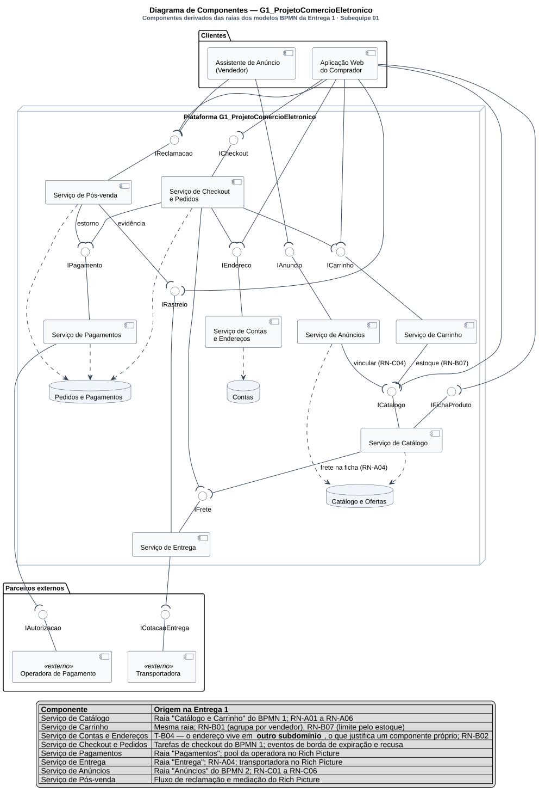

# Diagrama de Componentes

Conforme a divisão registrada em [1.1.1. SubEquipe_01](/Base/Relatórios/1.1.1.SubEquipe_01.md) e decidida na [reunião de 12/09/2026](/ReunioesAtas/Subequipe1/Ata12_09.md), este diagrama é de responsabilidade de **Patrick Anderson**. Ele continua os dois modelos BPMN da Entrega 1: as raias que separavam responsabilidades dentro da plataforma — Catálogo e Carrinho, Entrega, Pagamentos, Anúncios — são aqui promovidas a componentes com interfaces explícitas.

---

## O que é o artefato

O diagrama de componentes é um diagrama estrutural da UML que mostra a organização e as dependências entre **componentes** — partes modulares e substituíveis do sistema que encapsulam conteúdo e expõem seu comportamento por meio de **interfaces** (OMG, 2017, seção 11.6). A notação distingue interface **fornecida** (círculo cheio, o "pirulito") de interface **requerida** (semicírculo, o "soquete"); quando um soquete encaixa num pirulito, há uma dependência de montagem (*assembly connector*).

Booch, Rumbaugh e Jacobson (2005) recomendam o diagrama de componentes para responder a uma pergunta que o diagrama de classes não responde: **quem depende de quem em tempo de execução**. É essa pergunta que este diagrama faz sobre a plataforma.

---

## O artefato

Clique na imagem para abrir em tela cheia, com zoom.

> _Figura 3 — Diagrama de Componentes do G1\_ProjetoComercioEletronico. Oito serviços dentro do nó da plataforma, dois clientes agrupados no pacote `Clientes`, dois parceiros externos estereotipados `«externo»`, três bases de dados e doze interfaces. Pirulito: interface fornecida. Soquete: interface requerida. Linha tracejada com seta: dependência de persistência. A legenda embutida rastreia cada componente à raia do BPMN ou ao ator do Rich Picture que o origina. Fonte: Subequipe 01, 2026._

---

## Por que assumi o diagrama de componentes

O primeiro motivo é que o diagrama já existia, em outra notação. Na Entrega 1 modelei os dois BPMNs, e neles a plataforma não é uma caixa só: é uma *pool* dividida em raias — Catálogo e Carrinho, Entrega, Pagamentos, Anúncios. Raia, em BPMN, é exatamente uma partição de responsabilidade dentro de um mesmo participante. Promovê-las a componentes não inventa estrutura nenhuma; apenas troca a pergunta que o desenho responde. O BPMN diz *em que ordem* as coisas acontecem; o diagrama de componentes diz *quem precisa de quem* para que aconteçam. A tabela de rastreabilidade adiante mostra essa correspondência raia a raia.

O segundo motivo é uma evidência que só o meu recorte tinha. O Recorte B registrou que o cadastro de endereço acontece **em outro subdomínio** (T-B04) e que o endereço é dado da conta, não do pedido (RN-B02). Fronteira de subdomínio é a coisa mais próxima de uma fronteira de implantação que uma engenharia reversa de caixa-preta consegue observar: é o próprio sistema dizendo, pela URL, onde termina uma responsabilidade e começa outra. Separar `Serviço de Contas e Endereços` como componente próprio não é preferência de modelagem, é leitura de um achado.

O terceiro é que os eventos de borda que modelei no BPMN 1 — o temporizador sobre *Informar meio de pagamento* e o erro sobre *Autorizar pagamento* — implicam um orquestrador. Alguém inicia a autorização, espera, e reage tanto ao sucesso quanto à falha e ao tempo. No diagrama, esse alguém é `Serviço de Checkout e Pedidos`, e não por acaso é o componente com mais interfaces requeridas: quatro (`ICarrinho`, `IEndereco`, `IPagamento`, `IFrete`). A densidade de acoplamento dele é consequência direta do que a Entrega 1 observou, e é também o principal alerta que este diagrama produz.

---

## Como o diagrama foi montado

| # | Passo | O que foi feito |
| -- | -- | -- |
| 1 | Componentes candidatos | Cada raia das *pools* de plataforma dos dois BPMNs virou um componente candidato: Catálogo e Carrinho, Entrega, Pagamentos, Anúncios |
| 2 | Quebra por evidência | As raias que a observação mostrou conter responsabilidades distintas foram divididas: "Catálogo e Carrinho" virou `Serviço de Catálogo` e `Serviço de Carrinho`; o checkout ganhou componente próprio por causa dos eventos de borda; contas e endereços saíram por causa de T-B04 |
| 3 | Componentes externos | As *pools* externas do BPMN e os atores do Rich Picture que não são a plataforma viraram componentes `«externo»`: operadora de pagamento e transportadora |
| 4 | Interfaces | Cada troca observada entre participantes virou uma interface nomeada, fornecida por quem responde e requerida por quem pergunta — doze ao todo |
| 5 | Clientes | As *pools* de comprador e vendedor viraram as duas aplicações cliente, porque o Recorte C mostrou que o assistente de anúncio é um fluxo à parte (T-C01) |
| 6 | Persistência | As três bases foram agrupadas por coesão de dados e marcadas como inferidas |
| 7 | Revisão | Cada dependência foi conferida contra uma regra de RN-A, RN-B ou RN-C; as que não tinham regra que as sustentasse foram removidas ou declaradas inferidas |

---

## Decisões de modelagem e sua origem

### 1. `Serviço de Contas e Endereços` é um componente separado

**A decisão.** O endereço de entrega não pertence ao checkout nem ao carrinho: tem componente próprio, com interface `IEndereco`, e base de dados própria.

**Por quê.** T-B04 registrou que "Adicionar novo endereço" navega para um formulário **em outro subdomínio**, levando o endereço de retorno na URL. RN-B02 registrou que o endereço é dado da conta, e não do pedido — é escolhido em tela própria, fora do carrinho, e vale para a sessão. RN-B03 registrou que o contexto de retorno viaja na URL inclusive entre subdomínios. São três achados independentes apontando para a mesma fronteira.

**Trade-off.** O checkout passa a depender de um componente remoto para uma informação de que precisa sempre. É uma chamada de rede a mais no caminho crítico da compra, e um ponto de falha a mais. Em troca, o cadastro de endereço fica reutilizável por qualquer fluxo da conta — que é, aparentemente, a razão de ele estar onde está.

### 2. `Serviço de Catálogo` requer `IFrete`

**A decisão.** O catálogo depende da entrega, e não o contrário.

**Por quê.** RN-A04: frete e prazo dependem do CEP e são calculados **na ficha do produto, antes do carrinho**. Se o frete só aparecesse no checkout, essa dependência não existiria — o catálogo seria folha do grafo.

**Trade-off.** Vale registrar que esta é uma decisão de produto com custo arquitetural. Mostrar o frete cedo reduz o abandono no fim do funil, mas empurra uma dependência para o componente mais consultado do sistema: toda visita a uma ficha de produto passa a tocar o serviço de entrega. É o tipo de acoplamento que não aparece em nenhum requisito funcional e que só o diagrama de componentes torna visível.

### 3. `Serviço de Carrinho` requer `ICatalogo`

**A decisão.** O carrinho consulta o catálogo para validar a quantidade.

**Por quê.** RN-B07: o seletor de quantidade é limitado pelo estoque do anúncio, e o estoque é exibido no próprio controle ("1 unidade, +50 disponíveis"). O estoque é atributo da oferta, que mora no catálogo — logo, o carrinho não pode decidir sozinho.

**Trade-off.** A alternativa seria o carrinho guardar uma cópia do estoque. Ganharia latência e perderia correção: o estoque muda enquanto o item está no carrinho, e a Entrega 1 registrou justamente que esse caso ficou fora dos modelos BPMN por não ter sido observado.

### 4. `Serviço de Anúncios` requer `ICatalogo`

**A decisão.** Publicar uma oferta é uma operação sobre o catálogo, não sobre um repositório separado de anúncios.

**Por quê.** RN-C04: a plataforma tenta vincular a nova oferta a um item já existente antes de permitir descrição livre. RN-C05: o vínculo pode ser por palavras-chave, foto ou código. É a mesma dependência que, no Diagrama de Classes, aparece como `Anuncio → Produto`: dois diagramas, duas notações, a mesma regra.

**Trade-off.** Nenhum relevante — a dependência é a própria regra de negócio. O que vale notar é que ela explica o compartilhamento da base `Catálogo e Ofertas` entre dois componentes, que é a única base com mais de um escritor no diagrama.

### 5. `Serviço de Pós-venda` requer `IPagamento` e `IRastreio`

**A decisão.** O pós-venda não estorna nem rastreia por conta própria: pede a quem é dono de cada coisa. As duas dependências estão rotuladas no diagrama como "estorno" e "evidência".

**Por quê.** Vem do Rich Picture do Guilherme, não do meu recorte, e o diagrama diz isso. A mediação de uma reclamação precisa decidir entre manter a venda e devolver o dinheiro; devolver o dinheiro é operação da operadora, intermediada pelo serviço de pagamentos, e a evidência que sustenta a decisão é o histórico de rastreio.

**Trade-off.** É o componente mais inferido do desenho. O elo real está no [Diagrama de Atividades](/Base/Relatórios/Subequipe01/ModelagemDinamica/DiagramaDeAtividades.md) do Guilherme, e na [Máquina de Estados](/Base/Relatórios/Subequipe01/ModelagemDinamica/DiagramaDeMaquinaDeEstados.md) ele aparece como os estados `Em disputa` e `Reembolsado`.

### 6. Duas aplicações cliente, não uma

**A decisão.** `Aplicação Web do Comprador` e `Assistente de Anúncio (Vendedor)` são componentes distintos, no pacote `Clientes`.

**Por quê.** T-C01 registrou que acessar a área de venda **redireciona** para o assistente de anúncio, e T-C02 que a URL passa a carregar um identificador de rascunho em um caminho próprio. Não é uma tela a mais da aplicação do comprador: é outro fluxo, com outro estado, alcançado por redirecionamento.

**Trade-off.** As duas aplicações compartilham exatamente uma interface, `IReclamacao` — vendedor e comprador são partes da mesma disputa. Fora isso, os conjuntos de dependências são disjuntos, o que é um argumento a favor da separação.

### 7. Três bases de dados, e as três são inferência

**A decisão.** `Catálogo e Ofertas`, `Contas` e `Pedidos e Pagamentos`, ligadas por dependência tracejada aos componentes que as escrevem.

**Por quê.** Por coesão de dados, não por observação: catálogo e ofertas compartilham chave (RN-B09 — o mesmo produto com várias ofertas); pedido e pagamento são transacionais e mudam juntos; contas são isoladas e têm fronteira de subdomínio própria (T-B04).

**Trade-off.** Nada na interface revela persistência. Este é o ponto do diagrama em que mais me afastei da evidência, e por isso ele está declarado aqui e na seção de limites. Uma leitura igualmente defensável seria uma base única com esquemas separados.

---

## Recursos da notação utilizados

As Diretrizes pedem para usar os vários recursos de modelagem da notação. Este diagrama emprega:

| Recurso | Onde aparece | Por que estava lá |
| -- | -- | -- |
| Componente (retângulo com o ícone de componente) | Os oito serviços, as duas aplicações cliente e os dois parceiros externos | Unidade modular com interface própria |
| Interface fornecida (*pirulito*) | Doze interfaces, cada uma ancorada no componente que a implementa | Contrato que o componente oferece |
| Interface requerida (*soquete*) | Dezoito dependências de montagem | Contrato de que o componente depende |
| Conector de montagem | Soquete encaixado em pirulito | Liga quem requer a quem fornece, sem citar implementação |
| Nó / agrupamento | `Plataforma G1_ProjetoComercioEletronico` e o pacote `Clientes` | Separa o que é da plataforma do que é cliente |
| Estereótipo | `«externo»` na operadora de pagamento e na transportadora | Marca o que não é implementado pela plataforma |
| Dependência (linha tracejada com seta) | Dos componentes para as três bases de dados | Persistência, que não é interface |
| Rótulo em dependência | "estoque (RN-B07)", "frete na ficha (RN-A04)", "vincular (RN-C04)", "estorno", "evidência" | Registra no desenho a regra que sustenta o elo |
| Legenda | Tabela embutida no rodapé do diagrama | Rastreabilidade legível sem sair da imagem |

---

## Rastreabilidade

| Elemento | Vem de | Vai para |
| -- | -- | -- |
| `Serviço de Catálogo` | Raia "Catálogo e Carrinho" do BPMN 1; RN-A01 a RN-A06 | Classes `Produto` e `Anuncio` no [Diagrama de Classes](/Base/Relatórios/Subequipe01/ModelagemEstatica/DiagramaDeClasses.md) |
| `Serviço de Carrinho` | Mesma raia; RN-B01, RN-B07 | `Carrinho` no Diagrama de Classes; transição inicial da Máquina de Estados do Pedido |
| `Serviço de Contas e Endereços` | T-B04 (outro subdomínio), RN-B02, RN-B03 | Estado `Aguardando endereço` da [Máquina de Estados](/Base/Relatórios/Subequipe01/ModelagemDinamica/DiagramaDeMaquinaDeEstados.md) |
| `Serviço de Checkout e Pedidos` | Tarefas de checkout do BPMN 1; eventos de borda de expiração e recusa | Máquina de Estados do Pedido, do início ao encerramento |
| `Serviço de Pagamentos` | Raia "Pagamentos" do BPMN 1; *pool* da operadora | Estados `Autorizando`, `Pago` e `Recusado` |
| `Serviço de Entrega` | Raia "Entrega"; RN-A04; transportadora no Rich Picture | Estados `Enviado` e `Entregue` |
| `Serviço de Anúncios` | Raia "Anúncios" do BPMN 2; RN-C01 a RN-C06 | Máquina de Estados do Anúncio, integralmente |
| `Serviço de Pós-venda` | Fluxo de reclamação e mediação do Rich Picture | [Diagrama de Atividades](/Base/Relatórios/Subequipe01/ModelagemDinamica/DiagramaDeAtividades.md); estados `Em disputa` e `Reembolsado` |
| `ICatalogo`, `IFichaProduto` | RN-A04, RN-B09, RN-C04 | [Diagrama de Sequência](/Base/Relatórios/Subequipe01/ModelagemDinamica/DiagramaDeSequencia.md) — busca e escolha de produto |
| `ICarrinho`, `IEndereco` | T-B01 a T-B06 | Máquina de Estados do Pedido — transição `Aguardando endereço → Aguardando pagamento` |
| `ICheckout`, `IPagamento` | T-B07, T-B08; eventos de borda do BPMN 1 | Máquina de Estados do Pedido — `Autorizando`, `Recusado`, `Expirado` |
| `IFrete`, `IRastreio` | RN-A04; Rich Picture | Diagrama de Sequência (frete na ficha) e Diagrama de Atividades (evidência na mediação) |
| `IAnuncio` | T-C01 a T-C05 | Máquina de Estados do Anúncio |
| `IReclamacao` | Rich Picture | Diagrama de Atividades |
| Base `Catálogo e Ofertas` | Inferida de RN-B09 e RN-C04 | Seção 7 da [Engenharia Reversa](https://unbarqdsw2026-2-turma01.github.io/2026.2-T01-_G1_ProjetoComercioEletronico_Entrega_01/#/Base/Relat%C3%B3rios/SubEquipe01/EngenhariaReversa) — "o catálogo é o eixo do produto" |

---

## Limites do diagrama

- **A granularidade é escolha, não observação.** Oito serviços é uma partição plausível e defensável, mas a plataforma real pode ser um monólito ou cinquenta microsserviços. O que a evidência sustenta é a *separação de responsabilidades* — quem é dono de qual dado, quem precisa perguntar a quem —, não o número de processos em execução. Um diagrama de componentes lido como contagem de servidores seria uma leitura errada deste.
- **As bases de dados são inferidas.** Nada na interface revela persistência. Estão no desenho porque um diagrama de componentes sem elas esconde o acoplamento por dados, que é real; estão marcadas como inferidas porque não foram observadas.
- **Não há diagrama de implantação.** Componentes dizem *o que* depende de *o quê*, não *onde* roda. A única pista de implantação que a Entrega 1 produziu é T-B04 — o subdomínio separado —, e ela sustenta uma fronteira, não uma topologia. Um diagrama de implantação seria a iniciativa extra natural sobre esta página.
- **As interfaces têm nome, não assinatura.** `ICatalogo` diz que existe um contrato, não quais operações ele expõe. As operações estão no [Diagrama de Classes](/Base/Relatórios/Subequipe01/ModelagemEstatica/DiagramaDeClasses.md) e as chamadas no [Diagrama de Sequência](/Base/Relatórios/Subequipe01/ModelagemDinamica/DiagramaDeSequencia.md); aqui só o contrato existe. Fowler (2004) trata isso como propriedade desejável do diagrama, não como lacuna: ele é sobre topologia de dependência, e detalhar assinaturas o tornaria ilegível.
- **`Serviço de Pós-venda` é o componente mais frágil.** Ele e suas duas dependências vêm inteiramente do Rich Picture, e o meu recorte parou antes do pagamento. Está no diagrama porque sem ele os estados `Em disputa` e `Reembolsado` da minha própria máquina de estados ficariam sem componente responsável — mas é o primeiro elemento que eu removeria se a exigência fosse modelar só o observado.

---

## Referências

BOOCH, Grady; RUMBAUGH, James; JACOBSON, Ivar. **UML: guia do usuário**. 2. ed. Rio de Janeiro: Elsevier, 2005.

FOWLER, Martin. **UML Distilled: A Brief Guide to the Standard Object Modeling Language**. 3. ed. Boston: Addison-Wesley, 2004.

OBJECT MANAGEMENT GROUP. **OMG Unified Modeling Language (OMG UML), Version 2.5.1**. Needham: OMG, 2017. Disponível em: https://www.omg.org/spec/UML/2.5.1. Acesso em: 16 set. 2026.

---

## Histórico de Versões

| Versão | Data | Descrição | Autor(es) | Revisor(es) |
| -- | -- | -- | -- | -- |
| 1.0 | 16/09/2026 | Criação da página com o diagrama (autoria coletiva da subequipe) e o roteiro de redação | Pedro Luciano de Azevedo | -- |
| 1.1 | 17/09/2026 | Redação do conteúdo da página: justificativa da escolha do diagrama, método de montagem, sete decisões de modelagem rastreadas a RN-A, RN-B, RN-C e às transições T-B e T-C, recursos da notação utilizados, tabela de rastreabilidade e limites | Patrick Anderson | -- |
