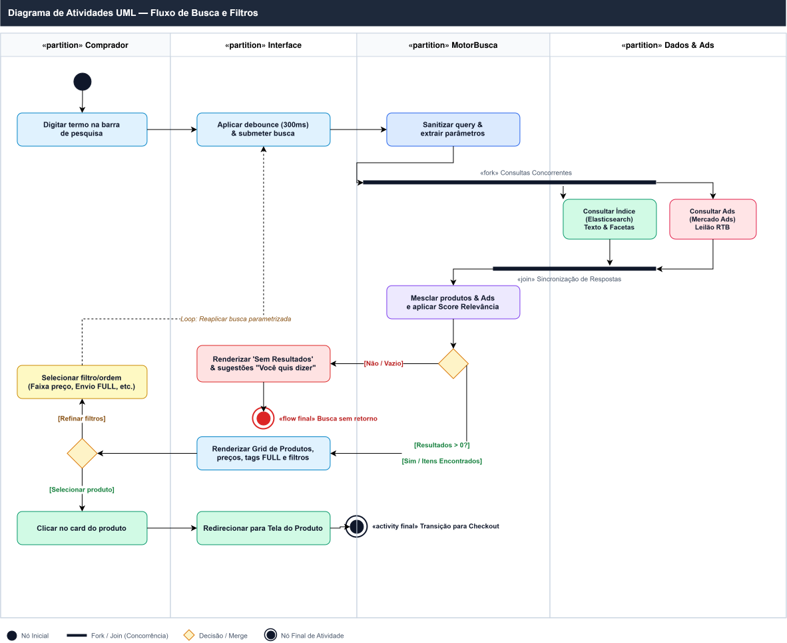
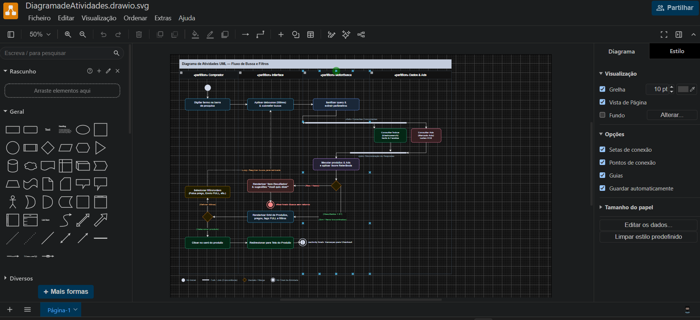

# Diagrama de Atividades

<strong>Diagrama de Atividades UML</strong> — fluxo concorrente de busca e filtragem de produtos.

## Objetivo e escopo

O diagrama especifica o fluxo de busca de produtos, desde a entrada da consulta pelo comprador até a exibição dos resultados e a aplicação de filtros. O comportamento foi organizado em partições para explicitar as responsabilidades do **Comprador**, da **Interface**, do **MotorBusca** e de **Dados & Ads**.

## Leitura do diagrama

O comprador informa o termo e a interface valida e encaminha a solicitação ao motor de busca. O fluxo é dividido por um nó **Fork** para permitir a recuperação dos resultados orgânicos e a consulta de produtos patrocinados em paralelo. Um nó **Join** sincroniza as respostas antes da composição da lista apresentada ao comprador.

Quando a consulta não retorna resultados, o fluxo direciona o tratamento para sugestões alternativas, como correção ou sugestão fonética. Quando há resultados, o comprador pode aplicar ou alterar filtros, retornando ao ciclo de consulta até confirmar a visualização desejada. As partições tornam visível a fronteira entre interação, coordenação e acesso aos dados.

## Justificativas e senso crítico

O uso de **Fork/Join** registra a intenção de reduzir o tempo percebido ao executar em paralelo operações independentes. A sincronização é necessária antes da apresentação consolidada, pois a interface precisa receber uma resposta coerente. O caminho sem resultados evita que a atividade termine abruptamente e representa uma decisão de experiência do usuário.

## Ferramenta
O diagrama foi elaborado no Draw.io.

<strong>Print da edição do Diagrama de Atividades no Draw.io</strong>

## Rastreabilidade e elos com outros artefatos

O Diagrama de Atividades é um refinamento do processo de busca modelado em BPMN na Entrega 1. O BPMN apresenta o fluxo de negócio em uma visão organizacional; este diagrama transforma as mesmas intenções em ações, decisões, partições e nós de controle da UML, aproximando o processo da especificação de software.
O [Diagrama de Componentes](/Base/Relatórios/Subequipe02/ModelagemEstatica/DiagramaDeComponentes.md) complementa esta visão ao mostrar os módulos que executam as ações do fluxo.

### Referências

- OBJECT MANAGEMENT GROUP. *OMG Unified Modeling Language (UML), Version 2.5.1*. 2017. Referência para atividades, ações, decisões, partições e nós de controle Fork/Join.

## Histórico de Versões

| Versão | Data | Descrição | Autor(es) | Revisor(es) |
| -- | -- | -- | -- | -- |
| 1.0 | 17/09/2026 | Criação da página | Maria Clara | -- |
| 1.1 | 17/09/2026 | Inclusão do diagrama, análise técnica, rastreabilidade e referências | Guilherme D'Avila | Maria Clara |
