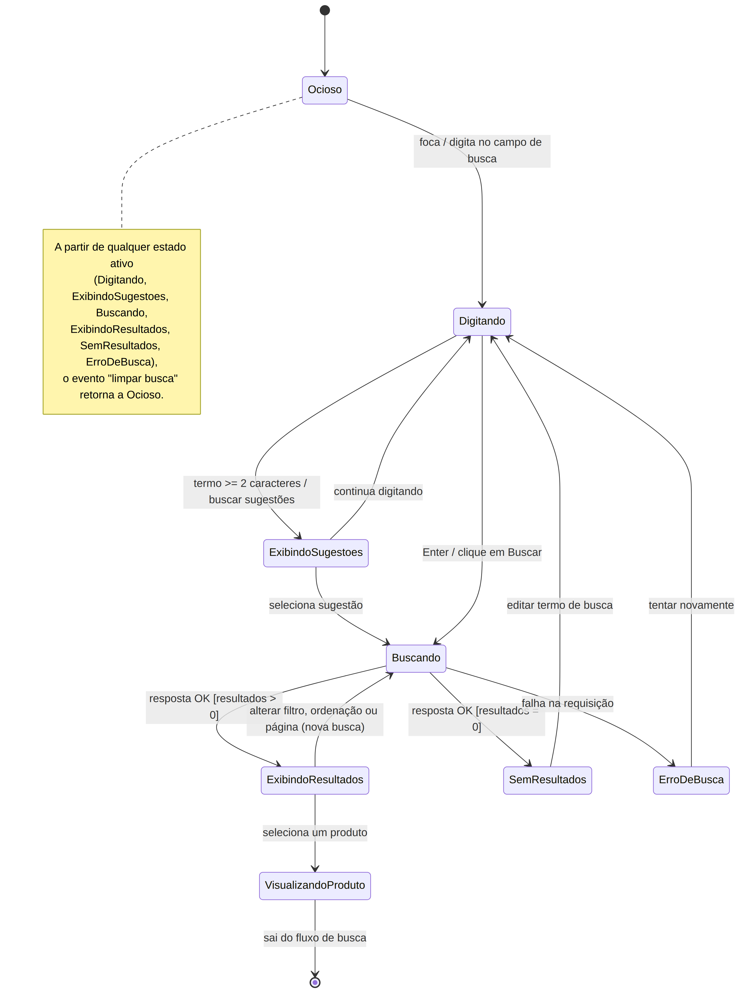

# Diagrama de Máquina de Estados

<strong>Diagrama de Máquina de Estados</strong> — fluxo de busca de produtos em um comércio eletrônico baseado no Mercado Livre. <em>Autor: Maria Clara</em>

[Clique aqui para baixar a imagem!](../../../../Assets/Subequipe2/DiagramaDeMaquinaDeEstados.png ':ignore')

## 1. Introdução

Este diagrama modela o comportamento do **fluxo de busca de produtos**, desde o momento em que o usuário começa a digitar um termo até a visualização de um produto encontrado. O objetivo é representar os estados pelos quais a funcionalidade de busca transita e os eventos que disparam cada transição.

## 2. Estados modelados

| Estado | Significado |
|---|---|
| `Ocioso` | Estado inicial; nenhuma busca em andamento. |
| `Digitando` | Usuário está digitando o termo de busca no campo. |
| `ExibindoSugestoes` | Sistema exibe sugestões de autocompletar para o termo digitado. |
| `Buscando` | Requisição de busca em andamento (inclui buscas novas, novas páginas, filtros e ordenações). |
| `ExibindoResultados` | Resultados retornados com sucesso e exibidos em lista/grade. |
| `SemResultados` | Busca concluída sem nenhum resultado encontrado. |
| `ErroDeBusca` | Falha na requisição de busca (ex.: erro de rede ou do servidor). |
| `VisualizandoProduto` | Usuário selecionou um resultado e saiu do fluxo de busca para a página do produto. |

## 3. Notação utilizada

Estados representados como retângulos de cantos arredondados, pseudo-estado inicial como círculo preenchido e estado final como círculo com anel, seguindo a notação padrão UML para diagramas de máquina de estados. Transições são rotuladas com o evento (e, quando aplicável, a guarda entre colchetes) que dispara a mudança de estado.

## 4. Decisões de modelagem

- **`Buscando` é reutilizado** para toda nova requisição ao backend de busca — seja a submissão inicial do termo, seja uma alteração de filtro, ordenação ou paginação a partir de `ExibindoResultados`. Isso evita duplicar um estado "buscando" para cada gatilho possível, já que o comportamento (requisição assíncrona em andamento) é idêntico.
- **`ExibindoSugestoes` é um estado, não uma transição instantânea**, pois o sistema permanece nele enquanto aguarda o usuário continuar digitando ou selecionar uma sugestão — refletindo o comportamento real de autocomplete.
- **A transição "limpar busca" foi registrada como nota**, em vez de uma seta a partir de cada estado ativo até `Ocioso`, para evitar poluir visualmente o diagrama com múltiplas setas repetidas com o mesmo significado.
- **`ErroDeBusca` retorna a `Digitando`, e não diretamente a `Buscando`**, ao evento "tentar novamente": o termo já digitado permanece preenchido, mas o usuário passa novamente pela decisão de reenviar a busca (`Digitando --> Buscando`), em vez de a requisição ser reemitida automaticamente. Isso também evita representar duas transições opostas entre os mesmos dois estados (`Buscando` ⇄ `ErroDeBusca`), o que tornaria o diagrama mais difícil de ler.

## Embasamento na literatura

O uso de um estado transitório dedicado à espera de resposta assíncrona (`Buscando`) segue a recomendação de Fowler (2004), em *UML Distilled*, de que uma máquina de estados deve representar explicitamente estados de espera/processamento sempre que a transição entre dois estados estáveis não for instantânea aos olhos do usuário.

### Referências

FOWLER, Martin. **UML Distilled: A Brief Guide to the Standard Object Modeling Language**. 3. ed. Boston: Addison-Wesley, 2004.

## Histórico de Versões

| Versão | Data | Descrição | Autor(es) | Revisor(es) |
| -- | -- | -- | -- | -- |
| 1.0 | 17/09/2026 | Criação da página | Maria Clara | -- |
| 1.1 | 17/09/2026 | Adiciona Diagrama de Máquina de Estados do fluxo de busca e documentação referente | Maria Clara | -- |
