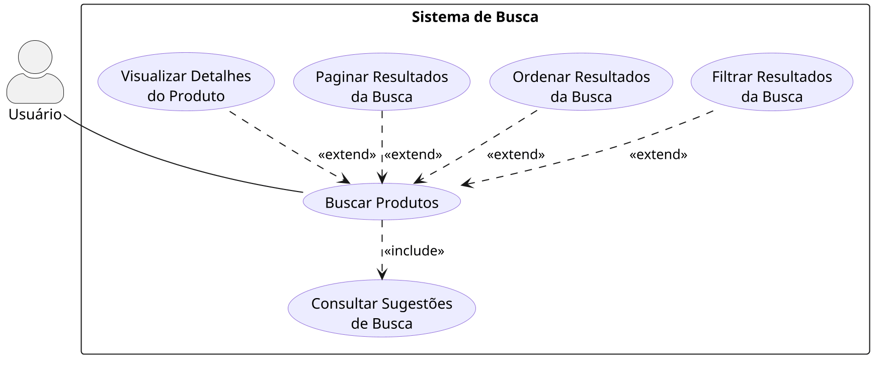

# Diagrama de Casos de Uso

<strong>Diagrama de Casos de Uso</strong> — fluxo de busca de produtos em um comércio eletrônico baseado no Mercado Livre. <em>Autor: Maria Clara</em>

[Clique aqui para baixar a imagem!](../../../../Assets/Subequipe2/DiagramaDeCasosDeUso.png ':ignore')

## 1. Introdução

Este diagrama modela, do ponto de vista do usuário, os objetivos alcançáveis na funcionalidade de **busca de produtos**, mesmo domínio já modelado no [Diagrama de Máquina de Estados](/Base/Relatórios/Subequipe02/ModelagemDinamica/DiagramaDeMaquinaDeEstados.md). Enquanto o diagrama de estados descreve o comportamento interno do sistema durante a busca, este diagrama descreve **o que o usuário pode fazer**.

## 2. Ator

| Ator | Descrição |
|---|---|
| **Usuário** | Qualquer visitante ou comprador que utiliza o campo de busca do site, autenticado ou não. |

## 3. Casos de uso modelados

| Caso de uso | Descrição |
|---|---|
| **Buscar Produtos** | Caso de uso principal: o usuário informa um termo e obtém uma lista de produtos correspondentes. |
| **Consultar Sugestões de Busca** | Sistema sugere termos/produtos conforme o usuário digita. Sempre ocorre como parte da busca. |
| **Filtrar Resultados da Busca** | Usuário refina os resultados por categoria, preço, condição, frete, etc. |
| **Ordenar Resultados da Busca** | Usuário reorganiza os resultados (relevância, menor preço, maior preço, etc.). |
| **Paginar Resultados da Busca** | Usuário carrega mais itens ou avança para a próxima página de resultados. |
| **Visualizar Detalhes do Produto** | Usuário acessa a página de um produto específico a partir dos resultados. |

## 4. Relacionamentos

- **`Buscar Produtos` «include» `Consultar Sugestões de Busca`**: a consulta de sugestões é uma etapa obrigatória do comportamento de busca (ocorre sempre que o usuário digita), por isso é modelada com `include`, e não como caso de uso opcional.
- **`Filtrar Resultados`, `Ordenar Resultados`, `Paginar Resultados` e `Visualizar Detalhes do Produto` «extend» `Buscar Produtos`**: são ações opcionais que só fazem sentido depois que uma busca já retornou resultados, por isso estendem o caso de uso base em vez de serem incluídas nele.

## 5. Notação utilizada

Ator representado como stick figure, casos de uso como elipses dentro do retângulo de fronteira do sistema ("Sistema de Busca"), associação ator–caso de uso como linha sólida, e relacionamentos `«include»`/`«extend»` como setas tracejadas, seguindo a notação UML padrão para diagramas de casos de uso.

## Embasamento na literatura

A distinção entre `include` (comportamento obrigatório e reutilizado) e `extend` (comportamento opcional e condicional) segue a definição de Booch, Rumbaugh e Jacobson (2005), no *UML User Guide*: `include` é usado quando um caso de uso sempre incorpora o comportamento de outro, enquanto `extend` é usado quando um caso de uso adiciona comportamento opcional a outro sob determinada condição.

### Referências

BOOCH, Grady; RUMBAUGH, James; JACOBSON, Ivar. **The Unified Modeling Language User Guide**. 2. ed. Boston: Addison-Wesley, 2005.

## Histórico de Versões

| Versão | Data | Descrição | Autor(es) | Revisor(es) |
| -- | -- | -- | -- | -- |
| 1.0 | 17/09/2026 | Criação da página | Maria Clara | -- |
| 1.1 | 17/09/2026 | Adiciona Diagrama de Casos de Uso do fluxo de busca e documentação referente | Maria Clara | -- |
