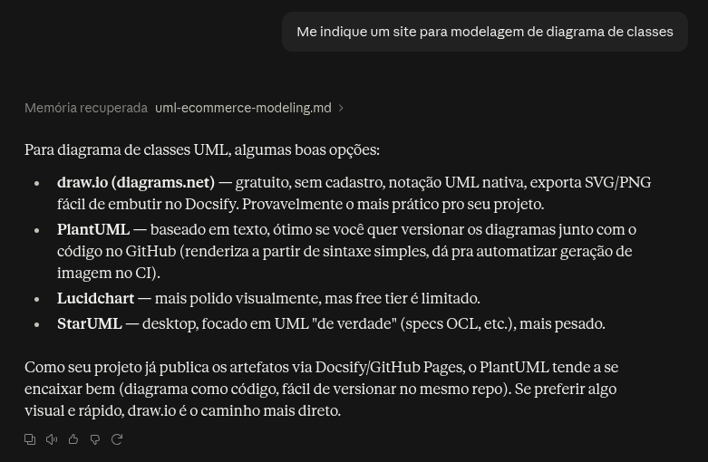
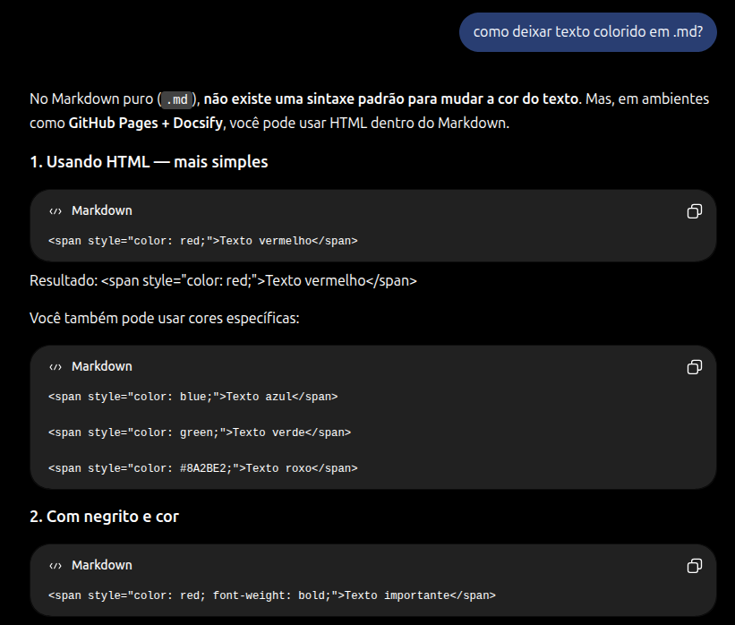

# Uso de IA Generativa e lições aprendidas

Este documento apresenta as **lições aprendidas** e o **uso de Inteligência Artificial Generativa** por cada membro da **Subequipe 3** ao longo do desenvolvimento do projeto.

---

## João Paulo Barbosa Pereira Nunes

### Lições aprendidas

Ao desenvolver o diagrama de máquina de estados do processo de autenticação (login), o principal aprendizado foi entender que a granularidade de um diagrama de estados não é uma escolha arbitrária: ela decorre de um critério formal, segundo o qual um novo estado só se justifica quando o sistema passa a responder de forma distinta a eventos futuros a partir dele. Isso me levou a abandonar uma primeira versão mais simples, que tratava o login como praticamente dois estados ("autenticando" e "autenticado"), e separar em situações que, apesar de parecerem equivalentes do ponto de vista do usuário, escondiam tratamentos de erro e transições diferentes entre si.

Também aprendi na prática a diferença entre um auto-laço de repetição e um pseudo-estado de escolha: os dois podem representar "tentar de novo em caso de erro", mas o pseudo-estado de escolha separa conceitualmente a ação (verificar as credenciais) da decisão sobre o resultado dessa ação, o que deixa o diagrama mais fiel à semântica de decisão da UML em vez de sobrecarregar um único estado com duas responsabilidades distintas.

Por fim, ficou evidente como a modelagem dinâmica ganha rigor quando ancorada em um comportamento real e documentado, no caso, o fluxo OAuth 2.0 do Mercado Livre, em vez de estados genéricos inventados. Além de tornar o diagrama mais crível, essa escolha manteve a modelagem dinâmica consistente com o diagrama estático de componentes já construído, já que as mesmas operações aparecem nos dois artefatos.

### Uso de IA Generativa
Utilizei a IA principalmente como apoio à pesquisa teórica e à revisão crítica das decisões de modelagem, não para gerar o diagrama pronto. Antes de definir os estados, pedi à IA que explicasse o formalismo original de statecharts de Harel (1987) e como a UML o incorporou, o que me ajudou a justificar por que sete estados, e não dois ou três, eram necessários para representar o login com fidelidade comportamental.

Também usei a IA para colocar lado a lado alternativas de modelagem antes de decidir entre elas, por exemplo, comparar um auto-laço de repetição com um pseudo-estado de escolha para representar a repetição da verificação de credenciais, e para separar, em cada decisão do relatório, o que era justificativa conceitual do que era apenas resolução de um problema prático de legibilidade na ferramenta de diagramação usada. Isso me obrigou a registrar os trade-offs de cada escolha, em vez de apresentar uma única alternativa como se fosse a única tecnicamente correta.

Por fim, recorri à IA para revisar a estrutura do relatório técnico (organização em decisão, justificativa crítica e trade-off reconhecido para cada seção) e para conferir a formatação em Markdown, mantendo o documento consistente com o padrão adotado pelo restante da subequipe.

---

## José Joaquim da Silva Neto

### Lições aprendidas

Ao longo desta entrega de modelagem UML do sistema de e-commerce, uma das principais lições aprendidas foi que um diagrama tecnicamente correto na sintaxe não é o mesmo que um diagrama semanticamente correto. Também aprendi, na prática, o valor de encapsular regras de validação em Value Objects em vez de tipos primitivos soltos, e a diferença real entre composição e associação como uma decisão que comunica quem controla o ciclo de vida de quem não, um mero detalhe estético do diagrama. Outra lição importante foi perceber que diagramas diferentes do mesmo sistema (classes, pacotes, atividades) precisam ser consistentes entre si: uma seta invertida no diagrama de atividades que contradiz a direção de dependência definida no diagrama de classes é um erro de modelagem, mesmo que cada diagrama, isoladamente, pareça correto. Por fim, comparar nosso modelo com a arquitetura real do Mercado Livre me ensinou que modelagem de domínio e arquitetura de infraestrutura são preocupações propositalmente separadas e que reconhecer as limitações e simplificações de um modelo, em vez de escondê-las, é o que de fato demonstra domínio crítico da disciplina.

### Uso de IA Generativa

#### Diagrama de Classes
Na fase de implementação da modelagem do diagrama de classes, eu fiz o uso de inteligência artificial para me indicar sites para modelagem. Primeiramente utilizei o site LucidChart, porém como comentei na [Reunião do dia 11/09/2026](/ReunioesAtas/Subequipe3/Gravacao11_09.md) o site LucidChart me impediu de adicionar mais classes e setas, esse problema me fez migrar a modelagem para o Drawio, site que de fato foi utilizado para terminar a modelagem do diagrama de classes. Nesse ponto a inteligência artificial acabou me atrapalhando por não informar ao certo quais eram as limitações do LucidChart gratuito.

<strong>Uso de inteligência no desenvolvimento do diagrama de classes</strong>   <em>Inteligência Artificial: Claude</em>

#### Sintaxe em markdown
Enquanto eu estava fazendo os registros das práticas da metodologia, me surgiram várias dúvidas sobre como colocar texto colorido para melhorar a visibilidade nas tabelas de rastreabilidade da metodologia, para isso usei inteligência artificial para me ajudar nesse quesito.

<strong>Uso de inteligência para aprender mais sobre cores em markdown</strong>   <em>Inteligência Artificial: ChatGPT</em>

---

## Júlia Santana Campos

### Lições aprendidas

### Uso de IA Generativa

---

## Pedro Henrique Gomes

### Lições aprendidas
Durante o desenvolvimento dos diagramas de implantação e atividades, aprofundei significativamente meu entendimento sobre a notação UML e a modelagem arquitetural. No Diagrama de Implantação, aprendi a estruturar adequadamente a topologia física de um sistema, separando claramente os nós de execução (como o ambiente do cliente, redes intermediárias e infraestrutura em nuvem) e representando as ligações de comunicação de forma coerente. Já na elaboração dos Diagramas de Atividades, consolidei meus conhecimentos sobre a modelagem de fluxos dinâmicos. Foi valioso entender, na prática, como utilizar barras de sincronização (`fork` e `join`) para representar execuções paralelas e como organizar fluxos complexos em diferentes raias (*swimlanes*) para delimitar perfeitamente as responsabilidades de cada ator ou serviço integrado.

### Uso de IA Generativa

#### Estruturação do Diagrama de Implantação e Mapeamento de Dados Reais
Utilizei a IA para me orientar sobre como iniciar o desenvolvimento do diagrama de implantação, fosse a partir de textos base ou da análise de testes empíricos. A IA foi crucial para me ajudar a entender como traduzir serviços reais para o modelo estático da UML. Por exemplo, ela me auxiliou a mapear corretamente componentes específicos de infraestrutura em nuvem (como instâncias e serviços da AWS) em nós (*nodes*) e artefatos dentro do diagrama, garantindo que as evidências reais se encaixassem na notação arquitetural adequada.

#### Auxílio na Sintaxe Markdown
Além da modelagem UML, utilizei a IA para tirar dúvidas e aprimorar a sintaxe dos documentos escritos em Markdown. A ferramenta me auxiliou na formatação correta de tabelas, inserção de imagens centralizadas, alinhamento de textos e na estruturação geral do documento, garantindo que a entrega final tivesse uma apresentação profissional, limpa e coesa com o padrão estabelecido pelos demais membros do projeto.

---

## Histórico de Versões

| Versão | Data | Descrição | Autor(es) | Revisor(es) |
| -- | -- | -- | -- | -- |
| 1.0 | 14/09/2026 | Criação da página | José Joaquim da Silva Neto | -- |
| 1.1 | 15/09/2026 | Adiciona evidências do uso de ia | José Joaquim da Silva Neto | -- |
| 1.2 | 17/09/2026 | Adiciona lições aprendidas e uso de IA| Pedro Henrique Gomes | -- |
| 1.3 | 18/09/2026 | Adiciona lições aprendidas | José Joaquim da Silva Neto | -- |
| 1.4 | 18/09/2026 | Adiciona Lições aprendidas e IA | João Paulo Barbosa Pereira Nunes | -- |
