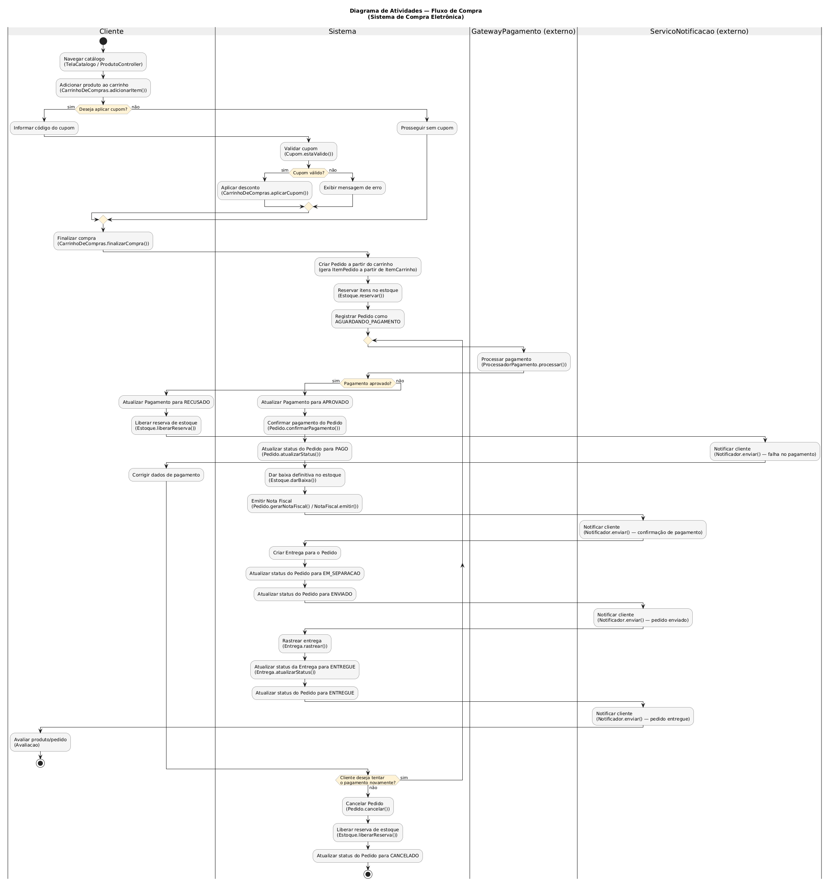
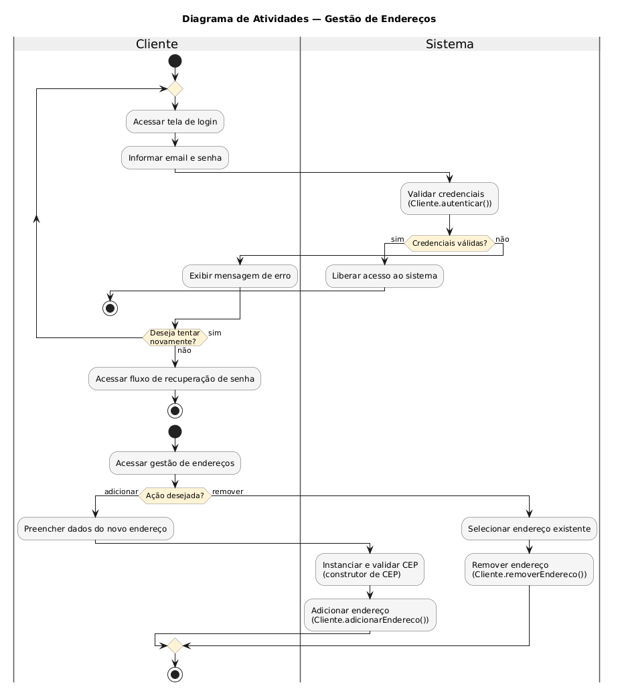
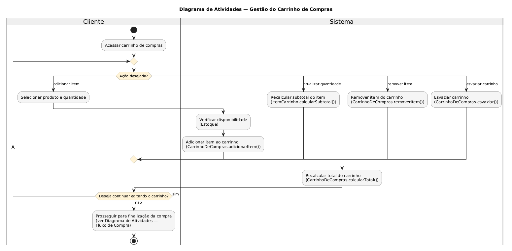
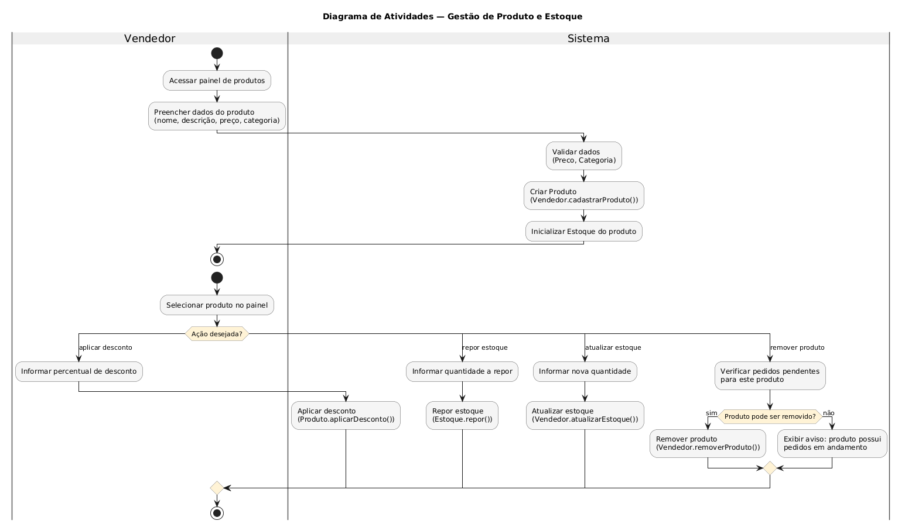
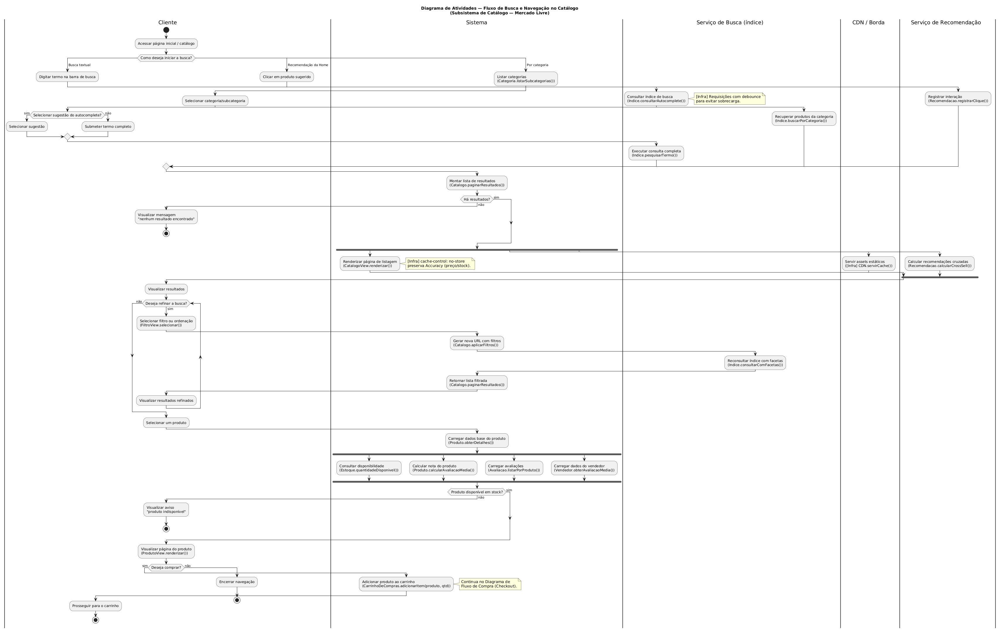
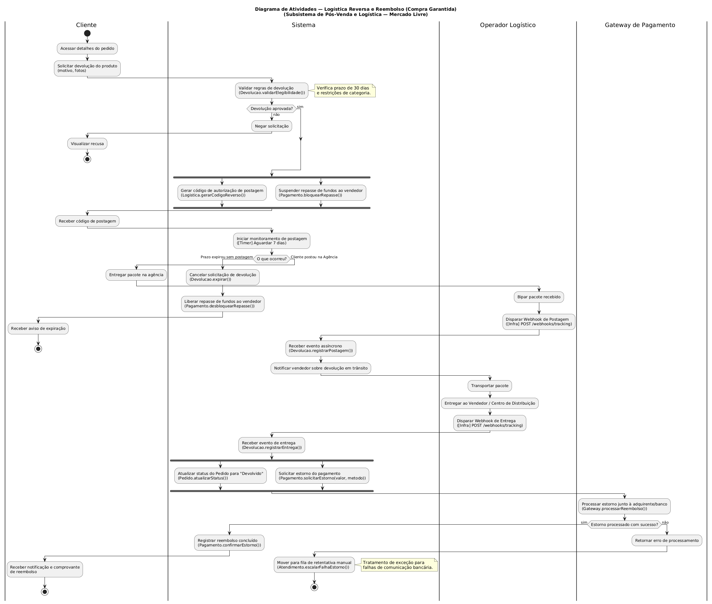

# Diagramas de Atividades

Este documento contém os diagramas de atividades desenvolvidos pelos membros José Joaquim da Silva Neto e Pedro Henrique Gomes, que modelam o comportamento dinâmico e os fluxos dos subsistemas do Mercado Livre.

### Diagrama do Fluxo de Compra

<strong>Diagrama de Atividades</strong> — Fluxo de compra.   <em>Autor: José Joaquim da Silva Neto</em>

[Clique aqui para baixar a imagem!](../../../../Assets/Subequipe3/DiagramaDeAtividades/FluxoCompraJoaquim.png ':ignore')

O diagrama central do sistema: cobre desde a navegação no catálogo até a avaliação pós-entrega. O processamento de pagamento está dentro de um laço `repeat`: se o pagamento for recusado, o cliente pode corrigir os dados e tentar novamente, sem sair do fluxo, só avançando para o cancelamento se desistir explicitamente. O caminho de sucesso atravessa todas as transições de status do pedido, com uma notificação disparada a cada etapa relevante.

### Diagrama de autenticação e gestão de endereços

<strong>Diagrama de Atividades</strong> — Autenticação e gestão de endereços.   <em>Autor: José Joaquim da Silva Neto</em>

[Clique aqui para baixar a imagem!](../../../../Assets/Subequipe3/DiagramaDeAtividades/EnderecosJoaquim.png ':ignore')

Modela o login do cliente. A validação de credenciais está dentro de um `repeat`: uma tentativa malsucedida permite nova tentativa sem reiniciar o diagrama; só ao desistir o cliente é direcionado ao fluxo de recuperação de senha. Adicionar e remover endereços é modelado como uma decisão binária simples, com a validação do CEP atribuída ao construtor do Value Object correspondente.

### Diagrama de gestão do carrinho de compras

<strong>Diagrama de Atividades</strong> — Gestão do carrinho de compras.   <em>Autor: José Joaquim da Silva Neto</em>

[Clique aqui para baixar a imagem!](../../../../Assets/Subequipe3/DiagramaDeAtividades/GestaoCarrinhoJoaquim.png ':ignore')

Modela as quatro operações do carrinho que não fazem parte do checkout em si: adicionar item, atualizar quantidade, remover item e esvaziar. Usa `switch`/`case` para representar uma única decisão com quatro saídas, dentro de um `repeat` que permite ao cliente editar o carrinho livremente antes de seguir para a compra.

### Diagrama de gestão de produto e estoque 

<strong>Diagrama de Atividades</strong> — Gestão de produto e estoque.   <em>Autor: José Joaquim da Silva Neto</em>

[Clique aqui para baixar a imagem!](../../../../Assets/Subequipe3/DiagramaDeAtividades/GestaoProdutoEstoqueJoaquim.png ':ignore')

Modela o cadastro de um novo produto pelo vendedor, incluindo a inicialização do estoque associado. Cobre aplicar desconto, repor estoque, atualizar estoque e remover produto, via `switch`/`case`. A remoção é o único ramo com uma decisão binária aninhada, pois depende de verificar se o produto tem pedidos em andamento.

### Diagrama de Fluxo de Busca e Navegação no Catálogo

<strong>Diagrama de Atividades</strong> — Busca e Navegação no Catálogo.   <em>Autor: Pedro Henrique Gomes</em>

[Clique aqui para baixar a imagem!](../../../../Assets/Subequipe3/diagrama_atividades2v.png ':ignore')

Modela a jornada de descoberta do cliente, desde o acesso inicial até à adição do produto ao carrinho. A escolha do método de busca inicial (texto, categoria, recomendação) é tratada num bloco `if/else`, enquanto o refinamento por filtros ocorre dentro de um ciclo `while`. O fluxo utiliza extensivamente barras de sincronização (`fork`/`join`) para representar o carregamento paralelo de dados críticos (preço, stock, avaliações) de forma assíncrona.

### Diagrama de Logística Reversa e Reembolso

<strong>Diagrama de Atividades</strong> — Logística Reversa e Reembolso (Compra Garantida).   <em>Autor: Pedro Henrique Gomes</em>

[Clique aqui para baixar a imagem!](../../../../Assets/Subequipe3/diagrama_atividade_devolucao.png ':ignore')

Modela o processo de devolução suportado pelo programa de proteção ao comprador. O diagrama introduz *Timeouts* (eventos temporais lógicos) para controlar o limite de 7 dias para devolução, e a receção de *Webhooks* (eventos assíncronos) da transportadora. Utiliza `fork` para executar paralelamente a geração da etiqueta de devolução e a suspensão do repasse financeiro, incluindo ainda o tratamento de exceção para falhas na comunicação com o *gateway* de pagamento.

---

## Histórico de Versões

| Versão | Data | Descrição | Autor(es) | Revisor(es) |
| -- | -- | -- | -- | -- |
| 1.0 | 14/09/2026 | Criação da página | José Joaquim da Silva Neto | -- |
| 1.1 | 17/09/2026 | Adiciona as imagens dos diagramas | José Joaquim da Silva Neto | -- |
| 1.2 | 17/09/2026 | Adiciona explicação dos diagramas | José Joaquim da Silva Neto | -- |
| 1.3 | 17/09/2026 | Adiciona diagrama e fluxo de Busca e Navegação | Pedro Henrique Gomes | -- |
| 1.4 | 17/09/2026 | Unificação do documento e adição do diagrama de Logística Reversa | Pedro Henrique Gomes | -- |