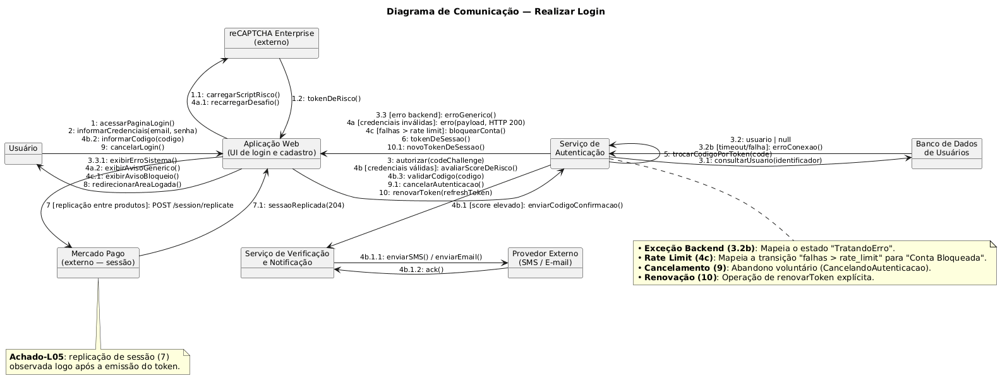
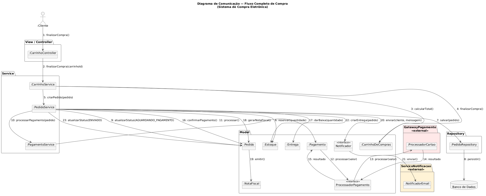

# Diagrama de Comunicação

<strong>Diagrama de Comunicação</strong> — Recorte de Engenharia Reversa do Subsistema de Login (SistemaLoginCadastroML).   <em>Autor: Pedro Henrique Gomes</em>

[Clique aqui para baixar a imagem!](../../../../Assets/Subequipe3/diagrama_comunicacao2v.png ':ignore')

<strong>Diagrama de Comunicação</strong> — Recorte do Subsistema de compra tendo como base o diagrama de classes.   <em>Autor: José Joaquim da Silva Neto</em>

[Clique aqui para baixar a imagem!](../../../../Assets/Subequipe3/diagramaComunicacaoJoaquim.png ':ignore')

## 1. Introdução

Este documento apresenta a fundamentação técnica das decisões de modelagem adotadas no diagrama de comunicação do processo de Autenticação (login) do Mercado Livre. O objetivo não é apenas listar as mensagens trocadas, mas justificar as escolhas arquiteturais da modelagem, discutir alternativas descartadas e evidenciar como a notação foi adaptada para um contexto de engenharia reversa de caixa-preta.

Enquanto o diagrama de sequência (seu par comportamental) enfatiza a ordem cronológica estrita das chamadas, o diagrama de comunicação (anteriormente conhecido como diagrama de colaboração na UML 1.x) foca na **topologia da rede de objetos**. Ele evidencia as ligações estruturais entre as instâncias e a arquitetura colaborativa do subsistema, respondendo visualmente à pergunta: "quem precisa conhecer quem para que o login aconteça?".

---

## 2. Topologia de Ligações e Agrupamento de Mensagens

### 2.1 A decisão

As mensagens trocadas entre os mesmos pares de objetos (ex: de `Usuário` para `UI`, ou de `UI` para `Auth`) foram agrupadas em um único link estrutural (linha de conexão), separadas por quebras de linha e ordenadas por suas respectivas numerações cronológicas (ex: `1`, `4b.2`).

### 2.2 Justificativa crítica

A alternativa adotada por ferramentas de desenho menos rigorosas é criar uma nova seta/linha para cada mensagem disparada. O problema dessa abordagem é que ela polui visualmente o diagrama e fere a semântica da UML: em um diagrama de comunicação, a linha sólida representa a **associação estática ou caminho de comunicação** entre duas instâncias. Se a UI consegue falar com o Serviço de Autenticação, o caminho existe, independentemente de 1 ou 50 mensagens transitarem por ele. Agrupar as chamadas no mesmo link reflete a realidade da arquitetura de rede: a conexão é estabelecida uma vez, e os pacotes (mensagens) fluem por ela.

### 2.3 Trade-off reconhecido

Essa condensação estrutural tem um custo cognitivo na leitura temporal: o leitor não pode simplesmente varrer o diagrama de cima para baixo como faria em um diagrama de sequência. Ele é forçado a caçar ativamente os números (`1`, `1.1`, `2`, `3`...) saltando entre os nós para reconstruir o fluxo do tempo. A decisão priorizou a clareza da **estrutura de acoplamento** em detrimento da facilidade de leitura cronológica, assumindo que, para fins de visualização do tempo, o diagrama de sequência preenche essa lacuna.

---

## 3. Ancoragem em Evidências (Os "Achados")

### 3.1 A decisão

O diagrama incorpora notas (`note`) explícitas documentando achados empíricos de rede (*Achado-L01* a *Achado-L05*), como o fato de o reCAPTCHA ser carregado antecipadamente e a sessão do Mercado Pago ser replicada logo após a emissão do token.

### 3.2 Justificativa crítica

A modelagem de sistemas de terceiros frequentemente sofre do viés de supor um "caminho feliz genérico". Sem essas notas, o diagrama representaria um fluxo de login teórico que serviria para qualquer site da internet. A inserção dos achados ancora o modelo na realidade específica da arquitetura do Mercado Livre. 

Por exemplo, a observação do *Achado-L01* força a existência da mensagem `1.1: carregarScriptRisco()` saindo da UI antes mesmo de o usuário digitar a senha. Isso reflete uma decisão arquitetural de segurança defensiva (avaliar o ambiente do browser no momento do carregamento, não no momento do submete), algo que só é possível comprovar via engenharia reversa.

---

## 4. Granularidade de Objetos e Separação de Fronteiras

### 4.1 A decisão

O subsistema não foi modelado como um bloco monolítico. Houve a decomposição explícita em instâncias independentes: a `Aplicação Web (UI)`, o `Serviço de Autenticação`, o `Banco de Dados`, o `Serviço de Verificação (MFA)` e atores externos (`reCAPTCHA` e `Mercado Pago`).

### 4.2 Justificativa crítica

A separação estrita entre UI e Auth demonstra a compreensão de um princípio fundamental em arquiteturas distribuídas e de segurança da informação: interfaces de usuário rodando no cliente não são confiáveis. A UI apenas atua como uma casca de repasse (`2: informarCredenciais` repassado como `3: autorizar`), enquanto a validação de regras de negócio, a verificação de código MFA e a emissão de tokens ocorrem isoladas no backend. 

Além disso, a modelagem do `Serviço de Verificação e Notificação` como um objeto separado do `Serviço de Autenticação` reflete o padrão de design *Single Responsibility Principle* (SRP). A emissão de um SMS é uma tarefa de infraestrutura e integração com operadoras; delegar isso a um objeto especializado evita o acoplamento profundo na lógica core de autenticação.

### 4.3 Limitação reconhecida

A decomposição, por ser baseada em observação externa, abstrai a complexidade do `Banco de Dados`. No diagrama, o DB é representado como uma entidade única e simples. Em uma arquitetura do porte do Mercado Livre, essa operação fatalmente envolveria camadas de cache (Redis/Memcached), microsserviços de *identity management* e fragmentação de dados (*sharding*). Essa simplificação foi adotada pois essas camadas internas não emitem rastros observáveis no front-end, e inferi-las sem dados seria mera especulação.

## 5. Introdução ao Diagrama de Comunicação — Fluxo de Compra

Complementando a Seção 1, este documento também apresenta a fundamentação do diagrama de comunicação do **Fluxo de Compra**, do subsistema de e-commerce projetado pela equipe. Diferente do diagrama de Login (Seções 1–4), que documenta um comportamento observado por engenharia reversa do Mercado Livre real, este diagrama modela a colaboração entre objetos de um sistema **proposto** pela equipe a partir do Diagrama de Classes já publicado nesta wiki — uma distinção metodológica que percorre todas as seções abaixo.

## 6. Topologia de Ligações e Agrupamento de Mensagens

### 6.1 A decisão

Assim como no diagrama de Login (Seção 2), mensagens repetidas entre o mesmo par de objetos foram mantidas no mesmo link estrutural — por exemplo, `PedidoService` troca mais de uma mensagem com `Estoque` (`6: reservar(quantidade)` e `17: darBaixa(quantidade)`), representadas em uma única linha de ligação, não em duas setas paralelas.

### 6.2 Justificativa crítica

A justificativa é a mesma já registrada na Seção 2.2: o link estrutural representa que `PedidoService` **conhece** `Estoque` — uma associação definida no Diagrama de Classes —, e não um caminho de rede específico de uma única chamada. Reservar estoque na criação do pedido e dar baixa após a confirmação de pagamento são dois momentos diferentes da mesma colaboração, não duas relações distintas entre as classes.

### 6.3 Trade-off reconhecido

O mesmo custo cognitivo descrito na Seção 2.3 se aplica aqui, agravado pela extensão do fluxo: com 23 mensagens numeradas sequencialmente (1 a 23), a leitura cronológica exige acompanhar a numeração, saltando entre `PedidoService`, `Pagamento`, `ProcessadorPagamento` e de volta — o Diagrama de Sequência do Fluxo de Compra, já publicado, é o artefato indicado para quem precisa da leitura estritamente temporal.

## 7. Ancoragem em Evidências: Elemento de Origem em vez de Achados Empíricos

### 7.1 A decisão

Onde o diagrama de Login cita um achado de engenharia reversa (Seção 3), este diagrama cita, para cada mensagem relevante, o **elemento do Diagrama de Classes** que a justifica — por não haver, aqui, tráfego real observado para ancorar a modelagem.

| Mensagem(ns) | Elemento de origem |
|---|---|
| `10–15: processar(valor)` entre `Pagamento` e `ProcessadorPagamento` | Associação `Pagamento ──► ProcessadorPagamento` (Strategy Pattern, Diagrama de Classes) |
| `6: reservar(quantidade)` | Composição `Pedido ◆── ItemPedido` e relação `Produto ◆── Estoque` |
| `19: emitir()` | Associação `NotaFiscal ────► Pedido` |
| `20–21: enviar()` | Associação `Pedido ──► Notificador` (Strategy Pattern) |

### 7.2 Justificativa crítica

Sem essa tabela, o diagrama daria a entender que a colaboração entre objetos foi observada de algum sistema real — o que não é o caso. Substituir "achado empírico" por "elemento de origem" no Diagrama de Classes preserva a rastreabilidade do modelo sem simular uma evidência que não existe.

## 8. Granularidade de Objetos e Separação de Fronteiras

### 8.1 A decisão

O fluxo foi decomposto em objetos correspondentes às camadas do Diagrama de Pacotes: `CarrinhoController` (Controller), `CarrinhoService`/`PedidoService`/`PagamentoService` (Service), `Pedido`/`Pagamento`/`Estoque`/`NotaFiscal`/`Entrega` (Model), `PedidoRepository` (Repository), e os sistemas externos `ProcessadorCartao` e `NotificadorEmail`.

### 8.2 Justificativa crítica

Essa granularidade replica, no diagrama de comunicação, a mesma separação de responsabilidades já justificada no documento de decisões do Diagrama de Pacotes — em particular, a decisão de tratar `ProcessadorPagamento` e `Notificador` como interfaces (Strategy Pattern) implementadas por sistemas externos, mantendo o núcleo do domínio (`Pagamento`, `Pedido`) desacoplado da forma concreta de processar pagamento ou enviar notificação.

### 8.3 Limitação reconhecida

Diferente do Banco de Dados do diagrama de Login (Seção 4.3), cuja simplificação foi justificada pela ausência de rastros observáveis, aqui a simplificação de `PedidoRepository → Banco de Dados` como uma única mensagem de persistência é uma escolha de **projeto**, não uma limitação de evidência: o sistema modelado pela equipe de fato não especifica sharding, cache ou múltiplos bancos — ao contrário do Mercado Livre real, que o documento de relação com a arquitetura real (já publicado) reconhece operar com milhares de bancos de dados distintos.

---

## Histórico de Versões

| Versão | Data | Descrição | Autor(es) | Revisor(es) |
| -- | -- | -- | -- | -- |
| 1.0 | 17/09/2026 | Criação da página e fundamentação do Diagrama de Comunicação | Pedro Henrique Gomes | -- |
| 1.1 | 18/09/2026 | Adiciona diagrama de comunicação do subsistema de compra | José Joaquim da Silva Neto | -- |