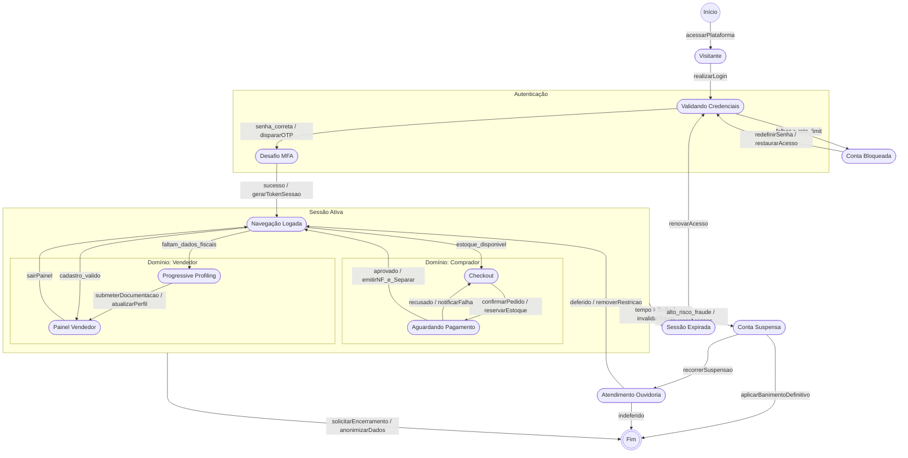

# Diagrama de Máquina de Estados

<iframe width="768" height="432" src="https://miro.com/app/live-embed/uXjVHluKsqg=/?embedMode=view_only_without_ui&moveToViewport=12,61,1492,815&embedId=648250601957" frameborder="0" scrolling="no" allow="fullscreen; clipboard-read; clipboard-write" allowfullscreen></iframe>

## 1. Introdução

Este documento apresenta a fundamentação técnica das decisões de modelagem adotadas no diagrama de estados do processo de Autenticação (login) do Mercado Livre. O objetivo não é apenas descrever os estados montados, mas justificar por que cada escolha foi feita, discutir alternativas descartadas e ancorar as decisões em literatura de modelagem comportamental.

O diagrama é composto por quatro categorias de elementos: estados (situações estáveis do processo, incluindo estados compostos), pseudo-estados de escolha (pontos de decisão dentro de um estado composto), transições (mudanças de estado disparadas por um evento ou condição) e os estados inicial/final que delimitam o processo. Cada categoria resolve um problema de modelagem específico, detalhado a seguir.

## 2. Decomposição em Estados

### 2.1 A decisão

O processo foi dividido em sete estados: Validando Credenciais (composto), Gerando Token de Acesso, Sessão Ativa, Finalizando Autenticação (composto), Notificando Usuário, Cancelando Autenticação e Tratando Erro.

### 2.2 Justificativa crítica

A alternativa mais simples seria representar o login como dois estados apenas, algo como Autenticando e Autenticado, afinal do ponto de vista do usuário o processo parece binário: ou ele está logado, ou não está. O problema dessa simplificação é que ela esconde exatamente os pontos em que o sistema se comporta de forma diferente dependendo do que aconteceu antes, que é o critério formal para justificar um novo estado: segundo Harel (1987), um estado deve existir quando ele representa uma configuração em que o sistema responde de maneira distinta a eventos futuros. Um "Autenticando" único não distingue entre estar validando a senha, esperando o token ser gerado ou gravando a sessão no banco, situações em que um erro ou um cancelamento levam a caminhos completamente diferentes.

A separação entre Gerando Token de Acesso e Sessão Ativa segue o mesmo raciocínio: são dois momentos em que uma falha tem origem e tratamento potencialmente diferentes (uma falha de token é um problema de autorização OAuth, uma falha em sessão ativa pode ser um problema de infraestrutura), e a literatura de máquinas de estado recomenda não colapsar dois momentos assim só porque, no caminho feliz, um sempre leva ao outro.

### 2.3 Trade-off reconhecido

Sete estados para um fluxo de login é, comparado a diagramas didáticos mais simples, uma granularidade relativamente fina. Um projeto com prazo mais apertado poderia razoavelmente unificar Gerando Token de Acesso e Sessão Ativa em um único estado "Sessão Estabelecida", já que a diferença entre os dois só importa para fins de depuração, não para o usuário final. A decisão de mantê-los separados se justifica pela mesma lógica de distinguibilidade comportamental descrita acima, mas é uma escolha discutível, não a única tecnicamente válida.

## 3. Estados Compostos e Pseudo-estados de Escolha

### 3.1 A decisão

Validando Credenciais e Finalizando Autenticação foram modelados como estados compostos, cada um com um sub-estado interno (Verificando Email e Senha, Registrando Sessão no Banco de Dados) e um pseudo-estado de escolha (losango) que decide entre repetir o sub-estado ou sair do estado composto.

### 3.2 Justificativa crítica

A alternativa mais direta seria uma transição de auto-laço, o próprio sub-estado apontando para ele mesmo em caso de falha (por exemplo, Verificando Email e Senha transitando para Verificando Email e Senha quando as credenciais são inválidas). Essa forma é tecnicamente válida em UML, mas ela conflita duas coisas que Harel trata como conceitualmente distintas em seu formalismo original de statecharts: a ação de verificar e a decisão sobre o resultado dessa verificação. O pseudo-estado de escolha separa essas duas responsabilidades, o sub-estado só executa a verificação, e o losango é quem decide o próximo passo, o que deixa o diagrama mais fiel à semântica de decisão da UML (equivalente ao nó de decisão em diagrama de atividades).

Vale registrar honestamente que essa troca também teve uma motivação prática: a primeira versão, com auto-laço, apresentou sobreposição visual entre os rótulos das transições na ferramenta usada para desenhar o diagrama. A mudança para pseudo-estado de escolha resolveu tanto o problema conceitual quanto o de legibilidade, mas o gatilho imediato para a mudança foi a renderização, não apenas a semântica.

O uso de estados compostos em si (em vez de expandir tudo em um único nível) segue diretamente o formalismo de Harel: estados compostos existem para esconder complexidade interna do fluxo externo, permitindo que quem lê o diagrama entenda a transição de alto nível (Validando Credenciais para Gerando Token de Acesso) sem precisar processar o detalhe de repetição interna.

### 3.3 Trade-off reconhecido

O pseudo-estado de escolha aumenta o número de elementos no diagrama em relação ao auto-laço direto (um losango extra por decisão). Para uma leitura rápida do fluxo, esse elemento adicional pode ser considerado ruído. A escolha de mantê-lo se justifica pela separação conceitual entre ação e decisão descrita acima, mas reconhecidamente também resolveu um problema de ferramenta, não só de modelagem.

## 4. Notação: Estados Inicial, Final e Transições Rotuladas

### 4.1 A decisão

O processo começa em um estado inicial (círculo preenchido) e termina em um estado final (círculo com anel), com toda transição rotulada com o evento ou condição que a dispara (por exemplo, "credenciais válidas", "token gerado", "erro").

### 4.2 Justificativa crítica

Essa notação segue diretamente o formalismo original de Harel (1987), posteriormente incorporado pela UML como a base dos diagramas de máquina de estados: cada transição é etiquetada pelo evento (ou condição de guarda) que causa a mudança de estado, nunca deixada implícita. A alternativa de setas sem rótulo até funcionaria para mostrar a ordem geral do processo, mas esconderia justamente a informação que diferencia um diagrama de estados de um simples fluxograma, o que precisa acontecer, e não apenas o que vem depois do quê.

### 4.3 Trade-off reconhecido

A notação UML completa permite rótulos no formato evento[guarda]/ação (por exemplo, erro[tentativas maior que 3]/registrarFalha()). O diagrama usou apenas o evento ou condição, sem formalizar guardas complexas nem ações explícitas de saída. Isso foi uma escolha deliberada de legibilidade para uma apresentação em sala de aula, mas é uma simplificação da notação completa, não a forma mais rigorosa que a UML permite.

## 5. Base Real: Fluxo OAuth 2.0 Versus Estados Genéricos

### 5.1 A decisão

Os estados e as transições do fluxo principal (Gerando Token de Acesso, com os eventos correspondentes a autorizar e trocar código por token) seguem o mesmo fluxo real de autenticação do Mercado Livre já usado no diagrama de componentes, documentado publicamente pela API deles (OAuth 2.0 com PKCE).

### 5.2 Justificativa crítica

A alternativa mais rápida seria criar estados genéricos plausíveis, como "Login iniciado" e "Login concluído", sem nenhuma correspondência com o mecanismo real de autenticação. O problema dessa abordagem é o mesmo já identificado na modelagem estática: estados genéricos não demonstram entendimento do sistema real, qualquer processo de login teria esses mesmos nomes. Ancorar o diagrama de estados no mesmo fluxo real já usado no diagrama de componentes também tem uma vantagem adicional específica da modelagem dinâmica: mantém consistência entre o artefato estático e o dinâmico, o Serviço de autenticação que "fornece" a operação autorizar() no diagrama de componentes é o mesmo autorizar() que aparece como transição aqui.

### 5.3 Limitação reconhecida

Vale a mesma ressalva já registrada no diagrama de componentes: o fluxo de OAuth 2.0 documentado publicamente pelo Mercado Livre é o de integração para desenvolvedores e vendedores terceiros, não necessariamente idêntico ao login interno de um comprador comum no site. Essa é uma simplificação assumida conscientemente, não um erro de pesquisa.

## 6. Convergência de Erros num Único Estado

### 6.1 A decisão

O estado Tratando Erro recebe transições vindas de três pontos diferentes do fluxo principal (Gerando Token de Acesso, Sessão Ativa e Finalizando Autenticação), em vez de existir um estado de erro separado para cada um.

### 6.2 Justificativa crítica

A alternativa seria um estado de erro específico por etapa (Erro ao Gerar Token, Erro de Sessão, Erro ao Registrar), o que preservaria a informação de origem da falha. A escolha por um único estado compartilhado segue um critério de minimização comum em modelagem de máquinas de estado: dois estados devem ser diferenciados apenas quando o comportamento subsequente do sistema também é diferente entre eles. Do ponto de vista do que acontece depois de qualquer uma dessas três falhas (informar o erro e encerrar o processo), o comportamento é idêntico, então mantê-los como um único estado reduz a complexidade do diagrama sem perder informação relevante ao nível de abstração escolhido.

### 6.3 Trade-off reconhecido

Essa convergência tem um custo real: ao chegar em Tratando Erro, o diagrama por si só não distingue qual das três falhas ocorreu, essa informação, se necessária, teria que vir de um parâmetro do evento ou de uma região adicional, fora do escopo deste modelo simplificado. Para um sistema em produção, essa diferenciação provavelmente seria necessária para fins de log e depuração.

## 7. Escopo Não Coberto: Regiões Concorrentes e Estado de Histórico

### 7.1 A decisão

O diagrama não usa regiões concorrentes (ortogonais) nem pseudo-estado de histórico, dois elementos que a UML de máquina de estados oferece e que o próprio material da disciplina exemplifica (o estado "Ligado" de um rádio relógio, com duas regiões simultâneas separadas por linha tracejada, e um pseudo-estado H marcando de qual sub-estado retomar ao ligar de novo).

### 7.2 Justificativa crítica

Região concorrente existe para representar comportamentos genuinamente independentes e simultâneos dentro do mesmo estado, como mostrar hora e tocar rádio ao mesmo tempo, sem que um dependa da conclusão do outro. O processo de autenticação modelado aqui não tem essa característica: validar credenciais, gerar token, manter sessão ativa e finalizar autenticação acontecem em sequência estrita, um depende do resultado do anterior para começar. Introduzir uma região concorrente aqui seria formalmente incorreto, não uma simplificação, já que o processo real não é paralelo nesse sentido.

O pseudo-estado de histórico existe para que, ao sair de um estado composto e depois voltar a entrar nele, o sistema retome o sub-estado exato em que estava, em vez de sempre reiniciar do sub-estado inicial padrão, como o rádio relógio que volta tocando rádio (não CD) se foi isso que estava tocando antes de desligar. No fluxo de autenticação modelado, essa necessidade não existe: se o usuário cancela ou o processo falha, o próximo login começa do zero, em Validando Credenciais, não há um ponto intermediário para retomar. Adicionar um estado de histórico aqui representaria um comportamento que o sistema não tem.

### 7.3 Trade-off reconhecido

Essa decisão foi verificada contra o processo específico modelado, não é uma omissão por desconhecimento da notação, ambos os elementos foram estudados a partir do próprio material de aula. Ainda assim, é uma decisão sensível a mudança de requisito: se o sistema real permitisse retomar uma autenticação interrompida exatamente de onde parou, ou se validação de credenciais e alguma verificação independente (por exemplo, checagem de fraude) pudessem rodar em paralelo, os dois elementos aqui descartados passariam a ser necessários.

## 8. Considerações finais

As decisões apresentadas não são as únicas tecnicamente válidas, modelagem de máquina de estados raramente tem resposta única, especialmente na escolha do nível de granularidade. Um projeto com prazo mais apertado poderia razoavelmente colapsar estados adjacentes do caminho feliz, usar auto-laços em vez de pseudo-estados de escolha, ou criar estados de erro genéricos sem base documental real. A escolha feita aqui prioriza distinguibilidade comportamental entre estados, separação conceitual entre ação e decisão, e fidelidade a um sistema real e verificável, consistente com o mesmo critério já aplicado na modelagem estática, ao custo de mais elementos no diagrama e maior esforço de pesquisa na etapa de modelagem.

## 9. Diagrama de Estados do Usuário (Sessão, Perfil e Segurança da Conta)

### 9.1 Introdução

Este diagrama complementa o de Autenticação apresentado nas seções anteriores. Enquanto aquele descreve o mecanismo interno do login (validação de senha, geração de token, tratamento de erro), este descreve o ciclo de vida do usuário na plataforma como um todo: o momento em que ele deixa de ser um Visitante anônimo, o que acontece durante toda a sua Sessão Ativa (incluindo a bifurcação entre a jornada de comprador e a de vendedor), e as formas pelas quais essa sessão pode terminar, seja por expiração, por encerramento voluntário ou por suspensão de segurança. As mesmas categorias de elementos usadas no diagrama de autenticação (estados simples e compostos, transições rotuladas por evento/ação, estados inicial e final) foram reaproveitadas aqui, e as justificativas a seguir seguem a mesma dinâmica de decisão, crítica e trade-off já adotada nas seções 2 a 7.

## 10. O Estado "Visitante" e a Integração entre os Dois Diagramas

### 10.1 A decisão

O diagrama parte de um estado Visitante, alcançado pelo evento acessarPlataforma a partir do pseudo-estado inicial, e só então transiciona para Validando Credenciais quando o evento realizarLogin ocorre. Validando Credenciais é o mesmo nome de estado já usado como estado composto no diagrama de autenticação (seção 3), e é reaproveitado aqui como ponto de entrada do fluxo de login, exatamente como SessaoExpirada também retorna a ele via renovarAcesso.

### 10.2 Justificativa crítica

A alternativa seria começar o diagrama de estados do usuário diretamente em Validando Credenciais ou em Navegação Logada, omitindo o estado de Visitante por ele não fazer parte do processo de autenticação em si. O problema dessa simplificação é que ela ignora um comportamento real e distinguível do sistema: um Visitante tem acesso de leitura à vitrine de produtos sem estar autenticado, um comportamento que nenhum outro estado do diagrama replica. Pelo mesmo critério de distinguibilidade comportamental usado na seção 2.2 (Harel, 1987), esse é um estado que precisa existir. Reaproveitar o nome Validando Credenciais, em vez de criar um estado equivalente com outro nome, também é uma decisão deliberada: ela mantém a rastreabilidade entre os dois diagramas, o Validando Credenciais que aparece aqui é o mesmo estado composto detalhado internamente na seção 3, apenas representado em um nível de abstração mais alto neste diagrama de escopo mais amplo.

### 10.3 Trade-off reconhecido

Ao reaproveitar o nome Validando Credenciais sem repetir seu detalhamento interno (o sub-estado Verificando Email e Senha e o pseudo-estado de escolha da seção 3), este diagrama assume que quem o lê já tem, ou pode consultar, o diagrama de autenticação para entender o que acontece dentro desse estado. Essa é uma aplicação direta do princípio de ocultamento de complexidade dos estados compostos (seção 3.2), mas estendida entre dois diagramas em vez de dentro de um único diagrama, o que exige que ambos sejam lidos como um par, não isoladamente.

## 11. Conta Bloqueada Versus Conta Suspensa: Duas Restrições Não Convergidas

### 11.1 A decisão

O diagrama modela duas restrições de acesso distintas: Conta Bloqueada, alcançada quando as falhas de login excedem um limite de taxa (falhas > rate_limit) durante Validando Credenciais, e Conta Suspensa, alcançada a partir de Sessão Ativa quando o sistema detecta alto risco de fraude (alto_risco_fraude / revogarAcessos). Diferentemente do que foi feito com os três pontos de erro do diagrama de autenticação (seção 6), esses dois estados não foram unificados em um único estado de "acesso restrito".

### 11.2 Justificativa crítica

Essa decisão aplica o mesmo critério de distinguibilidade comportamental da seção 6.2, mas leva a uma conclusão oposta porque a situação real é diferente: ali, as três origens de erro levavam ao mesmo comportamento subsequente (informar o erro e encerrar o processo), o que justificava convergência. Aqui, o comportamento subsequente diverge de forma significativa. Conta Bloqueada é resolvida por um fluxo de autoatendimento (redefinirSenha / restaurarAcesso, retornando diretamente a Validando Credenciais), enquanto Conta Suspensa exige um processo de contestação formal (recorrerSuspensao, passando por Atendimento Ouvidoria, com dois desfechos possíveis, deferido ou indeferido). Como o critério de Harel (1987) para a existência de um estado é justamente responder de forma distinta a eventos futuros, manter os dois estados separados é a escolha correta aqui, mesmo que ambos representem, em linguagem de negócio, "o usuário não consegue acessar a conta".

### 11.3 Trade-off reconhecido

Um leitor menos familiarizado com o domínio pode inicialmente confundir os dois estados por sua semelhança superficial de nome e de efeito imediato (impedir o acesso). Um rótulo mais explícito nas transições de entrada (por exemplo, diferenciando visualmente "bloqueio temporário" de "suspensão por risco") reduziria essa ambiguidade, mas aumentaria a poluição visual do diagrama. A escolha feita prioriza a precisão comportamental sobre a clareza imediata do rótulo, assumindo que a legenda textual do evento (rate_limit versus alto_risco_fraude) é suficiente para diferenciar os dois casos.

## 12. Transições Diretas com Múltiplos Rótulos em Vez de Pseudo-estados de Escolha

### 12.1 A decisão

Diferentemente do diagrama de autenticação, que usa pseudo-estados de escolha explícitos (losangos) para representar decisões dentro de Validando Credenciais e Finalizando Autenticação (seção 3), este diagrama representa suas decisões por meio de múltiplas transições rotuladas saindo do mesmo estado de origem. É o caso de Atendimento Ouvidoria, que tem duas transições de saída (deferido / removerRestricao, levando de volta a Navegação Logada, e indeferido, levando a Fim), e de Conta Suspensa, que também tem duas saídas possíveis (recorrerSuspensao e aplicarBanimentoDefinitivo).

### 12.2 Justificativa crítica

As duas notações são formalmente equivalentes na UML: um losango de escolha nada mais é do que um agrupamento visual de transições que, de outra forma, sairiam diretamente do estado anterior. A escolha por transições diretas aqui, em vez de losangos, se justifica pelo nível de abstração do diagrama: como cada decisão deste diagrama já está associada a um evento de negócio claramente nomeado (deferido, indeferido, aplicarBanimentoDefinitivo), o losango adicional não separaria uma ação de uma decisão, como fazia na seção 3.2, ele apenas repetiria a mesma bifurcação já expressa pelos rótulos das transições. Ou seja, aqui não há uma etapa de verificação a ser isolada da decisão sobre o resultado dela, a decisão (por exemplo, o julgamento do recurso na ouvidoria) acontece fora do escopo modelado, e o diagrama só precisa representar os dois desfechos possíveis.

### 12.3 Trade-off reconhecido

Essa inconsistência de notação entre os dois diagramas (losango em um, transições diretas no outro) é uma escolha discutível do ponto de vista de padronização visual: um leitor que espera a mesma convenção nos dois diagramas pode estranhar a ausência de losangos aqui. A justificativa técnica dada acima é válida, mas um padrão de equipe mais rígido poderia razoavelmente exigir o uso do mesmo elemento notacional em ambos os diagramas por consistência, mesmo quando não estritamente necessário.

## 13. Convergência de Múltiplas Origens para o Estado Final

### 13.1 A decisão

O pseudo-estado final Fim recebe transições de três origens distintas: de Sessão Ativa, por encerramento voluntário do próprio usuário (solicitarEncerramento / anonimizarDados), de Conta Suspensa, por banimento definitivo aplicado pela plataforma (aplicarBanimentoDefinitivo), e de Atendimento Ouvidoria, por indeferimento do recurso (indeferido).

### 13.2 Justificativa crítica

Assim como um diagrama de máquina de estados pode ter múltiplos pseudo-estados de escolha, ele também pode ter um único pseudo-estado final recebendo transições de qualquer estado em que o processo modelado legitimamente termina (OMG UML Specification, seção de State Machine Diagrams). As três origens aqui representam desfechos de negócio genuinamente diferentes (saída voluntária, saída punitiva, saída por decisão de segunda instância), mas o efeito final sobre o estado do sistema é equivalente o suficiente para não exigir três estados finais distintos: em todos os casos, a conta do usuário deixa de estar ativa na plataforma. Isso segue o mesmo raciocínio de convergência já aplicado ao estado Tratando Erro no diagrama de autenticação (seção 6), agora aplicado ao término do processo em vez de à sua falha intermediária.

### 13.3 Trade-off reconhecido

Assim como ocorre com Tratando Erro (seção 6.3), convergir para um único Fim custa a distinção da causa do encerramento: o diagrama, isoladamente, não registra se a conta terminou por decisão do próprio usuário ou por penalidade da plataforma, essa distinção fica implícita apenas no rótulo da transição de entrada, não no estado alcançado. Para fins de auditoria e de conformidade (por exemplo, a diferença entre anonimizarDados, associado a uma solicitação de exclusão de dados pelo titular, e aplicarBanimentoDefinitivo, associado a uma penalidade), essa informação provavelmente precisaria ser preservada fora do diagrama, em um registro de log separado.

## 14. Base Real e Escopo Não Coberto

### 14.1 A decisão

Os eventos de segurança do diagrama (dispararOTP como segundo fator de autenticação, o bloqueio por taxa de tentativas em ContaBloqueada, o Progressive Profiling como etapa de completude cadastral do vendedor, e a suspensão por alto_risco_fraude com posterior contestação via ouvidoria) foram baseados em práticas comuns de plataformas de comércio eletrônico de grande porte, e não em fluxos genéricos inventados. Da mesma forma, o diagrama não usa regiões concorrentes (ortogonais) para representar a Jornada Comprador e a Jornada Vendedor, embora elas apareçam como subgrafos dentro de Sessão Ativa.

### 14.2 Justificativa crítica

Mecanismos como autenticação multifator via OTP, bloqueio temporário por excesso de tentativas e motores de análise de risco que suspendem contas suspeitas até revisão humana são amplamente documentados como práticas de segurança de plataformas de e-commerce e pagamento, o que dá a esses estados a mesma fundamentação em sistema real já buscada no diagrama de componentes e no diagrama de autenticação (seção 5). Quanto à ausência de regiões concorrentes: apesar de Jornada Comprador e Jornada Vendedor estarem desenhadas como dois subgrafos dentro de Sessão Ativa, elas não são regiões ortogonais no sentido formal de Harel (1987), pois o usuário não está simultaneamente em Checkout e em Painel Vendedor, ele está em um ou em outro, dependendo de qual transição de Navegação Logada foi disparada (estoque_disponivel leva a um lado, faltam_dados_fiscais ou cadastro_valido levam ao outro). O agrupamento visual em subgrafos serve apenas para organizar o diagrama por domínio de negócio, não para expressar concorrência real, a mesma distinção já discutida, para o caso negativo, na seção 7.2.

### 14.3 Limitação reconhecida

A ressalva já feita na seção 5.3 se aplica igualmente aqui: os mecanismos de MFA, bloqueio e análise de risco foram modelados com base em práticas gerais de mercado, não necessariamente idênticas à implementação interna exata de uma plataforma específica, o que é uma simplificação assumida conscientemente para fins do exercício. Além disso, o agrupamento visual de Jornada Comprador e Jornada Vendedor em subgrafos, embora tecnicamente correto quanto à ausência de concorrência real, é uma escolha de notação que pode ser lida por engano como uma região ortogonal por quem conhece a notação de statecharts mas não observa com atenção que existe apenas um caminho ativo por vez.

## 15. Considerações Finais sobre o Diagrama de Estados do Usuário

Este segundo diagrama estende o de autenticação para o restante do ciclo de vida do usuário na plataforma, mantendo os mesmos critérios de decisão já adotados nas seções anteriores: distinguibilidade comportamental entre estados (o que justifica manter Conta Bloqueada e Conta Suspensa separadas), ocultamento de complexidade por meio de estados compostos (o que justifica reaproveitar Validando Credenciais sem repeti-lo) e fundamentação em práticas reais de segurança de plataformas de comércio eletrônico. A principal diferença de estilo em relação ao primeiro diagrama é o uso de transições diretas com múltiplos rótulos em vez de pseudo-estados de escolha explícitos, uma escolha justificada pelo nível de abstração das decisões modeladas, mas que introduz uma inconsistência notacional reconhecida entre os dois artefatos. Assim como no diagrama de autenticação, essas decisões não são as únicas tecnicamente válidas, e ficam sujeitas a revisão caso os requisitos do sistema mudem, por exemplo, caso se torne necessário preservar a causa exata de encerramento de uma conta para fins de auditoria.

### Referências

- Harel, D. (1987). *Statecharts: A Visual Formalism for Complex Systems*. Science of Computer Programming, 8(3), 231-274.
- OMG (Object Management Group). *Unified Modeling Language Specification*, seção de State Machine Diagrams.
- Booch, G., Rumbaugh, J., Jacobson, I. *The Unified Modeling Language User Guide*. Addison-Wesley.
- Material de aula: Arquitetura e Desenho de Software, Aula Modelagem UML Dinâmica, Profa. Milene Serrano.

## Histórico de Versões

| Versão | Data | Descrição | Autor(es) | Revisor(es) |
| -- | -- | -- | -- | -- |
| 1.0 | 14/09/2026 | Criação da página | José Joaquim da Silva Neto | -- |
| 1.1 | 17/09/2026 | Criaçao de relatorio sobre Diagrama de estados da autenticação(Login) | João Paulo Barbosa Pereira Nunes | -- |
| 1.2 | 17/09/2026 | Adição da parte sobre o Diagrama de estados de estados do Usuário | Júlia Santana Campos | -- |