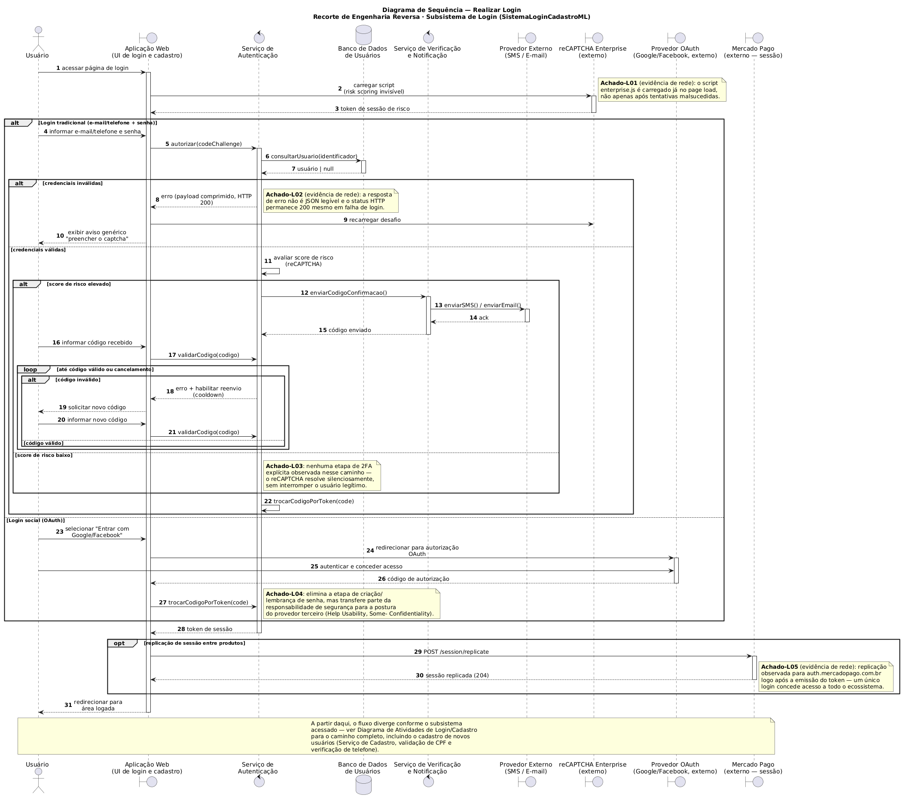
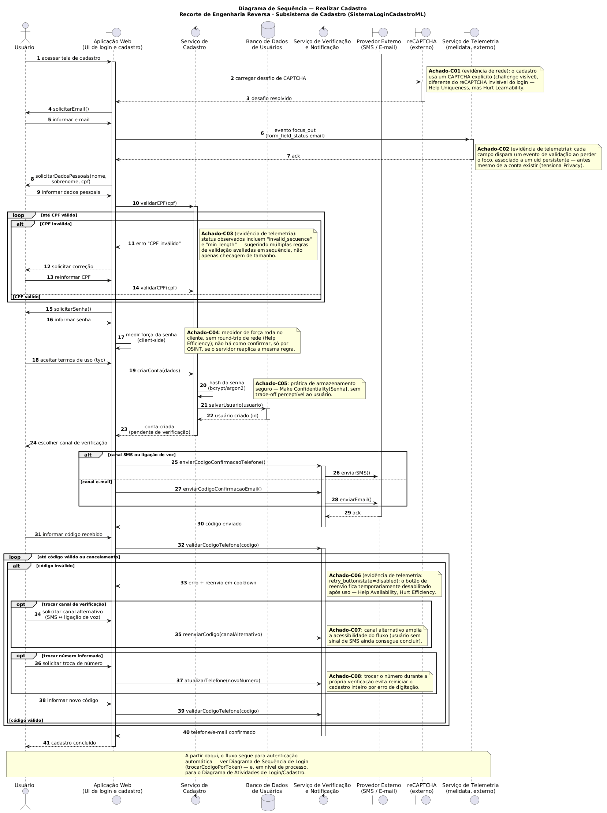
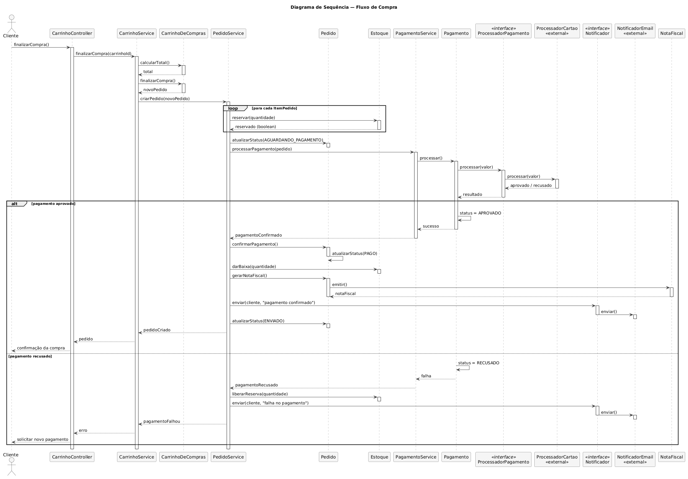

# Diagrama de Sequência

<strong>Diagrama de Sequência — Login</strong> — interação entre o usuário, a aplicação web e os serviços internos e externos envolvidos na autenticação, reconstruída por engenharia reversa. <em>Autor: Pedro Henrique</em>

[Clique aqui para baixar a imagem!](../../../../Assets/Subequipe3/diagrama_sequencia_login.png ':ignore')

<strong>Diagrama de Sequência — Cadastro</strong> — par complementar do diagrama de Login, cobrindo criação de conta e verificação de telefone/e-mail. <em>Autor: Pedro Henrique</em>

[Clique aqui para baixar a imagem!](../../../../Assets/Subequipe3/diagrama_sequencia_cadastro.png ':ignore')

<strong>Diagrama de Sequência — Compras</strong> — Diagrama de sequência cobrindo todo o processo de compra.   <em>Autor: José Joaquim da Silva Neto</em>

[Clique aqui para baixar a imagem!](../../../../Assets/Subequipe3/FluxoCompraDiagramaSequencia.png ':ignore')

<strong>Diagrama de Sequência — Devolução e estorno</strong> — Diagrama de sequência cobrindo todo o processo de devolução e estorno.   <em>Autor: José Joaquim da Silva Neto</em>

[Clique aqui para baixar a imagem!](../../../../Assets/Subequipe3/FluxoCompraDiagramaSequencia.png ':ignore')

## 1. Introdução

Este documento apresenta o par de diagramas de sequência do subsistema `SistemaLoginCadastroML`: um para o fluxo de **Login** e outro, complementar, para o fluxo de **Cadastro**. Os dois compartilham a mesma fronteira (`UI de login e cadastro`) e vários dos mesmos serviços de apoio, e por isso são documentados juntos nesta página.

## 2. O Artefato e a Notação Utilizada

O diagrama de sequência é o diagrama de interação da UML voltado à ordem temporal das mensagens trocadas entre participantes: cada linha de vida é vertical, cada mensagem é uma seta horizontal, e o tempo avança de cima para baixo. Dois recursos de notação estruturam os dois diagramas desta página:

- **Estereótipos de participante** (`actor`, `boundary`, `control`, `database`), na linha de Jacobson et al. (1992): a fronteira (`UI de login e cadastro`) é o único participante autorizado a interagir diretamente com o usuário; os controladores (`Serviço de Autenticação`, `Serviço de Cadastro`, `Serviço de Verificação e Notificação`) orquestram a lógica; o banco de dados é a entidade persistente.
- **Fragmentos combinados** (`alt`, `opt`, `loop`), conforme OMG (2017): usados para expressar, respectivamente, os caminhos alternativos de autenticação (tradicional vs. social), os comportamentos condicionais (2FA, replicação de sessão, troca de canal de verificação) e as repetições de tentativa (validação de código, correção de CPF).

## 3. Diagrama de Sequência — Login

### 3.1 Participantes

| Participante | Estereótipo | Papel |
|---|---|---|
| Usuário | `actor` | Inicia o login e responde às solicitações da interface |
| Aplicação Web (UI de login e cadastro) | `boundary` | Única fronteira com o usuário; orquestra as chamadas aos demais participantes |
| Serviço de Autenticação | `control` | Valida credenciais, avalia risco e emite o token de sessão |
| Banco de Dados de Usuários | `database` | Consulta os dados da conta durante a autenticação |
| Serviço de Verificação e Notificação | `control` | Aciona o envio de código quando o 2FA é exigido |
| Provedor Externo (SMS/E-mail) | `boundary` | Terceiro que efetivamente entrega o código ao usuário |
| reCAPTCHA Enterprise | `boundary` (externo) | Pontuação de risco carregada já no início da página |
| Provedor OAuth (Google/Facebook) | `boundary` (externo) | Alternativa de login social |
| Mercado Pago | `boundary` (externo) | Recebe a replicação de sessão após o login |

### 3.2 Fluxo de Mensagens

O diagrama se divide em três momentos: (i) o carregamento do risco de sessão antes de qualquer tentativa de credencial; (ii) a bifurcação `alt` entre login tradicional e login social; e, dentro do primeiro ramo, uma segunda bifurcação entre credenciais válidas e inválidas; (iii) a etapa comum de emissão de token e replicação de sessão, seguida do redirecionamento.

### 3.3 Achados que sustentam as guardas e notas

| Achado | Mensagem(ns) | Evidência de origem |
|---|---|---|
| Achado-L01 | Carregamento do reCAPTCHA | Script `enterprise.js` observado já no carregamento da página de login, antes de qualquer tentativa |
| Achado-L02 | Resposta a credenciais inválidas | Payload de erro comprimido/ofuscado, sempre com status HTTP 200 |
| Achado-L03 | Ausência de 2FA em score de risco baixo | Nenhuma etapa de segundo fator observada nesse caminho durante a coleta |
| Achado-L04 | Login social (OAuth) | Elimina a etapa de senha, mas desloca parte da confiança para o provedor terceiro |
| Achado-L05 | Replicação de sessão | Requisição observada para `auth.mercadopago.com.br` logo após a emissão do token |

## 4. Diagrama de Sequência — Cadastro

### 4.1 Participantes

Reaproveita `Usuário`, `Aplicação Web`, `Serviço de Verificação e Notificação`, `Provedor Externo` e `reCAPTCHA` do diagrama de Login (Seção 3.1), substituindo o `Serviço de Autenticação` pelo `Serviço de Cadastro` e acrescentando o `Serviço de Telemetria` (externo), cuja participação só foi identificada nesta etapa do trabalho.

### 4.2 Fluxo de Mensagens

O fluxo segue a ordem de preenchimento do formulário (e-mail, dados pessoais, senha), intercalada por um loop de correção de CPF e, ao final, por um segundo loop para a verificação de telefone/e-mail — este último com dois pontos de decisão opcionais (troca de canal e troca de número) aninhados dentro do próprio loop.

### 4.3 Achados que sustentam as guardas e notas

| Achado | Mensagem(ns) | Evidência de origem |
|---|---|---|
| Achado-C01 | Carregamento do CAPTCHA | Desafio explícito no cadastro, diferente do reCAPTCHA invisível do login |
| Achado-C02 | Evento `focus_out` | Telemetria de validação por campo, associada a um identificador persistente antes da conta existir |
| Achado-C03 | Validação de CPF | Status de telemetria observados (`invalid_secuence`, `min_length`) sugerem múltiplas regras avaliadas em sequência |
| Achado-C04 | Medição de força de senha | Ocorre no cliente, sem chamada de rede associada |
| Achado-C05 | Armazenamento da senha | Prática de hash (bcrypt/argon2) — sem trade-off perceptível ao usuário |
| Achado-C06 | Reenvio de código | Botão de reenvio observado em estado desabilitado (cooldown) após o uso |
| Achado-C07 | Troca de canal de verificação | Alternância entre SMS e ligação de voz durante a própria verificação |
| Achado-C08 | Troca de número informado | Permite corrigir o número sem reiniciar o cadastro inteiro |

## 5. Diagrama de Sequência — Fluxo de Compra

### 5.1 Participantes

| Participante | Estereótipo | Papel |
|---|---|---|
| Cliente | `actor` | Inicia a finalização da compra |
| CarrinhoController | `boundary` | Recebe a solicitação de finalização de compra |
| CarrinhoService / PedidoService / PagamentoService | `control` | Orquestram carrinho, criação do pedido e processamento de pagamento |
| CarrinhoDeCompras / Pedido / Pagamento / Estoque / NotaFiscal | `entity` | Objetos de domínio que concentram o estado e as regras de negócio |
| ProcessadorPagamento | `control` (interface, Strategy Pattern) | Contrato para processamento de pagamento, implementado externamente |
| ProcessadorCartao | `boundary` (externo) | Operadora de cartão que efetivamente processa o pagamento |
| Notificador | `control` (interface, Strategy Pattern) | Contrato para envio de notificações |
| NotificadorEmail | `boundary` (externo) | Provedor que efetivamente envia o e-mail ao cliente |

### 5.2 Fluxo de Mensagens

O diagrama cobre três momentos: (i) a criação do pedido a partir do carrinho, com reserva de estoque item a item (`loop`); (ii) a bifurcação `alt` entre pagamento aprovado e recusado; (iii), no ramo de aprovação, a cadeia de confirmação — baixa de estoque, emissão de nota fiscal, notificação e atualização de status da entrega.

### 5.3 Base das guardas e notas

Diferente dos diagramas de Login/Cadastro, as guardas deste diagrama não derivam de achados de tráfego observado, e sim das regras já formalizadas no **Diagrama de Classes** do sistema — em especial as enumerações `StatusPedido`/`StatusPagamento` e o Strategy Pattern (`ProcessadorPagamento`, `Notificador`). Por isso, a tabela equivalente aqui substitui "achado/evidência" por "elemento de origem":

| Guarda/Nota | Mensagem(ns) | Elemento de origem |
|---|---|---|
| `alt` pagamento aprovado/recusado | `processar(valor)` → resultado | `StatusPagamento` (enumeração, Diagrama de Classes) |
| `loop` reserva de estoque | `reservar(quantidade)` por item | Composição `Pedido ◆── ItemPedido` |
| Direção `Pagamento → ProcessadorPagamento` | `estornar()`/`processar()` | Associação `Pagamento ──► ProcessadorPagamento` (Strategy Pattern) |

## 6. Diagrama de Sequência — Devolução e Estorno

### 6.1 Participantes

Reaproveita `PagamentoService`, `Pagamento`, `ProcessadorPagamento`, `ProcessadorCartao`, `Notificador` e `NotificadorEmail` da Seção 5.1, substituindo `CarrinhoService` por `PedidoController`/`PedidoService` como ponto de entrada, e acrescentando `Entrega` e `NotaFiscal` como entidades adicionais envolvidas no cancelamento.

### 6.2 Fluxo de Mensagens

O fluxo modela a solicitação de devolução de um pedido já entregue, com uma bifurcação `alt` entre devolução aprovada e recusada. No ramo de aprovação, a sequência de cancelamento (entrega, pedido, nota fiscal, reposição de estoque) precede o estorno, que segue a mesma cadeia de delegação do Strategy Pattern usada no pagamento — `Pagamento.estornar()` aciona `ProcessadorPagamento.estornar()`, nunca o inverso.

### 6.3 Base das guardas e notas

| Guarda/Nota | Mensagem(ns) | Elemento de origem |
|---|---|---|
| `alt` devolução aprovada/recusada | `analisarSolicitacao(motivo)` | Regra de negócio do Diagrama de Atividades — Devolução e Estorno |
| Ordem `Pagamento → ProcessadorPagamento` no estorno | `estornar()` | Mesma associação do Diagrama de Classes citada na Seção 5.3 — reforça a consistência entre pagamento e estorno |

## 7. Decisões de Design e Senso Crítico

- **Notas de achado em vez de regras de negócio.** Onde um diagrama de sequência de projeto cita uma regra de negócio definida pela equipe, estes dois diagramas citam um achado de investigação, com o tipo de evidência que o sustenta (rede, telemetria, script). A escolha é deliberada: atribuir uma "regra de negócio" a um sistema de terceiros observado de fora seria apresentar inferência como especificação.
- **CAPTCHA modelado duas vezes, de formas diferentes.** O reCAPTCHA do Login (invisível, Achado-L01) e o CAPTCHA do Cadastro (desafio explícito, Achado-C01) não foram unificados em um único participante genérico "Captcha", ainda que ambos apareçam como `boundary` externo. Mantê-los como instâncias de mensagem distintas, cada uma com sua nota, preserva um achado relevante: a plataforma trata os dois pontos de entrada com posturas de fricção visivelmente diferentes.
- **`Serviço de Autenticação` e `Serviço de Cadastro` como controladores separados.** Essa separação replica a distinção já adotada no Diagrama de Componentes deste subsistema (Seção 6.1), não uma escolha nova feita aqui — o objetivo foi manter os três artefatos (Componentes, Atividades, Sequência) descrevendo a mesma fronteira interna.
- **Loop de tentativa em vez de repetição implícita.** Tanto a correção de CPF quanto a validação de código foram modeladas como `loop` explícito com um `alt` interno (inválido/válido), e não como uma única mensagem de "tentar até acertar" — a diferença importa porque cada iteração corresponde a uma troca de mensagens realmente observável (o cooldown do Achado-C06, por exemplo, só faz sentido dentro de um loop com múltiplas rodadas).

## 8. Rastreabilidade

| Elemento | Vem de | Vai para |
|---|---|---|
| Participantes `Serviço de Autenticação`, `Serviço de Cadastro`, `Serviço de Verificação e Notificação`, `Provedor Externo` | Diagrama de Componentes (`SistemaLoginCadastroML`) | — |
| Nomes de mensagem (`autorizar(codeChallenge)`, `trocarCodigoPorToken(code)`, `validarCPF(cpf)`, `criarConta(dados)`, `salvarUsuario(usuario)`, `validarCodigoTelefone(codigo)`) | Operações definidas nas interfaces do Diagrama de Componentes | — |
| Blocos `alt`/`opt`/`loop` de cada diagrama | Operacionalizações já registradas no Diagrama de Atividades de Login/Cadastro | — |
| Achados L01–L05, C01–C08 | Coletas de engenharia reversa (headers HTTP, scripts, telemetria) | SIG/NFR Framework: softgoals `Security[Login]`, `Accessibility[Login]`, `Privacy[Plataforma]`, entre outros já documentados |
| Nota final de cada diagrama | — | Diagrama de Sequência complementar (Login ⇄ Cadastro) |

## 9. Limites do Artefato

- **A fronteira interna entre "Serviço de Autenticação" e "Serviço de Cadastro" é uma partição lógica, não uma confirmação de arquitetura.** A coleta de rede confirma que ambas as funcionalidades existem e respondem de formas distintas; não confirma se, na implementação real, são dois serviços fisicamente separados ou módulos de um mesmo serviço.
- **O `Serviço de Verificação e Notificação` foi inferido a partir do comportamento, não observado como componente isolado.** É a explicação mais simples para o padrão de mensagens visto (canais alternativos, cooldown), mas o diagrama não tem como provar que não existem etapas intermediárias adicionais.
- **Nenhuma mensagem de falha de infraestrutura está representada.** Timeout, indisponibilidade do provedor de SMS/e-mail ou falha do serviço de risco não foram provocados durante a coleta e, por isso, não aparecem como fragmento `break` em nenhum dos dois diagramas.
- **A ordem exata de alguns eventos assíncronos (ex.: replicação de sessão, telemetria) é aproximada.** A coleta confirma que essas chamadas ocorrem em torno do momento modelado, mas não garante a ordem relativa exata entre elas e as demais mensagens da mesma faixa de tempo.
- **Os dois diagramas descrevem apenas o caminho observável sem autenticação prévia.** Comportamentos que dependem de sessão já existente (por exemplo, login com "lembrar-me" ativo) não foram modelados aqui.

## Embasamento na Literatura

### Referências

- JACOBSON, Ivar; CHRISTERSON, Magnus; JONSSON, Patrik; ÖVERGAARD, Gunnar. *Object-Oriented Software Engineering: A Use Case Driven Approach*. Wokingham: Addison-Wesley, 1992.
- OBJECT MANAGEMENT GROUP. *OMG Unified Modeling Language (OMG UML), Version 2.5.1*. Needham: OMG, 2017. Disponível em: https://www.omg.org/spec/UML/2.5.1.
- BOOCH, Grady; RUMBAUGH, James; JACOBSON, Ivar. *UML: Guia do Usuário*. 2. ed. Rio de Janeiro: Elsevier, 2005.

---

## Histórico de Versões

| Versão | Data | Descrição | Autor(es) | Revisor(es) |
| -- | -- | -- | -- | -- |
| 1.0 | 14/09/2026 | Criação da página | José Joaquim da Silva Neto | -- |
| 1.1 | 18/09/2026 | Criação da página; diagramas de sequência de Login e Cadastro, com achados de engenharia reversa como guardas de fragmento | Pedro Henrique Gomes | -- |
| 1.2 | 18/09/2026 | Adiciona diagramas de sequência de Compras e Estorno e devolução bem como sua devida documentação | José Joaquim da Silva Neto | -- |