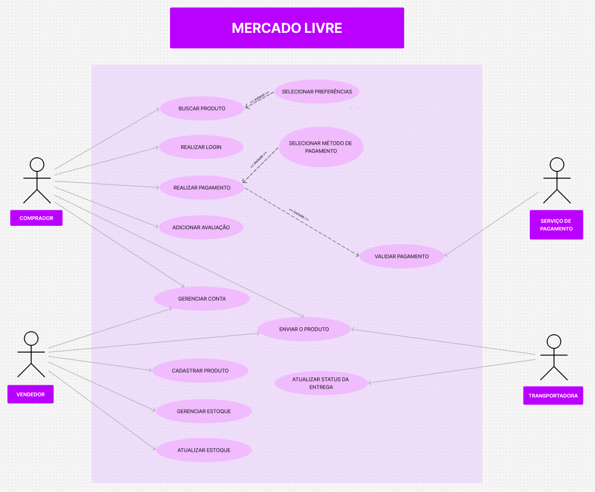

# Diagrama de Casos de Uso

<strong>Diagrama de Casos de Uso</strong> — Casos de uso do sistema de comércio eletrônico Mercado Livre.   <em>Autora: Júlia Santana Campos</em>

[Clique aqui para baixar a imagem!](../../../../Assets/Subequipe3/Diagrama_casos_uso.png ':ignore')

## 1. Introdução

Este documento apresenta a fundamentação técnica das decisões de modelagem adotadas no diagrama de casos de uso do sistema de comércio eletrônico Mercado Livre. O objetivo não é apenas listar atores e casos de uso, mas justificar por que cada associação e cada relacionamento entre casos de uso foi desenhado da forma como está, discutindo alternativas descartadas e apontando, com honestidade, os pontos em que o diagrama é uma simplificação ou apresenta uma inconsistência notacional.

O diagrama é composto por quatro atores (Comprador, Vendedor, Serviço de Pagamento e Transportadora), treze casos de uso delimitados pela fronteira do sistema "Mercado Livre", e dois tipos de relacionamento entre casos de uso: inclusão (`<<include>>`) e extensão (`<<extend>>`).

---

## 2. Atores Primários e Atores Secundários

### 2.1 A decisão

O diagrama distingue, ainda que sem um estereótipo explícito, dois grupos de atores por posição e função: Comprador e Vendedor, posicionados à esquerda da fronteira do sistema, são os atores humanos primários, aqueles que iniciam a maior parte dos casos de uso. Serviço de Pagamento e Transportadora, posicionados à direita, são atores secundários, sistemas externos que o Mercado Livre consome para completar um caso de uso já iniciado por um ator primário.

### 2.2 Justificativa crítica

Essa separação segue a convenção mais usual em diagramas de casos de uso (Jacobson, 1992): atores primários são aqueles cujos objetivos o sistema existe para atender, enquanto atores secundários apenas fornecem ou recebem um serviço no meio do caminho. No diagrama, isso fica evidente em Validar Pagamento, um caso de uso que nenhum ator primário aciona diretamente, ele só é alcançado pela relação `<<include>>` vinda de Realizar Pagamento, e sua única associação direta é com o Serviço de Pagamento, o ator que efetivamente executa a validação. O mesmo raciocínio vale para Atualizar Status da Entrega, acionado apenas pela Transportadora.

### 2.3 Trade-off reconhecido

O diagrama não usa generalização de atores (uma seta de herança ligando Comprador e Vendedor a um ator abstrato comum, como "Usuário Cadastrado"), embora ambos compartilhem o caso de uso Gerenciar Conta. A alternativa de generalização reduziria para uma única linha a associação que hoje é desenhada duas vezes (uma a partir de Comprador, outra a partir de Vendedor). A escolha por associações duplicadas em vez de um ator abstrato é discutível, mas evita introduzir um ator que não aparece em nenhum outro artefato do projeto (os diagramas de classes e de componentes também tratam Comprador e Vendedor como papéis distintos, não como especializações de uma superclasse Usuário modelada explicitamente).

---

## 3. Casos de Uso Compartilhados: Gerenciar Conta e Enviar o Produto

### 3.1 A decisão

Dois casos de uso recebem associação de mais de um ator: Gerenciar Conta, acionado tanto por Comprador quanto por Vendedor, e Enviar o Produto, acionado por Comprador, Vendedor e Transportadora simultaneamente.

### 3.2 Justificativa crítica

Gerenciar Conta ser compartilhado é diretamente justificável: dados cadastrais, senha e endereço são conceitos que existem igualmente para quem compra e para quem vende na plataforma, não há motivo para duplicar esse caso de uso em "Gerenciar Conta do Comprador" e "Gerenciar Conta do Vendedor" quando o comportamento subjacente é idêntico para os dois papéis.

### 3.3 Limitação reconhecida

A associação direta entre Comprador e Enviar o Produto é, ao ser revisada de forma crítica, semanticamente imprecisa: quem efetivamente despacha o produto é o Vendedor (que embala e posta o pedido) e a Transportadora (que executa o transporte), o Comprador não pratica a ação de enviar. O mais provável é que essa associação pretenda representar que a conclusão do fluxo de compra do Comprador é o evento que desencadeia o envio, uma relação de precedência entre casos de uso, e não uma participação direta do Comprador na execução de Enviar o Produto. Uma modelagem mais rigorosa substituiria essa associação por um relacionamento entre os próprios casos de uso (por exemplo, Realizar Pagamento anterior a Enviar o Produto). Optou-se por manter a descrição fiel ao que está desenhado na imagem em vez de corrigi-la silenciosamente, registrando aqui a imprecisão da mesma forma que o diagrama de classes registra, na seção sobre interfaces, um erro de modelagem identificado durante sua própria elaboração.

---

## 4. Relacionamentos de Inclusão (`<<include>>`)

### 4.1 A decisão

Realizar Pagamento participa de duas relações de inclusão: uma vinda de Selecionar Método de Pagamento e outra apontando para Validar Pagamento.

### 4.2 Justificativa crítica

O uso de `<<include>>` aqui é apropriado porque ambos os sub-passos são obrigatórios, sempre que um pagamento é realizado, um método precisa ter sido selecionado e o pagamento precisa ser validado junto ao Serviço de Pagamento, não são comportamentos opcionais como os modelados por `<<extend>>` na seção seguinte. Isso segue a definição padrão da OMG para inclusão: o caso de uso base sempre incorpora o comportamento do caso de uso incluído durante sua execução.

### 4.3 Limitação reconhecida

A direção das duas setas de inclusão não é consistente entre si. Entre Realizar Pagamento e Validar Pagamento, a seta segue a convenção canônica da UML (`<<include>>` parte do caso de uso base em direção ao caso de uso incluído, com a seta apontando para este último). Já entre Selecionar Método de Pagamento e Realizar Pagamento, a seta está desenhada no sentido inverso, apontando para Realizar Pagamento como se ele fosse o caso de uso incluído, quando na verdade ele é o caso base que inclui a seleção do método de pagamento como sub-passo. Trata-se de uma inconsistência notacional do artefato original, mantida aqui de forma transparente em vez de silenciosamente corrigida na descrição, já que o objetivo deste documento é descrever o diagrama tal como ele foi desenhado.

---

## 5. Relacionamento de Extensão (`<<extend>>`)

### 5.1 A decisão

Selecionar Preferências estende Buscar Produto, com a seta tracejada partindo de Selecionar Preferências em direção a Buscar Produto.

### 5.2 Justificativa crítica

Diferentemente da inclusão, a extensão modela um comportamento opcional, que só ocorre sob determinada condição. Selecionar preferências de busca (categoria, faixa de preço, localização) não é uma etapa obrigatória para buscar um produto, um Comprador pode simplesmente digitar um termo e pesquisar sem refinar nada, o que justifica `<<extend>>` em vez de `<<include>>` nesse ponto específico. A direção da seta, partindo da extensão em direção ao caso base, segue corretamente a convenção da UML para esse tipo de relacionamento.

### 5.3 Trade-off reconhecido

A UML permite nomear explicitamente o ponto de extensão (*extension point*) dentro do caso de uso base, indicando em que momento exato da execução de Buscar Produto a extensão pode ser inserida. O diagrama não nomeia esse ponto, uma simplificação razoável para um diagrama de apresentação, mas que deixaria de responder, por exemplo, se a seleção de preferências pode ocorrer antes ou também depois de uma busca inicial já ter sido feita.

---

## 6. Casos de Uso Exclusivos do Domínio Vendedor

### 6.1 A decisão

Cadastrar Produto, Gerenciar Estoque e Atualizar Estoque são acionados exclusivamente pelo Vendedor, sem nenhuma associação com o Comprador.

### 6.2 Justificativa crítica

Essa exclusividade é coerente com o critério de distinguibilidade comportamental já aplicado nos demais diagramas do projeto: um Comprador não tem, em nenhum fluxo do sistema, motivo de negócio para cadastrar um produto ou alterar uma quantidade em estoque, esses casos de uso pertencem inteiramente ao papel de Vendedor.

### 6.3 Trade-off reconhecido

Gerenciar Estoque e Atualizar Estoque coexistem como dois casos de uso distintos, apesar de conceitualmente próximos. A leitura mais provável é que Gerenciar Estoque representa o conjunto amplo de operações sobre o estoque (consulta, ajuste manual, definição de limites mínimos), enquanto Atualizar Estoque representa especificamente a alteração pontual de quantidade disparada por um evento (uma venda concluída, por exemplo). O diagrama, porém, não deixa essa distinção explícita por meio de um relacionamento de inclusão entre os dois (o que seria esperado caso Atualizar Estoque fosse, de fato, um sub-passo obrigatório de Gerenciar Estoque), ficando a cargo do leitor inferir a diferença apenas pelo nome dos casos de uso.

---

## 7. Escopo Não Coberto

### 7.1 A decisão

O diagrama não representa autenticação multifator, bloqueio de conta por tentativas excedidas, expiração de sessão, nem o processo de contestação de suspensão de conta, todos eles presentes no Diagrama de Máquina de Estados do Usuário. Realizar Login aparece aqui como um único caso de uso, sem relacionamentos de inclusão ou extensão associados a ele.

### 7.2 Justificativa crítica

Essa omissão é deliberada e não uma lacuna de pesquisa: o diagrama de casos de uso opera em um nível de abstração mais alto, descrevendo o que os atores podem fazer no sistema, não como cada caso de uso se comporta internamente ao longo do tempo. Detalhar o desafio de MFA ou o bloqueio por taxa de tentativas dentro de Realizar Login duplicaria, em outra notação, o mesmo conteúdo já coberto com mais precisão pelo diagrama de estados, o que é justamente o tipo de redundância entre artefatos que a modelagem em UML busca evitar ao usar diferentes diagramas para diferentes preocupações.

### 7.3 Limitação reconhecida

Essa divisão de responsabilidade entre diagramas exige que ambos sejam consultados em conjunto para uma compreensão completa do fluxo de login: quem lê apenas o diagrama de casos de uso não saberá, só por ele, que o login pode envolver um segundo fator de autenticação ou um bloqueio temporário por excesso de tentativas.

---

## 8. Considerações finais

As decisões de modelagem apresentadas priorizam a fidelidade descritiva ao artefato produzido, incluindo o registro transparente de inconsistências notacionais (a direção invertida de uma das setas de inclusão) e de imprecisões semânticas (a associação do Comprador a Enviar o Produto), em vez de uma correção silenciosa que tornaria a documentação incoerente com a imagem publicada. Assim como nos demais diagramas do projeto, a separação entre atores primários e secundários, o uso diferenciado de inclusão e extensão, e a decisão de não duplicar nos casos de uso o detalhamento já coberto pelos diagramas dinâmicos seguem o mesmo critério de distinguibilidade comportamental e de não redundância entre artefatos já adotado na modelagem estática e dinâmica deste documento.

---

## Embasamento na literatura

### Referências

- Jacobson, I. (1992). *Object-Oriented Software Engineering: A Use Case Driven Approach*. Addison-Wesley.
- OMG (Object Management Group). *Unified Modeling Language Specification*, seção de Use Case Diagrams.

## Histórico de Versões

| Versão | Data | Descrição | Autor(es) | Revisor(es) |
| -- | -- | -- | -- | -- |
| 1.0 | 10/09/2026 | Criação da página | José Joaquim da Silva Neto | -- |
| 1.1 | 17/09/2026 | Adição do diagrama de casos de uso | Júlia Santana Campos | -- |
| 1.2 | 18/09/2026 | Adição da descrição de atores, casos de uso e relacionamentos do diagrama | Júlia Santana Campos | -- |
