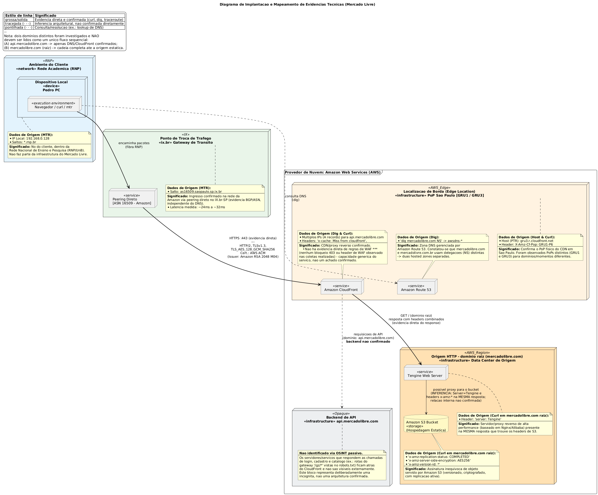

# Diagrama de Implantação

<strong>Diagrama de Implantação</strong> — Reconstrução da infraestrutura de implantação do Mercado Livre a partir de engenharia reversa de caixa-preta (OSINT passivo: DNS, TLS, headers HTTP e traceroute). <em>Autor: [Seu Nome]</em>

[Clique aqui para baixar a imagem!](../../../../Assets/Subequipe3/diagrama_implantacao3v.png ':ignore')

## 1. Introdução

Este documento apresenta a fundamentação técnica e metodológica do diagrama de implantação (Deployment Diagram) construído por engenharia reversa da plataforma Mercado Livre. Diferente de um diagrama de implantação tradicional — em que a arquitetura é desenhada *a priori*, durante o planejamento de um sistema próprio —, este diagrama foi **reconstruído a posteriori**, a partir de evidências coletadas externamente sobre um sistema de terceiros já em produção.

Essa inversão de método tem uma consequência direta na forma como o diagrama deve ser lido: cada nó, aresta e nota está explicitamente ancorado em uma evidência técnica verificável (comando executado, header observado, resposta de rede), e cada elemento cuja existência não pôde ser confirmada diretamente está identificado como tal. O objetivo não é apenas mostrar "onde o sistema roda", mas também **demonstrar o raciocínio e os limites do método** usado para chegar a essa reconstrução — um exercício de Engenharia Reversa aplicado à camada de infraestrutura, complementar aos artefatos de comportamento (Casos de Uso, BPMN) e de qualidade (SIG/NFR) já documentados neste wiki.

---

## 2. Metodologia e Ética da Coleta

### 2.1 A decisão

Toda evidência utilizada neste diagrama foi obtida por meios **passivos e publicamente acessíveis**: consultas DNS (`dig`), inspeção de certificado TLS, leitura de cabeçalhos HTTP (`curl -I`) e medição de rota de rede (`traceroute`/`mtr`). Em nenhum momento houve tentativa de acesso não autorizado, varredura de portas, exploração de vulnerabilidades ou qualquer ação que ultrapassasse o que um navegador comum já faz ao carregar a página.

### 2.2 Justificativa crítica

A escolha por evidência estritamente passiva não é apenas uma cautela ética — ela também define o **teto de confiabilidade** do diagrama. Um `dig` ou um `curl -I` revela metadados de borda (DNS, CDN, certificado) com alta confiança, mas nada revela sobre a lógica de negócio, o código-fonte ou a topologia interna dos serviços de aplicação. Reconhecer esse limite é parte do resultado, não uma limitação a ser escondida: por isso o diagrama inclui deliberadamente um nó identificado como **não confirmado** (ver Seção 3.3), em vez de preencher essa lacuna com suposição.

### 2.3 Trade-off reconhecido

Um método mais invasivo (varredura de portas, fuzzing de headers, tentativa de acesso a rotas internas) provavelmente revelaria mais nós e mais detalhes de arquitetura. Esse ganho de completude foi deliberadamente descartado em favor de manter o trabalho dentro dos limites éticos e legais de um exercício acadêmico de engenharia reversa sobre um sistema de produção de terceiros.

---

## 3. Elementos do Diagrama e Decisões de Modelagem

### 3.1 Separação Cliente / Rede de Trânsito / Nuvem

O diagrama divide explicitamente três domínios de responsabilidade: o **Ambiente do Cliente** (a rede acadêmica de onde a coleta foi feita, estereótipo `«network»`), o **Ponto de Troca de Tráfego** (IX.br-SP, onde o tráfego ingressa na rede da Amazon) e o **Provedor de Nuvem** (AWS, onde a infraestrutura do Mercado Livre efetivamente reside).

Essa separação evita um erro comum em diagramas de implantação feitos por engenharia reversa: atribuir à empresa-alvo nós que, na verdade, pertencem ao caminho de rede do próprio observador. Os saltos intermediários de RNP/UnB observados via `mtr`, por exemplo, **não fazem parte da infraestrutura do Mercado Livre** e foram propositalmente isolados no nó "Ambiente do Cliente" para que essa distinção fique inequívoca a quem lê o diagrama.

### 3.2 O peering via IX.br como evidência independente do DNS

O salto `as16509.saopaulo.sp.ix.br` no traceroute foi modelado como um nó próprio porque representa uma **segunda fonte de evidência**, independente da resolução DNS: o Autonomous System 16509 é o ASN publicamente registrado da Amazon. Ou seja, mesmo que toda a cadeia de DNS estivesse de alguma forma incorreta ou desatualizada, o roteamento BGP observado já confirmaria, por si só, que o tráfego ingressa na rede da Amazon.

### 3.3 O nó "Backend de API" como incógnita deliberada

Este é o elemento mais importante do ponto de vista metodológico. As chamadas ao domínio `api.mercadolibre.com` puderam ser confirmadas até a camada de CDN (Amazon CloudFront), mas os serviços que efetivamente processam login, cadastro e busca — evidenciados indiretamente pelo prefixo `/gz/*` encontrado no `robots.txt` — não são observáveis de fora.

Em vez de omitir esse nó ou de especular sua composição interna, ele foi mantido no diagrama como um nó **opaco**, com uma nota explícita descrevendo o que se sabe e o que não se sabe. A alternativa — não desenhar nada ali, ou desenhar uma arquitetura de microsserviços hipotética sem aviso — foi descartada por comunicar, respectivamente, menos informação do que a evidência permite, ou mais confiança do que a evidência sustenta.

### 3.4 A tensão Tengine/S3 na origem do domínio raiz

Ao inspecionar `mercadolibre.com` (domínio raiz, sem subdomínio), a mesma resposta HTTP trouxe simultaneamente o cabeçalho `server: Tengine` (um servidor/proxy de alta performance) e cabeçalhos característicos do Amazon S3 (`x-amz-server-side-encryption`, `x-amz-version-id`, `x-amz-replication-status`). Essa coexistência é ambígua: pode indicar um proxy Tengine posicionado à frente de um bucket S3, ou alguma outra configuração de origem que replica metadados do S3.

Em vez de resolver essa ambiguidade por suposição, ela foi mantida como está — uma aresta tracejada, explicitamente rotulada como inferência não confirmada — em vez de uma aresta sólida que sugeriria uma relação comprovada.

### 3.5 Por que a capacidade "WAF" do CloudFront foi removida

Uma versão anterior deste diagrama incluía "WAF" como parte do papel do Amazon CloudFront. Essa inclusão foi retirada porque nenhuma evidência coletada (nenhum bloqueio HTTP 403, nenhum header de WAF) confirma que regras de *Web Application Firewall* estão de fato configuradas. O CloudFront **pode** operar como WAF, mas essa é uma capacidade genérica do produto, não um achado desta investigação — incluí-la seria apresentar uma possibilidade como um fato observado.

---

## 4. Legenda de Confiança da Evidência

Um diagrama de implantação construído por engenharia reversa mistura, inevitavelmente, graus diferentes de certeza. Para tornar essa diferença visível — e não apenas mencionada em texto corrido —, adotou-se uma convenção gráfica própria, além da notação UML padrão:

| Estilo de linha | Significado | Exemplo no diagrama |
|---|---|---|
| Sólida/grossa | Evidência direta e confirmada (`curl`, `dig`, `traceroute`) | Cliente → Peering IX.br; CloudFront → Tengine |
| Tracejada | Inferência arquitetural, não confirmada diretamente | CloudFront → Backend de API; Tengine → S3 |
| Pontilhada | Consulta/resolução (ex.: lookup de DNS) | Cliente → Route 53 |

Essa convenção não faz parte do padrão UML formal — foi uma extensão deliberada para este contexto de engenharia reversa, e está declarada explicitamente no próprio diagrama para que não seja confundida com notação UML oficial.

---

## 5. Limitações do Método

- **Cobertura parcial:** o diagrama documenta apenas o que a coleta passiva permitiu observar. A ausência de um nó não significa que o componente não existe — significa apenas que nenhuma evidência sobre ele foi coletada.
- **Momento único:** DNS, CDN e roteamento de rede podem mudar com o tempo (balanceamento, deploys, mudança de provedor). As evidências aqui refletem o estado observado nas datas das coletas, não uma garantia permanente.
- **Ambiguidade não resolvida:** a relação exata entre Tengine e S3 (Seção 3.4) permanece uma hipótese, não uma conclusão.
- **Escopo geográfico:** as coletas foram feitas a partir de uma única localização de rede (Brasília/RNP); o PoP de CDN e a rota observada podem diferir para usuários em outras regiões.

---

## 6. Considerações Finais

O diagrama apresentado não é — nem pretende ser — uma descrição definitiva da arquitetura do Mercado Livre. Ele é uma reconstrução parcial e honesta, construída inteiramente a partir de evidência passiva e publicamente observável, com os limites do método explicitados no próprio artefato. Essa é, em si, uma escolha metodológica: preferiu-se um diagrama menos completo, mas inteiramente rastreável a cada comando executado, a um diagrama mais completo, porém apoiado em suposições não verificáveis. Essa mesma evidência de infraestrutura (CDN dedicado, separação de zonas DNS, replicação de sessão entre domínios) também dialoga diretamente com os softgoals de Performance, Scalability e Security documentados no SIG/NFR Framework deste projeto — a arquitetura física observada aqui é, em grande medida, a materialização concreta daquelas decisões de qualidade.

---

## Embasamento na Literatura

### Referências

- AMAZON WEB SERVICES. *Amazon CloudFront Developer Guide*. Disponível em: https://docs.aws.amazon.com/cloudfront/
- AMAZON WEB SERVICES. *Amazon Route 53 Developer Guide*. Disponível em: https://docs.aws.amazon.com/route53/
- AMAZON WEB SERVICES. *AWS Well-Architected Framework*. Disponível em: https://aws.amazon.com/architecture/well-architected/
- RFC 4271 — *A Border Gateway Protocol 4 (BGP-4)*. IETF, 2006. Disponível em: https://www.rfc-editor.org/rfc/rfc4271
- RFC 8446 — *The Transport Layer Security (TLS) Protocol Version 1.3*. IETF, 2018. Disponível em: https://www.rfc-editor.org/rfc/rfc8446
- NEWMAN, S. *Building Microservices: Designing Fine-Grained Systems*. 2. ed. Sebastopol: O'Reilly Media, 2021.
- OMG — Object Management Group. *UML 2.5.1 Specification* — Deployment Diagrams. Disponível em: https://www.omg.org/spec/UML/

---

## Histórico de Versões

| Versão | Data | Descrição | Autor(es) | Revisor(es) |
| -- | -- | -- | -- | -- |
| 1.0 | 15/09/2004| Criação da página e do diagrama de implantação | Pedro Henrique Gomes | -- |