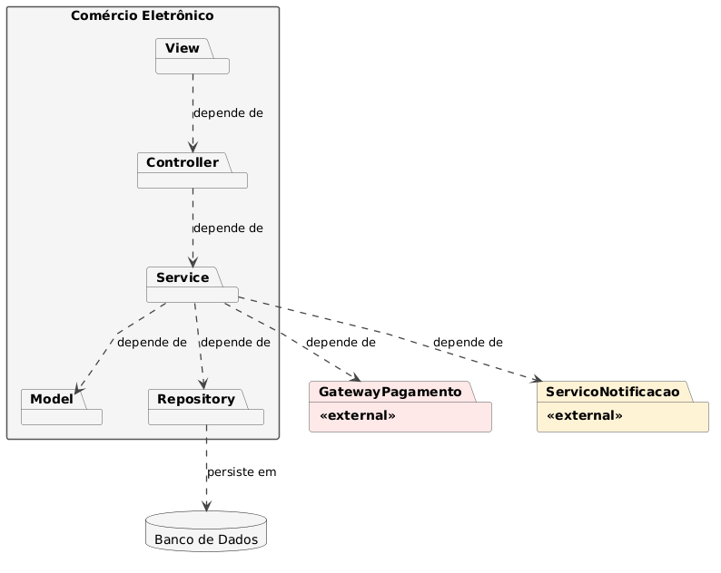

# Diagrama de Pacotes

<strong>Diagrama de Pacotes</strong> — Diagrama de Pacotes de um comércio eletrônico baseado no Mercado Livre.   <em>Autor: José Joaquim da Silva Neto</em>

[Clique aqui para baixar a imagem!](../../../../Assets/Subequipe3/DiagramaDePacotes3.png ':ignore')

---

## Sumário

**Parte I — Justificativa das decisões de modelagem**
1. Introdução
2. Arquitetura em camadas: View, Controller, Service, Model, Repository
3. Sistemas externos como pacotes `«external»`, fora do container principal
4. Regra de dependência unidirecional (sem dependências circulares)
5. Granularidade do diagrama: por que ele não lista as classes internas de cada pacote
6. Fundamentação teórica
7. Limitações reconhecidas

**Parte II — Relação com a arquitetura real do Mercado Livre**

8. O que está oficialmente documentado sobre a arquitetura do Mercado Livre
9. Relação com o nosso diagrama
10. Justificativa do uso do nosso diagrama
11. Transparência recomendada para o relatório final

**Referências** (consolidadas das duas partes)

---

# Parte I — Justificativa das decisões de modelagem

## 1. Introdução

Este documento discute, com visão crítica, as decisões arquiteturais por trás do diagrama de pacotes do sistema de compra eletrônica. Diferente do diagrama de classes — que expõe atributos, métodos e relacionamentos detalhados, o diagrama de pacotes tem um propósito distinto: comunicar **como o sistema se organiza em módulos** e **quais dependências existem entre eles**. Essa diferença de propósito orienta praticamente todas as decisões discutidas a seguir, incluindo algumas tensões e inconsistências que o próprio processo de modelagem expôs.

---

## 2. Arquitetura em camadas: View, Controller, Service, Model, Repository

### 2.1 A decisão

O sistema foi organizado em cinco camadas horizontais, cada uma com uma responsabilidade única: `View` (apresentação), `Controller` (recebimento de requisições), `Service` (regra de negócio), `Model` (domínio) e `Repository` (persistência).

### 2.2 Justificativa crítica

A separação em camadas resolve um problema recorrente em sistemas mal estruturados: a mistura de responsabilidades na mesma classe. Sem essa separação, é comum encontrar controllers que validam regra de negócio, models que sabem executar SQL, ou views que decidem fluxo de pagamento, o que dificulta testes automatizados (não é possível testar a regra de negócio sem subir um servidor HTTP) e a substituição de qualquer peça isolada (trocar o banco de dados exigiria alterar código espalhado por várias camadas).

Uma crítica legítima a essa escolha, no entanto, é que a arquitetura em camadas horizontais é um padrão **antigo e, para alguns autores, ultrapassado** frente a alternativas mais modernas como Arquitetura Hexagonal (Ports and Adapters) ou Clean Architecture. A diferença central é a direção da dependência: aqui, `Service` depende diretamente de `Repository` (uma classe concreta de infraestrutura), enquanto em Clean Architecture a regra de negócio dependeria apenas de uma **interface** abstrata de persistência, definida dentro do próprio domínio, com a implementação concreta injetada de fora. Optar pela camada tradicional, e não pela inversão total de dependência, foi uma escolha consciente de reduzir a complexidade do modelo para o escopo do projeto, mas é uma limitação real, não uma ausência de alternativa melhor.

### 2.3 Uma inconsistência identificada durante a própria modelagem

Vale registrar criticamente algo que emergiu ao longo da construção deste diagrama: o sistema **não aplica a inversão de dependência de forma uniforme**. Para pagamento e notificação, `Service` depende de **interfaces** (`ProcessadorPagamento`, `Notificador`) definidas dentro de `Model`, e são os pacotes externos (`GatewayPagamento`, `ServicoNotificacao`) que implementam essas interfaces — a dependência aponta do externo para o domínio, não o contrário. Já para persistência, `Service` depende **diretamente** da classe concreta `Repository`, sem nenhuma interface intermediária.

Essa assimetria é uma inconsistência de design: por que o acesso a um gateway de pagamento merece abstração via interface, mas o acesso ao banco de dados não? Do ponto de vista da literatura (discutido na seção 6), o padrão **Repository** de Fowler (2002) normalmente já pressupõe uma interface pertencente ao domínio, com a implementação de acesso a dados sendo um detalhe substituível — o que sugeriria tratar `Repository` da mesma forma que tratamos os sistemas externos. A escolha de não fazer isso aqui é defensável (reduz uma camada de abstração para um projeto de escopo acadêmico), mas deveria ser reconhecida como uma simplificação deliberada, não como a única forma "correta" de modelar.

---

## 3. Sistemas externos como pacotes «external», fora do container principal

### 3.1 A decisão

`GatewayPagamento` e `ServicoNotificacao` foram modelados como pacotes com estereótipo `«external»`, deliberadamente separados do container `EcommerceWeb`.

### 3.2 Justificativa crítica

A escolha de não tratá-los como "só mais um pacote" é intencional: um pacote comum, na notação UML, sugere que a equipe do próprio sistema controla e organiza o que está dentro dele. Isso não é verdade para um gateway de pagamento de terceiros (ex.: uma operadora de cartão) — a estrutura interna dele é opaca, não versionada junto com o restante do sistema, e sujeita a mudanças fora do controle da equipe. O estereótipo `«external»` comunica exatamente essa fronteira de responsabilidade e governança, que se perderia se essas dependências fossem apenas mais dois pacotes junto dos demais.

Uma crítica possível é que o próprio nome escolhido, `GatewayPagamento`, já denuncia a intenção de aplicar um padrão de projeto específico (Gateway, discutido na seção 6) — mas o diagrama não deixa explícito, apenas pelo nome, que esse pacote deveria ser tratado como um **adaptador substituível**. Se o professor ou avaliador não estiver familiarizado com o padrão, o estereótipo `«external»` sozinho comunica "isso é de fora", mas não necessariamente "isso é plugável e trocável sem alterar o núcleo do sistema" — essa nuance está mais explícita no diagrama de classes (via a interface `ProcessadorPagamento`) do que neste diagrama de pacotes.

---

## 4. Regra de dependência unidirecional (sem dependências circulares)

### 4.1 A decisão

Todas as setas de dependência apontam em uma única direção — `View → Controller → Service → {Model, Repository, GatewayPagamento, ServicoNotificacao}` e `Repository → Banco de Dados`, sem nenhuma seta retornando "para cima".

### 4.2 Justificativa crítica

Isso não é um detalhe estético: é a regra central que evita **acoplamento circular**, uma das formas mais custosas de dívida técnica em sistemas de médio/grande porte. Se `Model` dependesse de `Controller`, por exemplo, seria impossível reutilizar as classes de domínio em um contexto sem interface HTTP (um script de importação em lote, por exemplo) sem arrastar toda a camada de apresentação junto.

A crítica honesta aqui é que garantir essa unidirecionalidade **no diagrama** não garante que ela seja respeitada **na implementação real** — nada impede, tecnicamente, que um desenvolvedor importe uma classe de `Controller` dentro de `Model` no código-fonte, violando a regra documentada. Diagramas de pacotes comunicam intenção arquitetural; a garantia efetiva viria de ferramentas de análise estática de dependência (ex.: ArchUnit, para sistemas Java) aplicadas ao código, algo fora do escopo de um exercício de modelagem, mas que vale mencionar como limitação.

---

## 5. Granularidade do diagrama: por que ele não lista as classes internas de cada pacote

### 5.1 A decisão

O diagrama de pacotes final mostra apenas os pacotes e suas dependências — não enumera as ~16 classes de domínio, os Value Objects, nem os controllers/services específicos dentro de cada camada.

### 5.2 Justificativa crítica

Essa decisão surgiu de uma tensão prática real durante a elaboração: uma versão anterior, mais detalhada, listava todas as classes dentro de cada pacote, e o resultado — embora tecnicamente correto — se tornou difícil de renderizar sem sobreposição de setas e praticamente ilegível em uma única página. Isso expôs uma lição de modelagem importante: **diagramas diferentes existem para responder perguntas diferentes**, e tentar fazer um único diagrama responder a todas as perguntas simultaneamente (que módulos existem? quais suas dependências? quais classes cada um contém? quais os atributos de cada classe?) tende a produzir um artefato pior do que a soma de diagramas especializados.

A decisão final foi devolver ao diagrama de pacotes seu escopo original — módulos e dependências — e deixar o detalhamento de classes para o diagrama de classes, que já cumpre esse papel com precisão. Isso não é uma limitação imposta pela ferramenta de renderização; é, na verdade, mais alinhado à própria definição da UML para esse tipo de diagrama (discutido na seção 6). A crítica que se pode fazer é que essa "descoberta" só ocorreu de forma iterativa, depois de uma tentativa mal-sucedida — o que sugere que, num projeto real, valeria a pena consultar a documentação da notação **antes** de tentar sobrecarregar o diagrama.

---

## 6. Fundamentação teórica

**Padrão de camadas (Layers).** Buschmann et al. (1996), em *Pattern-Oriented Software Architecture*, formalizam o padrão arquitetural de camadas, no qual cada camada só pode depender da camada imediatamente abaixo (ou de camadas mais internas), nunca o inverso — o que fundamenta diretamente a regra de dependência unidirecional discutida na seção 4. Fowler (2002), em *Patterns of Enterprise Application Architecture*, detalha essa mesma ideia sob o nome de **Layers**, discutindo o trade-off entre a simplicidade de camadas rígidas e a flexibilidade (menor) que elas oferecem em comparação a arquiteturas com inversão de dependência mais explícita.

**Repository e Gateway.** Ainda em Fowler (2002), os padrões **Repository** (uma coleção em memória de objetos de domínio, escondendo os detalhes de acesso a dados) e **Gateway** (um objeto que encapsula o acesso a um sistema ou recurso externo, oferecendo uma API mais simples e específica do domínio) fundamentam, respectivamente, as camadas `Repository` e o pacote `GatewayPagamento`. É justamente por essa fundamentação que a assimetria apontada na seção 2.3 é uma crítica válida: o próprio padrão Repository, na formulação original de Fowler, já sugere uma interface abstrata como contrato — o que este diagrama aplicou ao Gateway, mas não à Repository.

**Regra de Dependência (Dependency Rule).** Martin (2017), em *Clean Architecture*, propõe que dependências de código-fonte devem sempre apontar para dentro, em direção às políticas de negócio de mais alto nível, e nunca na direção oposta — círculos concêntricos onde a camada de domínio não conhece nada sobre banco de dados, frameworks ou interface. Esse é o padrão contra o qual a arquitetura em camadas tradicional (adotada aqui) é frequentemente comparada, e a comparação explica por que a dependência direta de `Service` sobre `Repository` (uma camada de infraestrutura) seria vista, sob essa ótica, como uma inversão de dependência incompleta.

**Bounded Context.** Evans (2003), em *Domain-Driven Design*, argumenta que sistemas complexos devem ser divididos em **Bounded Contexts** — fronteiras explícitas dentro das quais um modelo de domínio é consistente, permitindo que conceitos como "Cliente" tenham significados e implementações diferentes em contextos diferentes (ex.: cobrança vs. logística). Este diagrama modela o sistema inteiro como um único contexto (`EcommerceWeb`), o que é adequado ao escopo atual, mas seria uma simplificação a ser revisitada caso o sistema crescesse a ponto de precisar de equipes e modelos de domínio independentes para partes diferentes do negócio.

**Especificação UML.** A Object Management Group (OMG) define formalmente o diagrama de pacotes como uma ferramenta para expressar a organização de elementos do modelo em unidades gerenciáveis e suas dependências — sem exigir que o conteúdo detalhado de cada pacote seja exibido no mesmo diagrama. Essa definição embasa diretamente a decisão discutida na seção 5.

---

## 7. Limitações reconhecidas

- **Ausência de múltiplos Bounded Contexts**: todo o domínio vive em um único pacote `Model`, o que simplifica a modelagem, mas não escalaria bem para um sistema com múltiplas equipes trabalhando em paralelo.
- **Inconsistência na inversão de dependência**: como discutido na seção 2.3, `Repository` é tratado de forma diferente de `GatewayPagamento`/`ServicoNotificacao`, apesar de ambos serem, em essência, detalhes de infraestrutura substituíveis.
- **Nenhuma camada de segurança/autenticação explícita**: o diagrama não modela onde autenticação, autorização ou controle de sessão se encaixam — uma omissão relevante para um sistema que lida com dados de pagamento.
- **Regra de dependência é documental, não garantida por ferramenta**: nada no diagrama impede, por si só, que a regra seja violada na implementação real.

Essas limitações não invalidam o diagrama para o propósito acadêmico a que se destina, mas deveriam ser o ponto de partida de uma discussão em sala sobre até onde um diagrama de pacotes deve ir antes de se tornar necessário migrar para uma arquitetura com fronteiras de contexto mais explícitas.

---

# Parte II — Relação com a arquitetura real do Mercado Livre

## 8. O que está oficialmente documentado sobre a arquitetura do Mercado Livre

### 8.1 Escala atual

Segundo o próprio blog de engenharia da empresa e um estudo de caso publicado pela AWS, o Mercado Livre opera hoje com aproximadamente **30 mil microsserviços** em produção, rodando sobre mais de **100 mil instâncias**, dando suporte a mais de **15 mil engenheiros**. O estudo da AWS especifica ainda a existência de cerca de **17 mil bancos de dados** e **56 mil serviços de dados**, processando a marca de **900 milhões de requisições por minuto** entre as comunicações internas.

Essa infraestrutura é sustentada por uma plataforma interna de desenvolvimento chamada **Fury**, uma Internal Developer Platform (IDP) construída pela própria empresa, hoje rodando sobre Kubernetes (EKS/GKE), que permite aos times criar, implantar e monitorar serviços de forma padronizada e independente.

### 8.2 Histórico: de monolito a microsserviços

O dado mais relevante para a nossa discussão está na origem da empresa. De acordo com relato de engenheiros do próprio Mercado Livre, a empresa foi fundada no final dos anos 1990 e **operou inicialmente como um sistema monolítico construído em Java**. Foi somente quando a empresa atingiu a escala de cerca de 100 desenvolvedores trabalhando no mesmo código-fonte que problemas de conflito de código, alto acoplamento e implantações caóticas se tornaram insustentáveis — o que motivou, em meados dos anos 2000, a transição para uma arquitetura de microsserviços.

### 8.3 Stack tecnológica

Fontes complementares indicam que, historicamente, parte considerável do backend do Mercado Livre foi construída sobre **Grails** (framework web que segue o padrão arquitetural MVC, na mesma família conceitual do Ruby on Rails) e **Groovy**, com bancos de dados relacionais. A empresa hoje utiliza uma combinação mais heterogênea de linguagens (Java, Go, Node.js) e contêineres via Docker, mas mantém a tradição de organizar aplicações individuais em camadas internas.

---

## 9. Relação com o nosso diagrama

| Aspecto do nosso modelo | Situação real documentada do Mercado Livre |
|---|---|
| Arquitetura monolítica em 5 camadas (View/Controller/Service/Model/Repository) | Corresponde à **fase inicial** real da empresa (fim dos anos 1990 até meados dos anos 2000), não ao estado atual |
| Um único container `EcommerceWeb` | O sistema real está fragmentado em ~30 mil serviços independentes, cada um com seu próprio ciclo de vida |
| `Repository` único, dependendo de um único `Banco de Dados` | A empresa opera ~17 mil bancos distintos — um padrão consistente com *Database per Service*, típico de arquiteturas de microsserviços |
| `GatewayPagamento` como pacote externo, com estereótipo `«external»` | Coerente com a realidade: o processamento de pagamentos do Mercado Livre é, de fato, operado por uma unidade de negócio e produto **separado** (Mercado Pago), com identidade e infraestrutura próprias — o que valida a decisão de isolá-lo como fronteira externa, mesmo sendo parte do mesmo grupo empresarial |
| Uso de framework com padrão MVC nas camadas `View`/`Controller` | Alinhado ao uso histórico de Grails, framework MVC, no backend do Mercado Livre |

### 9.1 Onde o modelo se aproxima genuinamente da realidade

O ponto de maior aderência não é o estado *atual* da empresa, mas seu estado **fundacional**: o Mercado Livre foi, de fato, um monolito Java em camadas antes de crescer — exatamente a forma que modelamos. Isso significa que nosso diagrama não é uma fantasia distante da realidade corporativa; é uma representação plausível de **uma fase real e documentada** da trajetória da própria empresa que estamos estudando.

A decisão de isolar `GatewayPagamento` como pacote externo também encontra respaldo direto na realidade: o Mercado Pago (produto de pagamentos do grupo Mercado Livre) opera como uma unidade de negócio e engenharia distinta — o que é exatamente o tipo de fronteira organizacional que o estereótipo `«external»` pretende comunicar.

### 9.2 Onde o modelo diverge, e por quê isso é esperado

A divergência mais evidente é de **escala e paradigma**: o Mercado Livre real de hoje não é um sistema em camadas, é uma malha de dezenas de milhares de microsserviços independentes, coordenados por uma plataforma própria (Fury) sobre Kubernetes. Reproduzir essa realidade em um diagrama de classes ou de pacotes acadêmico seria não apenas inviável, como contraproducente: um diagrama com 30 mil elementos não comunica nada, não é avaliável, e não corresponde ao nível de abstração esperado em uma disciplina de Engenharia de Requisitos ou modelagem UML introdutória.

---

## 10. Justificativa do uso do nosso diagrama

### 10.1 Requisitos funcionais, não infraestrutura de produção

O propósito de um diagrama de classes/pacotes em um projeto de Engenharia de Requisitos é representar o **domínio funcional** do sistema — quais entidades existem, como se relacionam, quais operações o sistema oferece — e não a infraestrutura de deploy, escalabilidade ou distribuição física dos serviços. Essas duas preocupações são propositalmente separadas na literatura de engenharia de software: modelo de domínio de um lado, arquitetura de implantação de outro. Um sistema com 30 mil microsserviços ainda precisa, em algum nível, representar conceitos como "Cliente", "Pedido" e "Pagamento" — a diferença é que, no mundo real, esses conceitos estão fisicamente distribuídos em serviços diferentes, não organizados nas mesmas cinco camadas de um único processo.

### 10.2 "Monolith First" como estratégia legítima, não como erro

A trajetória real do Mercado Livre — começar monolítico e migrar para microsserviços apenas quando a escala exigiu — não é uma peculiaridade da empresa: é uma recomendação consolidada na literatura de arquitetura de software. Fowler (2015) descreve essa abordagem sob o nome de **"MonolithFirst"**, argumentando que a maioria dos sistemas de microsserviços bem-sucedidos começou como monolitos que foram decompostos progressivamente à medida que os limites de domínio (bounded contexts) se tornavam claros — decompor cedo demais, sem entender esses limites, tende a produzir uma distribuição arbitrária e cara de corrigir depois.

Isso significa que modelar o sistema como um monolito em camadas não é uma simplificação ingênua: é, na verdade, o ponto de partida arquitetural que a própria empresa estudada percorreu — e que a literatura recomenda como caminho responsável antes de se considerar a fragmentação em microsserviços.

### 10.3 Escopo do trabalho e proporcionalidade do esforço

Reverse-engineer a arquitetura de produção real do Mercado Livre é logicamente impossível (código-fonte fechado) e metodologicamente desnecessário: a avaliação de um diagrama de classes/pacotes em disciplina acadêmica não exige fidelidade a uma infraestrutura corporativa de bilhões de dólares, exige demonstração de competência na notação UML e na captura correta de requisitos funcionais observáveis externamente (o que o sistema faz do ponto de vista do usuário e do negócio).

---

## 11. Transparência recomendada para o relatório final

Para que essa comparação fortaleça o trabalho (em vez de expor uma fragilidade), recomenda-se declarar explicitamente, na metodologia do relatório:

> "O diagrama apresentado modela o domínio funcional do sistema a partir dos requisitos observados externamente, adotando uma arquitetura monolítica em camadas por adequação didática e de escopo. Reconhece-se que a arquitetura real de produção do Mercado Livre é significativamente distinta — composta por dezenas de milhares de microsserviços independentes sobre a plataforma interna Fury —, sendo esse nível de detalhe de infraestrutura não observável externamente e fora do escopo de um projeto de Engenharia de Requisitos. Notavelmente, a própria empresa operou historicamente sob uma arquitetura monolítica em suas fases iniciais, o que reforça a validade do modelo aqui proposto como representação de um estágio arquitetural real e documentado."

Essa transparência transforma a diferença entre modelo e realidade em um **ponto analítico a favor do trabalho** — evidencia que a equipe pesquisou a empresa real além do que foi pedido, e sabe justificar criticamente a fronteira entre modelagem de domínio e arquitetura de infraestrutura.

---

## Referências

AMAZON WEB SERVICES (AWS). *Mercado Libre: Case Study*. Disponível em: https://aws.amazon.com/pt/solutions/case-studies/innovators/mercado-libre/. Acesso em: 2026.

BUSCHMANN, Frank; MEUNIER, Regine; ROHNERT, Hans; SOMMERLAD, Peter; STAL, Michael. *Pattern-Oriented Software Architecture, Volume 1: A System of Patterns*. Chichester: Wiley, 1996.

EVANS, Eric. *Domain-Driven Design: Tackling Complexity in the Heart of Software*. Boston: Addison-Wesley, 2003.

FOWLER, Martin. *Patterns of Enterprise Application Architecture*. Boston: Addison-Wesley, 2002.

FOWLER, Martin. MonolithFirst. *martinfowler.com*, 2015. Disponível em: https://martinfowler.com/bliki/MonolithFirst.html.

MARTIN, Robert C. *Clean Architecture: A Craftsman's Guide to Software Structure and Design*. Boston: Prentice Hall, 2017.

MARTINS, Juliano Marcos. The technological evolution at Mercado Libre: from the monolith to the multicloud platform. *Mercado Libre Tech (Medium)*, 2024. Disponível em: https://medium.com/mercadolibre-tech/the-technological-evolution-at-mercado-libre-fb269776a4e8.

MARTINS, Juliano Marcos. Unveiling the secrets of a successful journey: Mercado Libre's Internal Developer Platform. *Platform Engineering*, 2026. Disponível em: https://platformengineering.org/blog/unveiling-the-secrets-of-a-successful-journey-mercado-libres-internal-developer-platform.

MARTINS, Juliano Marcos. Kubernetes at Mercado Libre. *Mercado Libre Tech (Medium)*, 2025. Disponível em: https://medium.com/mercadolibre-tech/kubernetes-at-mercado-libre-ec331bea1866.

OBJECT MANAGEMENT GROUP (OMG). *Unified Modeling Language (UML) Specification*. Disponível em: https://www.omg.org/spec/UML/. Acesso em: 2026.

RICHARDSON, Chris. *Microservices Patterns: With Examples in Java*. Shelter Island: Manning, 2018.

## Histórico de Versões

| Versão | Data | Descrição | Autor(es) | Revisor(es) |
| -- | -- | -- | -- | -- |
| 1.0 | 13/09/2026 | Criação da página | José Joaquim da Silva Neto | -- |
| 1.1 | 13/09/2026 | Adiciona diagrama e conteúdo | José Joaquim da Silva Neto | -- |
